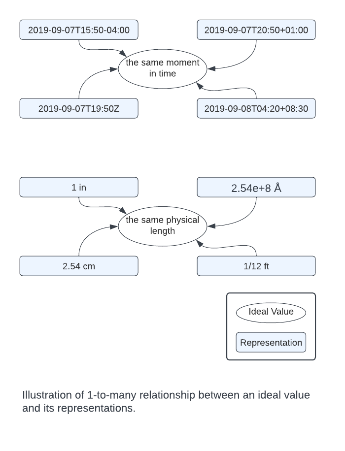

## Introduction

In this essay, I introduce the concept of **functional equality**, and discuss why  `2+2` may or may not equal `4.0`.

Obviously `2+2` is mathematically equal to `4.0`. And yet in many programming languages, the integer and float representations of the same number are functionally different values, because operations such as division and conversion-to-string behave differently for different types.

When comparing two values for equality, it is important to ask, *what do you mean by "equal"?* In some cases, programmers just want to know if two values **represent** the same ideal value, such as the same point on the number line, the same moment in time, or the same physical quantity.

But in other cases, what matters is whether the two values are, for all intents and purposes, **exchangeable** in code: you can replace one value with the other in your program and get the exact same output. This only happens if the two values are **functionally equal**.

In this essay I will explore the difference between functional equality and **ideal equality**. Both types of equality comparisons are sometimes necessary, and this gives rise to what I call the **representation problem**. I explore how some common programming languages solve the representation problem by supporting different ways of doing equality comparisons. I argue that the `==` operator should always respect functional equality, and that ideal equality tests should be done by explicitly comparing canonical representations. I then recommend the use of [**canonical types**](/representationless-types) that only permit canonical representations.

## Definition of Functional Equality

In a functional language, the principle of functional equality says that if `a == b`, then there should exist no function `f` for which `f(a) != f(b)`. 

Formally:

$$
a = b ⟺ ∀f ~ f(a) = f(b)
$$

## Why Functional Equality is Important

Here are some cases where strict functional equality tests are needed.

### Caching

When implementing a cache, two cache keys should probably not be considered equal unless they are functionally equal. Otherwise the cache can return a value for a different key. This would violate the basic principle of a cache, which should only effect program performance, never behavior. And it's easy to see how subtle differences in behavior stemming from the hazard of cache hits could cause frustrating bugs.

### Debugging

Programmers expect equal inputs to produce equal outputs. 

Suppose a programmer has written a program that plots data on charts, placing labels with the numeric value next to each point. She may be encounter a situation where a label sometimes is displayed as "4.0" and sometimes is displayed as "4". While debugging she is perplexed to find that she gets different outputs for two variables that are equal according to the `==` operator.

Only after considerable frustration does she realize that the inputs, while passing the `==` test, are functionally different, because one uses floats and the other integers. She was testing for numerical equality, but what she really wanted was functional equality.

### Functional Purity

A functionally pure language must respect the principle of [**referential transparency**](http://en.wikipedia.org/wiki/Referential_transparency_(computer_science)). An expression is referentially transparent if it can be replaced with its **value** without changing the behavior of the program. But shouldn't we be able to replace any value with an **equal value** without changing the behavior of the program? Obviously yes. Certain functional programming techniques, such as memoization, require testing for functional equality. And so I would argue that a pure functional programming language must support a concept of functional equality.

## Different Representations of the Same Value

Programmers are often tempted to think of two different values as being equal when they are different **representations** of the same ideal value.

- Two timestamps corresponding to the same moment in time but with different time zones
- Two measurements representing the same length but using different units
- Two different semantically identical Unicode strings (e.g. “ñ” (U+00F1) and "ñ" (U+006E U+0303) )
- Two different lists representing the same set

But it is best to think of each of these cases as involving functionally **different** values that can be used to **represent** the **same ideal value**. 

## Representations Are Values

Mathematically, when we think of "values", we think of numbers, or other ideal abstractions such as sets. But in programming, values of variables are data which **represent** something. In most languages values have a type, and *the type is part of the value*. And values of different types can behave differently. Thus two **representations** of the same number using different numeric types can be two *functionally* different values.

Since these representations themselves are values, it helps to think of an ideal value and its representations as different entities, with a 1-to-many relationship.

## The Representation Problem

Of course, you can't work with an ideal value without representing it somehow. You need to choose a format for numbers (int64, IEEE float, decimal float, etc.). You need to choose a timestamp when displaying human-readable time zones. You need to store the elements of a set in some order.

But once your language or library allows different possible representations of the same ideal value, you need two different types of equality tests:

1. **ideal equality** (equality of ideal value being represented)
2. **functional equality** (equality of representations)

I call the complexity arising from multiple representations of the same ideal value the **representation problem**.

<!--
In an ideal set, elements have no order, but the representation of the set necessarily stores the elements in a data structure in some order, and this order may effect functionality, such as the order of iteration.

Developers need to be able test if two values represent the same number, time, set, etc.  But as I argue earlier, tests for functional equality are also [needed for some applications](#why-functional-equality-is-important).

So once your language or library allows different possible representations of the same ideal value, you need two different types of equality tests:

1. **functional equality** (equal representations)
2. **ideal equality** (different representations of same ideal value)
-->

## Common Solutions to The Representation Problem

There are a few common ways that programming languages try to solve the representation problem.

### Implicit Conversion and Special `==` Logic

In many languages, the `==` operator implicitly converts numbers to the same type, so that for example an integer variable with value `4` will be `==` to a float variable with value `4.0` . 

And in languages such as Javascript, values of completely different types can sometimes be `==`. In Javascript `false`, `0`, `""`, `[]`, and [various other values are all `==` to `false`](https://algassert.com/visualization/2014/03/27/Better-JS-Equality-Table.html)!

### Multiple Equality Operators

Implicit conversions and other special logic for cross-type equality comparison effectively converts the `==` operator into an *ideal* equality test. But because a functional equality test is important for some applications, these languages must provide some other way to test for functional equality.

For example Javascript provides a separate `===` operator for strict functional equality.

### Disallowing Cross-Type Comparison

In other languages, the `==` operator is reserved for functional equality. 

Ssince values of different types can generally not be functionally equal, `==` comparisons across types don't make sense. A float can never `==` an int.

Since developers could be confused to find that `2+2 != 4.0`, in many typed languages, the compiler doesn't even allow comparison across types. To test for ideal equality, programmers must explicitly convert values to a common type. For example in Go:



var a int64 = 2+2
var b float64 = 4.0

// compile error
// a == b

// true
float64(a) == b



### `==` Overloading for Same-Type Comparison

However, this does not completely solve the representation problem, for it's possible for two functionally different values of *the same type* to represent the same ideal value. For example in many languages, there is a type that represents a timestamp with a timezone. Two different values can represent the same moment in time in two different time zones.

Two provide an ideal equality test for such types, some languages allows `==` to be overloaded. But I think this is a mistake, because it robs the  type of a functional equality test.

Instead, the language or library should provide some other way of testing for ideal equality. 

### Canonical Representations

In Go, to test whether two values [`time.Time`](https://pkg.go.dev/time#Time) represent the same moment in time, you can convert them both to Unix epoch seconds using the [`Unix()`](https://pkg.go.dev/time#Time.Unix) method.



// t1 and t2 are the same time in two different time zones
t1, _ := time.Parse(time.RFC3339, "2016-06-16T19:20:30+00:00")
t2, _ := time.Parse(time.RFC3339, "2016-06-16T12:20:30-07:00")

fmt.Println(t1 == t2)
// Output: false

fmt.Println(t1.Unix() == t2.Unix())
// Output: true



Epoch seconds is a **canonical** way of representing a moment in time (epoch seconds don't have time zones, because the number of seconds that have passed since the epoch -- January 1, 1970 midnight UTC -- is the same no matter where you are on the planet).

Similarly, meters is a canonical way of measuring distance, NFC is a canonical way of representing Unicode strings, etc.

Comparing two values' canonical representations is more clear and explicit test of ideal equality than special `==` logic.

## Canonical Types

For many applications, you don't need more than way to represent the ideal value. In such cases, it can be safest to use a **canonical type**, which is what I call a type that only permits canonical representations.

For example, many databases have separate types for timestamps with and without a timezone. An application that just needs to record *when* something happens, and not the timezone it happens in, should use a timestamp *without* a timezone, because this represents a moment in time, stored canonically using epoch seconds. Storing an additional, irrelevant timezone just invites bugs.

I think date/time libraries should also provide separate types for moments in time (e.g. `UniversalTime`) and timestamps with timezones (e.g. `LocalTime`). In languages that don't allow comparison across types, a `UniversalTime` could not be compared to a `LocalTime` value, even if the timezone of the `LocalTime` value happened to be UTC. But `LocalTime` would have a `UniversalTime()` method, so to see if two different `LocalTime` values in two different timezones represented the same actual moment in time, one could compare their `UniversalTime` values:


localtime1.UniversalTime() == localtime2.UniversalTime()


The string form of a `UniversalTime` (e.g. the value of `toString()`) would default of course to UTC. `UniversalTime` would probably be seen to developers as a kind of `LocalTime` that only supported UTC. Hopefully, developers would recognize that `UniversalTime` is the proper timestamp type to use for most applications, where timestamps need to be represented in the user's local timezone only for display purposes.

Other examples of canonical types would be a canonical distance type that only uses meters, a NFC Unicode string type that only allows strings in NFC form, and a canonical set type that stores values in sorted order (so that a function that lists elements of a set behaves equally for equal sets).

### Canonical Numbers

But what is the canonical representation of a number? There is a standard scientific notation for *writing* rational numbers, but this is an *arbitrary-length decimal* format. This is incompatible with the *fixed-length binary* format that computer-programs use. 

Numeric types have a finite size, because otherwise they tend to grow arbitrarily in size (but not necessarily in magnitude). Further, a precise representation of numbers such as `1/3` as a float would require an infinite amount of memory (`0.3333333...` and so on forever). Other numeric formats can precisely represent `1/3` but not `1/10`, or `2^80`. There is no fixed-size canonical format for rational numbers.

However, I think it is still possible to have something like a canonical number type. I hope to discuss this in a future essay.

## Summary: Everything is eeeeSame, Everything is Different

If you think about it, any two things are the same in some ways, but different in other ways. So if you want to know whether two values are equal, you must first ask yourself *what do you mean by equal*?

Two values are **functionally equal** iff it is never true that `f(a) != f(b)` for any `f`. 

But often some **ideal value** can be represented in many different ways. So there is a difference between **functional equality tests** which compare **representations**, and **ideal equality** tests which compare ideal values. 

Having more than one way to represent the same ideal value gives rise to the **representation problem**: the need to support both types of equality tests.

I suggest that languages  and libraries solve this problem by reserving the `==` operator for functional equality, and allow users to test for ideal equality by comparing canonical representations. Using canonical types can be a good way to do this.

<!--

, and then provide other ways of testing for other types of equality, such as separate numeric equality operators or deep equality operators. Pure functional programming languages in particular need a proper functional equality test to ensure **equal inputs always produce equal outputs**.

. If a type supports different internal representations of functionally equal values, there needs to be a way to overload the `==` operator, but then this can be implemented in a way that violates functional equality. Deep equality tests can be used 

In another essay, I suggest the idea of [**Representationless types**](/representationless-types) to represent values independently of their representations

## Precisionless Numbers and Blind Pointers

## Normalizers

Another reason for overloading equality...different internal representations...set class might be otherwise

This suggests possible language-level support for types with different internal representations of the same value. A language could allow a private `normalForm` method to be defined for a type, and then then convert values to normal form before testing for equality or converting to a string. 

Programmers could still implement a type incorrectly such that two values with the same normal form are not functionally equal, but the `normalForm` method may be simpler and less error-prone than operator overloading.

TODO: normalized attribute for methods. Must be called on normal form.

----

---

Similarly I would propose, a unitless Distance type, a NFC Unicode string type, etc.

Unfortunately, I have not seen many languages that have a separate type for moments in time and their representations in different time zones. 

A date/time library could define a canonical `UniversalTime` type for representing an ideal moment in time, which would be different from the `LocalTime` type with a timezone. 

Because they are different types, a `UniversalTime` value could not be compared to a `LocalTime` value, even if the timezone of the `LocalTime` value happened to be GMT. But `LocalTime` would have a `UniversalTime()` method. So to see if two different `LocalTime` values in two different timezones represented the same actual moment in time, just compare their `UniversalTime` values:


localtime1.UniversalTime() == localtime2.UniversalTime()


To represent a `UniversalTime` as a string, you would need to first convert it to a localtime by specifying a timezone:


localtime = universaltime.LocalTime("America/Los_Angeles")
println(localtime.Format(ISO8601))


Similarly I would propose, a unitless Distance type, a NFC Unicode string type, etc.

So a TIMESTAMP WITH TIMEZONE can be stored as a single integer representing a moment in time, whereas a TIMESTAMP WITH TIMEZONE requires an integer representing a moment in time, plus a byte representing the timezone to display it in.

A representation of a moment in time in a specific timezone requires

 (the number of seconds that have passed since January 1, 1970 (midnight UTC/GMT), which is itself a specific moment in time. 

, is the same no matter what timezone you are in).

 **canonical** representation of a moment in time (epoch seconds are the number of seconds that have passed since the epoch, which is itself a ideal moment in time, though it is commonly represented in UTC as "1970-01-01T00:00:00Z"). 

 -- a single integer representing the number of seconds that have passed since the epoch..

For example, when storing timestamps in a database, timezone usually doesn't matter. So timestamps are often stored as UNIX epoch seconds

A timestamp represented using epoch seconds does not have a time zone. It is a **canonical** representation of a moment in time (epoch seconds are the number of seconds that have passed since the epoch, which is itself a ideal moment in time, though it is commonly represented in UTC as "1970-01-01T00:00:00Z"). 

When stored in a database, no timestamp is needed. Thus a timestamp without timezone. THis is confusing. A timestmap with a timezone needs another field.

Of course, to represent epoch seconds as an ISO string, you need to choose a time zone: often UTC, or the local timezone of the user, depending on the application. 

I suggest that language and library designers might define separate **canonical types** for situations where there are multiple ways of representing the same underlying value. 

For example, a `UniversalTime` type would store a moment in time canonically using epoch seconds, where as a `LocalTime` type would represent a moment in time in a specific time zone. Because they are different types, a `UniversalTime` value could not be compared directly to a `LocalTime` value, even if the timezone of the `LocalTime` value happened to be GMT. But `LocalTime` would have a `UniversalTime()` method. So to see if two different `LocalTime` values in two different timezones represented the same actual moment in time, just compare their `UniversalTime` values:


localtime1.UniversalTime() == localtime2.UniversalTime()


 **canonical types** and **representation types**.

For example, a `UniversalTime` might represent a moment in time, whereas `LocalTime` represented a type with a timezone. 

 for situations where there are multiple ways of representing the same underlying value. 

For example, a `UniversalTime` type without a timezone would be different from the `LocalTime` type with a timezone. 

Because they are different types, a `UniversalTime` value could not be compared to a `LocalTime` value, even if the timezone of the `LocalTime` value happened to be GMT. But `LocalTime` would have a `UniversalTime()` method. So to see if two different `LocalTime` values in two different timezones represented the same actual moment in time, just compare their `UniversalTime` values:


localtime1.UniversalTime() == localtime2.UniversalTime()


For this reason, developers often

## Common Approaches to Equality

Of course, you can't work with an ideal value without representing it somehow. You need to choose how to choose a numeric format (floats, decimal floats, ratio of two int, etc.). If you represent a moment in time as a string, you need to choose a timezone.

And once you have different possible representations of the same ideal value, you need two different types of equality tests:

- functional equality (equal representations)
- ideal equality (different representations of same ideal value)

Here are some common ways that programming languages approach this.

### Separate Equality Operators

Javascript provides two different equality operators. The strict equality operator `===` tests for functional equality, while the `==` operator tests for...[something else](https://algassert.com/visualization/2014/03/27/Better-JS-Equality-Table.html).

### Disallowing Equality Comparison Across Types

In other languages, the `==` operator is reserved for functional equality. But since values of different types can generally not be functionally equal, `==` comparisons across types don't make sense. A float can never `==` an int, meaning an expression such as  `2+2 == 4.0` could evaluate to false.

So in many typed languages, the compiler doesn't even allow comparison across types. Programmers must explicitly convert values to a common type before comparing. For example in Go:



var a int64 = 2+2
var b float64 = 4.0

// compile error
// a == b

// true
float64(a) == b



### Implicit Conversion

In other languages, `==` tests for functional equality, but when comparing numeric values of different types, they are implicitly converted to the same type. 

This means that, effectively, `==` tests for numeric, not functional equality. So languages that do this must also provide a way to test for strict equality, such as a separate strict `===` operator.

### Operator Overloading

For user defined types, the compiler doesn't know whether two different values represent the same ideal value. 

so allow overloading to make `==` test for equality of ideal values. 

The problem here is that there is not a test for functional equalt

Because Go does not support operator overloading, it can still fail to respect strict functional equality. Many types support different **internal** representations of the same value. For example, a `Rational` data type might be implemented such that `1/2` and `2/4` are functionally equal. Except that the `==` test would fail, since the `==` operator compares internal representations.

Many languages solve this problem by allowing the `==` operator to be overloaded. The problem here of course is that programmers can implement `==` in a way that fails to respect functional equality. For example, `1/2` and `2/4` are not functionally equal if their string representations are different. 

A correct implementation of a type would require the `toString` method to display the normal form, and the `==` operator to ensure equality of normal forms.

### Implicit 

 that (`int`) `4` and (`float`) `4.0` will never be equal. 

Of course, finding that `2+2 != 4.0` could surprise some developers, and thus cause bugs.

In Javascript, you can compare two values of two different types for strict functional equality, but this comparison is pointless, because values of different types can never be functionally equal. But in many typed languages the compiler doesn't even allow comparison across types. Programmers must explicitly convert values to a common type before comparing. For example in Go:



var a int64 = 2+2
var b float64 = 4.0

// compile error
// a == b

// true
float64(a) == b



### Normal Forms

When there are multiple ways of representing the same value, one representation is often the **normal** representation (also "standard" or "canonical" form). To test if two values represent the same ideal value, the best approach is often to just compare their normal forms: for example, to see if two timestamps represent the same moment in time we can convert them to a Unix epoch time (which is always UTC).

### Operator Overloading

Because Go does not support operator overloading, it can still fail to respect strict functional equality. Many types support different **internal** representations of the same value. For example, a `Rational` data type might be implemented such that `1/2` and `2/4` are functionally equal. Except that the `==` test would fail, since the `==` operator compares internal representations.

Many languages solve this problem by allowing the `==` operator to be overloaded. The problem here of course is that programmers can implement `==` in a way that fails to respect functional equality. For example, `1/2` and `2/4` are not functionally equal if their string representations are different. 

A correct implementation of a type would require the `toString` method to display the normal form, and the `==` operator to ensure equality of normal forms.

## Canonical Types

However, for many applications, the representation doesn't matter. For example, when storing a timestamp in a database, timezone is often irrelevant, because what usually matters is the moment in time something happened, and not where. For this reason, many databases have a `TIMESTAMP WITHOUT TIME ZONE` type.

Of course, you can't work with the ideal value without representing it somehow. Databases of course store value as UNIX epoch seconds: the number of seconds that have passed since the epoch, which is an **ideal moment in time**, though it is most commonly represented in UTC "1970-01-01T00:00:00Z". 

When a `TIMESTAMP WITHOUT TIME ZONE` is represented as a string, it is generally represented in UTC, or it could be represented in the local timezone of the user, depending on the application. 

`TIMESTAMP WITHOUT TIME ZONE` is an example of what I will call a **canonical type**. Canonical types only permit a single value for each ideal value.

A date/time library could define a canonical `UniversalTime` type for representing an ideal moment in time, which would be different from the `LocalTime` type with a timezone. 

Because they are different types, a `UniversalTime` value could not be compared to a `LocalTime` value, even if the timezone of the `LocalTime` value happened to be GMT. But `LocalTime` would have a `UniversalTime()` method. So to see if two different `LocalTime` values in two different timezones represented the same actual moment in time, just compare their `UniversalTime` values:


localtime1.UniversalTime() == localtime2.UniversalTime()


To represent a `UniversalTime` as a string, you would need to first convert it to a localtime by specifying a timezone:


localtime = universaltime.LocalTime("America/Los_Angeles")
println(localtime.Format(ISO8601))


Similarly I would propose, a unitless Distance type, a NFC Unicode string type, etc.

A 1-to-many relationship between some ideal value, and its many possible representations.

Of course, you can't perform computations with these values without representing them somehow. You must store them as bits in a variable of some type. And you probably need to be able convert that value into a human-readable string.

...recommend the use of **canonical types**. Canonical types only allow a single, canonical representation of the value. Canonical types cannot be compared...might have different internal representations.

Each of the different **representations** of some ideal value is itself a value.

## Common Approaches to Equality

Many languages enable testing for functional equality, while also making it easy to test for equality of ideal values.

### Separate Equality Operators

Javascript provides a separate equality operator. The strict equality operator `===` tests for functional equality, while the `==` operator tests for...[something else](https://algassert.com/visualization/2014/03/27/Better-JS-Equality-Table.html).

### Disallowing Comparison Across Types

In other languages, the `==` operator is reserved for strict functional equality. This means that (`int`) `4` and (`float`) `4.0` will never be equal. But when working with numbers, what developers care about is often numeric equality, and finding that `2+2 != 4.0` could surprise some developers, and thus cause bugs.

In Javascript, you can compare two values of two different types for strict functional equality, but this comparison is pointless, because values of different types can never be functionally equal. But in many typed languages the compiler doesn't even allow comparison across types. Programmers must explicitly convert values to a common type before comparing. For example in Go:



var a int64 = 2+2
var b float64 = 4.0

// compile error
// a == b

// true
float64(a) == b



### Normal Forms

When there are multiple ways of representing the same value, one representation is often the **normal** representation (also "standard" or "canonical" form). To test if two values represent the same ideal value, the best approach is often to just compare their normal forms: for example, to see if two timestamps represent the same moment in time we can convert them to a Unix epoch time (which is always UTC).

### Operator Overloading

Because Go does not support operator overloading, it can still fail to respect strict functional equality. Many types support different **internal** representations of the same value. For example, a `Rational` data type might be implemented such that `1/2` and `2/4` are functionally equal. Except that the `==` test would fail, since the `==` operator compares internal representations.

Many languages solve this problem by allowing the `==` operator to be overloaded. The problem here of course is that programmers can implement `==` in a way that fails to respect functional equality. For example, `1/2` and `2/4` are not functionally equal if their string representations are different. 

A correct implementation of a type would require the `toString` method to display the normal form, and the `==` operator to ensure equality of normal forms.

## Normalizers

This suggests possible language-level support for different internal representations of the same value. A language could allow a private `normalForm` method to be defined for a type, and then then convert values to normal form before testing for equality or converting to a string. 

Programmers could still implement a type incorrectly such that two values with the same normal form are not functionally equal, but the `normalForm` method may be simpler and less error-prone than operator overloading.

## Representationless Types 

For some use cases, the representation of a value may be irrelevant. Whether a `Rational` is represented as `1/2` or `2/4` may not matter as long as the final result is correct. Or the time zone may be irrelevant in a database as long as the correct time is displayed to the user in their local time zone.

In [**Representationless Types**](/representationless-types), I suggest the use of completely separate types for the representations of a value (e.g. local timestamps with time zones) and the ideal value (e.g. a moment in time), and I discuss the challenges with this approach and explore the idea of representationless timestamps, pointers, and numbers.

## Summary: Everything is the Same, Everything is Different

If you think about it, any two things are the same in some ways, but different in other ways. So if you want to know whether two values are equal, you must first ask yourself *what do you mean by equal*?

The *functional equality* principle allows `a` and `b` to pass the equality test only if it is never true that `f(a) != f(b)` for any `f`.

I suggest that languages should reserve the `==` operator for functional equality, and then provide other ways of testing for other types of equality, such as separate numeric equality operators or deep equality operators. Pure functional programming languages in particular need a proper functional equality test to ensure **equal inputs always produce equal outputs**.

. If a type supports different internal representations of functionally equal values, there needs to be a way to overload the `==` operator, but then this can be implemented in a way that violates functional equality. Deep equality tests can be used 

In another essay, I suggest the idea of [**Representationless types**](/representationless-types) to represent values independently of their representations

## Multiple Internal Represent
ations

Often the user doesn't need different representations of a value, but there can be performance advantages to allowing different *internal* representations of the same functional value. For example, a user probably doesn't need multiple ways of representing the same rational number, so always storing rationals in standard form would make sense, except converting a rational to standard form involves finding a GCD, which can be computationally expensive, and doing so after every operation may be unnecessary.

A better approach would be to convert internal representations to normal form only when necessary: when testing for `==` or converting to a string. Two rational numbers could then have different internal representations and still be functionally equal.

A language could support this approach by allowing types to define a `NormalForm` method, and then converting values to normal form before testing for equality or converting to a string. Overloading the `==` operator would not be necessary in such a language.

Languages that allow overloading the `==` operator solve one problem while opening the door to others, because of course programmers can implement `==` incorrectly...or at least ways that violates functional equality.

If `==` is implemented such that two different representations of the same ideal value are equal, this robs the user of a functional equality test for the type. 

I suggest that the `==` operator should always test for functional equality, and that there should be other ways of testing for the equality of ideal values. 

### Normal Representations

When there are multiple ways of representing the same value, one representation is often the **normal** representation (also "standard" or "canonical" form). To test if two values represent the same ideal value, the best approach is often to just compare their normal representations: for example, to see if two timestamps represent the same moment in time we can convert them to a Unix epoch time (which is always UTC). Or we can convert two `Rational`s to standard form.

## Multiple Internal Representations

Often the user doesn't need different representations of a value, but there can be performance advantages to allowing different *internal* representations of the same functional value. For example, a user probably doesn't need multiple ways of representing the same rational number, so always storing rationals in standard form would make sense, except converting a rational to standard form involves finding a GCD, which can be computationally expensive, and doing so after every operation may be unnecessary.

A better approach would be to convert internal representations to normal form only when necessary: when testing for `==` or converting to a string. Two rational numbers could then have different internal representations and still be functionally equal.

A language could support this approach by allowing types to define a `NormalForm` method, and then converting values to normal form before testing for equality or converting to a string. Overloading the `==` operator would not be necessary in such a language.

## Representationless Types

A good approach to functional equality is to make `==` respect functional equality, disallow comparison across types, disable implicit conversions, and make it easy to convert values to a common type or normal form to compare for equality of ideal values.

For types that can represent the same value TODO

But I suggest an even more refined approach to equality: completely separate types for the representations of a value (e.g. local timestamps with time zones) and the ideal value (e.g. a moment in time). [**Representationless Types**](/representationless-types) would be independent of any particular representation: they would hide their internal representation, though they would use a default representation when converted to a string. I discuss the challenges with this approach and explore the idea of representationless timestamps, pointers, and numbers.

 and have no default string form: you must select a representation (e.g. a time zone) before you can display it as string. 

TODO: also default representation

----

  - Two see if two representations represent the same ideal value, convert them to a representationaless value first (e.g. convert `LocalTime` values to `UniversalTime` values).
  - Two represent (e.g. print out) representationless values, you must first choose a specific representation (a time zone, units, etc.).
- **Representationless numeric types** would be possible if the language required the precision of the output of numeric operations to be explicitly specified. This could be done at the level of a block scope.

### MISC

### Deep Equality Tests

In languages that use pointers, two complex data structures might represent the same abstract data, but if they include different pointer values, they are usually treated by the language as two separate values. Many languages provide a "deep equality" tests to determine if two different data structures represent the same abstract data.
For example, the elements of two equal sets may be stored in different orders. These differences mean the `==` test for equal sets will fail unless `==` is overloaded. But the sets may be functionally different: if, for example, the elements of the set are iterated over in different orders.

For example in Go, you can see if two  [`time.Time`](https://pkg.go.dev/time#Time) values represent the same moment in time by comparing the value of the `Unix()` method

## MIsc

### Reference Types, Pointers, and Mutability

Two complex data structures might represent the same abstract data but with different pointer values, which can result in functional differences. In most languages, a simple equality test will treat these structures as different, and a separate "deep equality" function must be used to ask if they represent the same abstract data.

For mutable data structures, the concept of "equality" gets even more complicated, but I will not get into that here.

### Functionally Equal Inputs Should be Equal

Treating functionally equal values as not equal can also be a problem. Two values of a Rational type might be functionally identical even though their internal representations differ. If a pair of otherwise-functionally identical values sometimes may or may not pass the `==` test, depending on how they happen to be represented internally, this can be a source of all sorts of bugs.

Complex data structures involving pointers might represent the same abstract data, but in most languages these won't pass the `==` test unless the `==` operator is overloaded. 

might represent the same abstract data, but because they have different internal representations, the language treats

 In most languages, a simple equality test will treat these structures as different, and a separate "deep equality" function must be used to ask if they represent the same abstract data.

 ---

In another article, I propose [Representationless Types](/representationless-types) that represent some ideal value independently of its representation, such as a moment in time without a time zone

I think Go has a better approach to functional equality than Haskell and Javascript. Making the `==` operator always perform a strict functional equality test prevents certain foot-guns: users will never accidentally test for equal underyling values when they meant to test for functional equality. If users want to test for whether two values represent the same ideal value, they must  convert the values to the same representation. 

Go helps to enforce this by disallowing equality comparison across types. But it is also possible for a single type to represent the same ideal value in different ways. For example [`time.Time`](https://pkg.go.dev/time#Time) can represent the same moment in time in different time zones. 

TODO: need to overload equality operator....
-->

