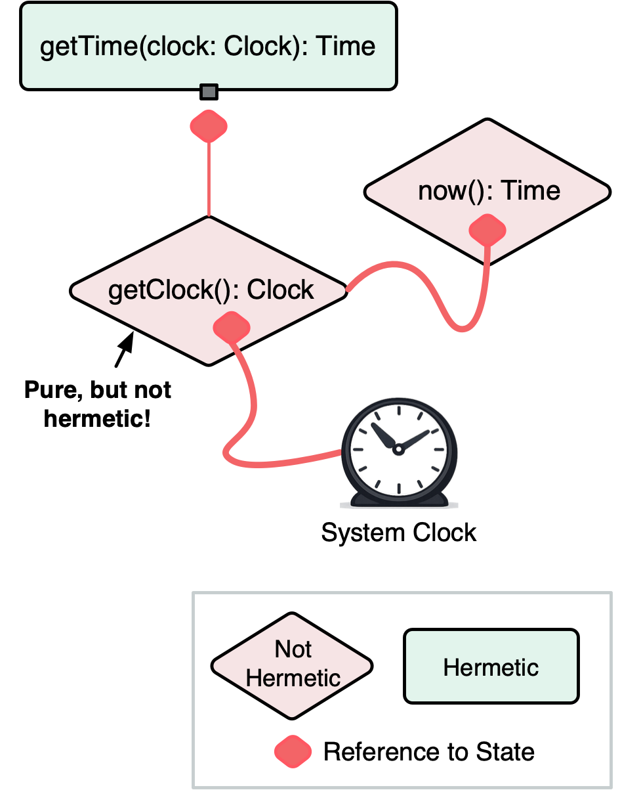
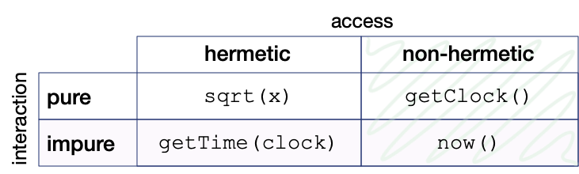
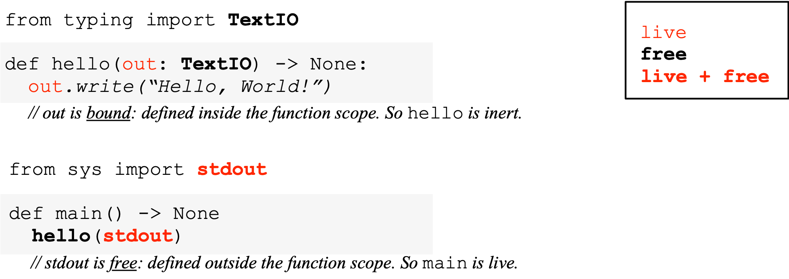
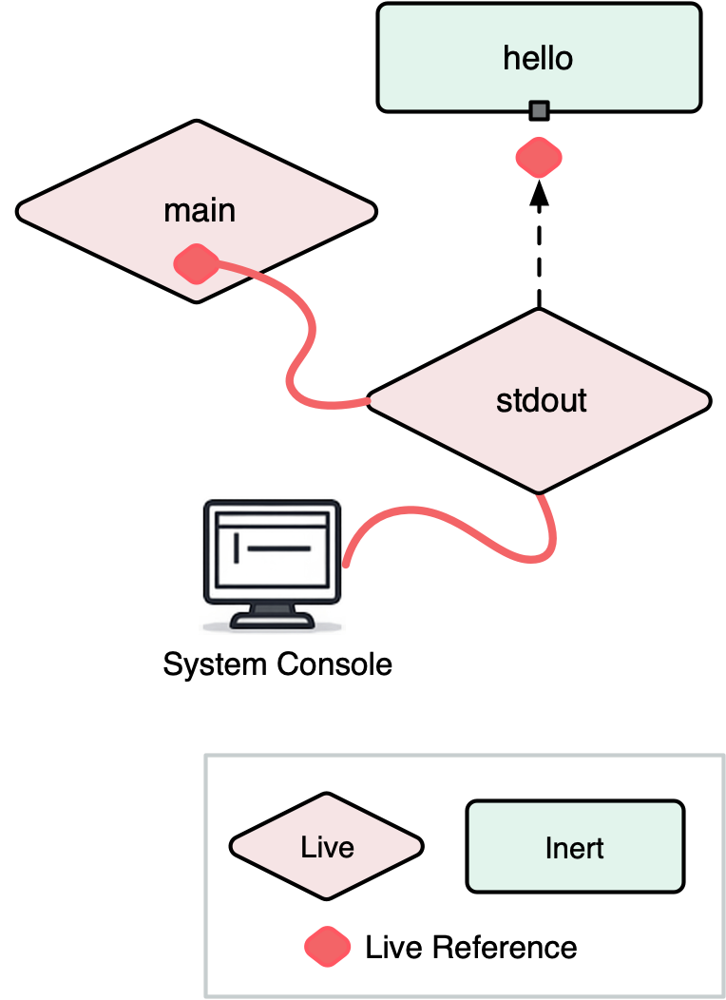

<style>
    .image-with-caption {
        display: block; margin-left: auto; margin-right: auto; max-width: 450px

    }
</style>


## Introduction

In most programming languages, any function can reach out and touch the world: read the clock, write a file, open a socket. But this **ambient access** to state—through singletons, globals, built-in functions—makes testing brittle and reasoning murky. You run a test once and it passes; run it again and it fails because the clock advanced or a temporary file wasn’t deleted.

The practice of **dependency injection**[^di] can help tame access to state: don’t let code "reach out" for resources; pass them as parameters instead. What if we take dependency injection to its logical conclusion, and make it a **semantic property** of code, not just a design pattern?


This essay proposes **access to state** as a first-class semantic property, distinct from purity:

> **Hermetic programming** is parameterization of all access to state.

By eliminating ambient access to state, a hermetic programming language isolates code from its environment, forcing inversion of control: all system resources become capabilities that must be injected—for example as parameters passed to `main`.

**Example (Typescript)**

```typescript
import type { Console } from "io";

// Runtime injects the concrete Console implementation.
export function main(console: Console): number {
  console.println("Hello, World!");
  return 0;
}
```

In the above example, `main` is a **hermetic function**:

> A function is **hermetic** iff it **only accesses existing state through its parameters.**

<!--
Programming with hermetic functions means authority over state always flows through parameters: whether a function sorts an array or writes to a file, the caller controls the world the function can see. All interaction with state flows through "hermetically sealed" channels. Deterministic time? Pass a fake clock. Sandboxed output? Pass a mock filesystem. Every potential access to state is visible at the call boundary. You can read a function's dependencies off its signature. All authority is explicit. 
-->

Programming with hermetic functions means authority over state always flows through "hermetically sealed" channels. Whether a function sorts an array or writes to a file, the caller controls the world the function can see.  Deterministic time? Pass a fake clock. Sandboxed output? Pass a mock filesystem. Every potential access to state is visible at the call boundary. You can read a function's dependencies off its signature. Effects, without ambient side-effects.


## The Purity Gap

Hermetic programming is not just functional programming-lite. **Hermeticity is orthogonal to purity**.

Suppose I have a global immutable constant `systemClock: Clock` holding an opaque handle to the system clock. And suppose `getClock(): Clock` is a function that simply returns that constant.

`getClock` is pure: it has no effect on the clock, and since it returns a constant, it is referentially transparent.

Suppose I also have a function `getTime(clock: Clock): Time`, which takes a `Clock` (either the real clock or a mock) and returns that clock's time. I can now get the current time from the system clock by calling `getTime(getClock())`. 

`getTime` is hermetic because it doesn't read or write any state other than the clock passed as a parameter. `getClock` is pure. But the resulting composed function `now = getTime ∘ getClock` is *neither hermetic nor pure*! 

How can this be? A hermetic function by definition can't "reach out" and access the clock. And a *pure* function is even...purer...then a hermetic function, isn't it?

The problem is that `getClock`, while being technically pure, is tainted by **access** to existing state. By returning a reference to the real clock, it **exposes** ambient state.


## Interaction vs Access

`now` and `getClock` can be thought of as being **hard-wired** to state. They both access the system clock and you can't pass a parameter that redirects that access to some other clock.

`getTime` on the other hand parameterizes its access to state and is not hard-wired to any clock.


<div class="image-with-caption">



<div>
    <strong>Figure 1</strong>. Illustration of hermetic vs non-hermetic functions. Non-hermetic functions are hard-wired to state.
</div>

</div>

Although `getClock` is hard-wired to the clock, it is pure because it does not actually **interact** with the clock like `now` does.

It is interaction with state that makes a function impure. The most widely accepted definition of purity is **referential transparency**: an expression can be replaced by its value in any program context without changing observable[^observable] behavior. A function fails referential transparency when evaluation has observable interaction with external state: either it *affects* state, or it returns different outputs for the same inputs because it is *affected* by state.


Hermetic functions are restricted in terms of access to state, not interaction. So hermeticity is actually *more strict* than purity in some ways (it forbids access to ambient state), and less strict than others (it permits interaction).

**Interaction vs Access Grid: Examples**

<!--

|           |hermetic        | non-hermetic    
|-          |-               |-
|**pure**   | `sqrt(n)` ⬅ pristine        | `getClock()`
|**impure** | `getTime(clock)` | `now()`


-->

<div class="image-with-caption">



<div>
    <strong>Figure 2</strong>. Example functions arranged along the axes of interaction (pure/impure) and access (hermetic/non-hermetic).
</div>

</div>


This distinction between access and interaction has consequences beyond individual functions—it extends to packages, standard libraries, and whole programming languages. But to get there, we need to understand what exactly it means to **expose** state.


<style>
.glossary {
  margin: auto;
  background-color: lightgrey;
  border: 1px solid black;
  max-width: 600px;
  padding-top: 1em;
  padding-bottom: 0px;
  padding-left: 1em;
  padding-right: 1em;
  margin-bottom: 1em;
}
</style>

<aside class="glossary" markdown="1">

***Summary of Definitions***

* **existing state**: state that existed before the function call
* **external state**: state observable outside the call (including fresh state that escapes)
* **free state**: existing state not accessed through a function’s parameters
* **interact**: to **affect or be affected by** state
* **expose**: to return a value or write it into **external state**
* **access**: to **interact with or expose** state
* **pure**: no **interaction** with **external state**
* **hermetic**: no **access** to **free state**

</aside>


## Live and Inert Values

`getClock` exposes state by returning a handle. A function could also expose the same handle by writing it into existing state reachable from a parameter—for example, `setClock(app, getClock())` could store the clock inside `app` (a way of exposing state we call [grafting](#grafting-state)).

In either case, what is exposed is a value that provides access to state.

> A value that provides access to state is **live**. 

Live values can include object references, handles, primitives, closures, etc.; as well as anything that embeds any of these and thereby provides a path to state.

Live values are like live wires. A value can become live when it is connected to another live value. And if you plug a live value into a hermetic function, you can cause an interaction.

Values that don't provide access to state are **inert**: isolated from state.

### Providing Access to State

Providing access to state is different from merely **designating** state. A file name for example does not by itself provide the ability to interact with the file system. A function that receives a filename would need to "reach out" to some library or builtin function such as `open` -- in which  case, it's `open` that's live.

Intuitively, a value is live if it can cause interaction with existing state in some context (directly or by enabling a call), whereas it is inert if it cannot, no matter how used, lead to interaction with existing state unless paired with a live value.

Equivalently: a value is live if you can swap it for a mock that redirects the interactions it enables into in-memory state controlled by the caller, without otherwise changing program behavior. In [Appendix D](#appendix-d-the-mockability-test) we formalize this as the **Mockability Test**.

### Hermetic Functions are Inert

We can talk about functions in two roles: as code (a callable) and as values (passable/storable). 

> A function is hermetic as code exactly when it is inert as a value.

Hermetic functions can only access state through live values passed as parameters. No live value is hard-coded in their definition, so they are not hard-wired to state. Passing a hermetic function to another function cannot provide the latter with access to state. So they are inert as values.

A function can only be live if it embeds a live value in its definition.

### Live Free Identifiers

A **free identifier** is any name appearing in a function that is not a parameter or a local variable. A function embeds a live value in its definition when it refers to a free identifier that resolves to a live value. So:

> A function is inert if its definition has no live free identifiers.

Consider the Python example below:

<div class="image-with-caption">



<div>
    <strong>Figure 3</strong>. Example of inert vs a live function definition. 
</div>

</div>

`hello` is inert because it has no live free identifiers: the only lexical name it references is the parameter `out` (`write` is a member selection on `out`). In contrast, `main` is live because it refers to the live free identifier `stdout`. Although `main` is a function and `stdout` is a handle, they are both live values—hard-wired to state.


<div class="image-with-caption">



<div>
    <strong>Figure 4</strong>. Live and inert values in Hello, World! program. main and stdout are both hard-wired to state.
</div>

</div>


## Hermetic Programming Languages

At this point we've closed the loop: hermeticity is a restriction on **access** to state; access is mediated by **live values**; and a function stops being hermetic exactly when it becomes live as a value. 

A function can only be live if it captures **live free identifiers**. There are two ways this can happen:

- Ambient identifiers (globals/imports/primitives)
- Captured environments (closures)

### Inert Ambient Scope

**Ambient identifiers** are names that are available to all functions and modules by default. These are the identifiers that are *just there*: default imports, preludes, built-in functions, system calls, global constants, primitives, etc.

Collectively, these form the **ambient scope**. 

> A hermetic programming language requires an **inert ambient scope**.

 If the ambient scope contains even one live identifier (like a global `console` object), it allows any function to "reach out" and access ambient state.

#### Inert Packages

> An inert ambient scope implies **inert packages**. 

An import statement must not introduce live values into the ambient scope, nor have any observable side effects (no module initialization with observable interactions).

This means every identifier exported by a package or module must be inert. Consequently, package-scoped functions must not capture live values. This effectively bans global singletons.

**Example (go): live package with a global singleton**

```go
package logger

import "os"

var defaultOutput = os.Stdout

// Log is live because it captures a live free identifier.
func Log(msg string) {
    defaultOutput.WriteString(msg + "\n")
}
```


The same principle applies to package-level state. Package-level globals must be immutable, inert constants — otherwise they pollute every function that captures them, making those functions live.

**Example (go): live package with package-global state**

```go
package counter

var count int = 0

// Inc is live because it captures a live free variable.
func Inc() int {
    count++
    return count
}
```

However, inert packages can export inert functions that allocate and expose fresh state.

**Example (go): inert package with exported hermetic constructor**

```go
package counter

// NewCounter is inert because it does not capture any live free variables
func NewCounter() func() int {
    var count int = 0
    return func() int {
        count++
        return count
    }
}
```


Although `NewCounter` returns a closure over mutable state, it is freshly [**minted**](#minting-sate) state that didn't exist before the call, not existing state. `NewCounter` does not embed any live free identifiers and so it is inert as a value.

> Hermetic constructors can mint state.

Inert packages can export types, interfaces, constants, wrappers, methods, constructors, and other hermetic functions. They can provide complex imperative algorithms that *interact* with external resources (e.g., a database client), as long as those resources are passed as parameters.

In a hermetic programming language, the standard library defines *interfaces* to system resources (filesystem, network, clock, etc.), but the actual access happens through parameters injected into main.

#### Example: Hermetic HTTP

It may seem like forcing packages and libraries to be inert would severely limit then. For example, how could an HTTP library be inert? HTTP is all about I/O and state.

But hermetic HTTP just requires parameterizing access to the network. For example, go's `net/http` exports an `http.Serve` function that accesses the network exclusively through its `net.Listener` parameter. This parameter can be substituted for an in-memory `net.Listener` implementation (notably gRPC’s `bufconn`[^bufconn]) that doesn't interact with the actual network at all.

Although go's `net/http` package is live because it exports functions that are hard-wired to the network and other resources (default logger, global transports/resolvers), it could easily be made hermetic by parameterizing access to all these resources, reducing the HTTP package to the protocol logic only.

<!--TODO: Of course, where does the actual `net.Listener` come from? -->

In the Python world, Cory Benfield popularized the "sans-I/O"[^sansio] idea: protocol libraries should be pure state machines over bytes, like the [hyper-h2](https://github.com/python-hyper/h2) HTTP/2 library, with all I/O delegated to a thin, parameterized shell.

In Rust, capability-oriented standard-library efforts, such as cap-std[^capstd], route filesystem and networking access through passed-in handles.


### Closures

A language with an inert ambient scope has no live ambient identifiers, which guarantees that top-level definitions are inert. But that does not prevent creating live closures that capture live local variables.

So there are two design choices:

1. **Allow live closures.**
   Ambient access to state is still forbidden, but function values can be made intentionally live via capture. This is often desirable—especially in languages where partial application and higher-order functions are idiomatic.

2. **Make all function values hermetic.**
   Prevent or expose captures (e.g. capture checks), or adopt the standard *closures-as-objects*[^defun] view: treat a closure as a live object with an `apply` method. Under this view, the `apply`/method can still be **hermetic**—it only reaches state through `self` and its explicit parameters, not through ambient channels. Functions with hidden environments become objects with explicit environments.

> Inert ambient scope as the core requirement for a hermetic language.

Making all function values inert is an optional strengthening: it extends hermeticity's confinement and local-reasoning guarantees to all function values, but may be too restrictive for languages where closure capture is central.

## Benefits of Hermetic Programming


### Behavioral Referential Transparency 

For pure functions, Referential Transparency ensures that `f(x)` depends only on the **value** of `x` (and the definition of `f`). **Behavioral Referential Transparency** generalizes this to stateful inputs: `f(x)` depends only on the **behavior** of `x` (as observable by `f`). There are no "hidden inputs".

The Behavioral Referential Transparency property facilitates **local reasoning**: minimizing the number of things a programmer needs to keep in mind to understand a fragment of code.

Pure functional programming achieves a strong form of local reasoning by eliminating interaction with state completely. But hermeticity also aids local reasoning by reducing the "splash radius" of possible interaction with state to the **explicit parameters** of a function.

For example, suppose I pass a mutable list to a hermetic function:

```typescript
// x is a mutable list
let x = [1, 2, 3]
f(x)
```

If `f` is indeed hermetic, the only state it can access is the list referenced by `x`: it cannot consult a global, log to a singleton, or touch the clock. To understand `f(x)` the only state I need to think about is `x`. I can forget about any other possible side-effects.


### Composability

Hermeticity scales. Hermetic functions cannot give each other access to state, so hermetic functions are **closed under composition** as well as **closed under higher-order application**, 

This means you can assemble large programs out of small pieces while preserving the **no hidden inputs / no ambient access** guarantees. You can read dependencies off the **signature**, instead of re-auditing the whole program.

### Isolation

Because hermetic functions are isolated from ambient state, all hermetic functions can be **tested with mocks** with no additional refactoring. They can be run **deterministically**: all sources of non-determinism (clock, RNG, network) must be explicitly passed as parameters, and can be replaced with deterministic alternatives. A hermetic function can be run in different execution contexts -- as a stored procedure, plugin, browser, or sandbox -- without the need for separate hermetic runtimes.[^hermetic-runtimes]

### Security

One of the tenets of secure code is the **principle of least authority**[^pola] (POLA): each function should have only the minimum authority it needs to do its job. If you assume the functions you call may be malicious, a random math library should not be able to write to your filesystem.

[Capability-based security](https://en.wikipedia.org/wiki/Object-capability_model) discipline promotes POLA by eliminating **ambient authority**.[^capmyths] Code can’t *reach out* for resources; it can only act through explicitly provided **capabilities** that designate a resource and authorize specific operations on it (e.g. read access to a specific file).

> Hermetic programming enforces the "no ambient authority" rule as a semantic language property. 

If we define "resources" and "dependencies" to include *any* state (filesystem, network, clock, randomness), then "inject all dependencies" is literally equivalent to "no ambient authority". All authority must be delegated explicitly through live values passed as parameters: providing access is equivalent to granting authority.

> In a hermetic programming language **live values are capabilities**.

Further, hermetic programming enforces second-order capability-based security practices such as confinement and revocation.[^confinement] Authority can only flow through channels or existing state that are themselves explicitly authorized. Confinement becomes a graph property: if untrusted code never receives a capability *nor the authority to [graft](#grafting-state) a capability into some existing state*, there is no path for that authority to spread. Revocation fits the same model: delegate via a proxy capability controlled by a revoker you keep.

So simply making a programming language hermetic -- without explicitly designing it as an object capability (ocap)[^ocap] language -- provides the core single-process capability security baseline: **no ambient authority**, **explicit authority flow**, and therefore **confinement-by-construction** (relative to what you pass), with **revocation** as an ordinary library pattern (proxies).


## Hermetic Programming Practices

### Capability Security Discipline

While a hermetic programming language enables secure programming practices, it is ultimately up to the programmer to apply the principle of least authority when writing hermetic functions.

If `main(world)` is injected with a "world" object with sub-fields for all external resources (`world.clock`, `world.fs`, `world.net`...), it can just pass this "god object" down through the call stack. So every function always takes `world` as the first parameter and has access to everything. This is still hermetic: callers still have complete control. But it violates the principle of least authority (as well as the interface segregation principle).[^isp]

Instead, if `main` receives the whole world, it should pass on just the parts it needs.

```typescript
// main receives the whole world...
function main(world: World) {
    // ...but only passes the console to helloWorld
    helloWorld(world.console)
}
```

Further, the caller should **restrict the operations** available to the callee as much as possible. Pass a single file handle instead of the entire filesystem; make it read-only if possible. 

This sort of proactive restriction helps prevent **confused deputies**[^confused], where a function uses the capabilities it was given—accidentally or maliciously—to do something it wasn't meant to do.

POLA also requires restricting authority to **delegate** authority by passing mutable state whose type is broad enough to hold live values. A callee that receives both a capability and such a container can **graft** the capability into the container.

**Example (Go) of a function that delegates authority by grafting**

```go
func handle(ctx map[string]any, db *Database) {
    ctx["db"] = db // grafted: db is now reachable via ctx
}
```

Any code that reads `ctx` now has database access.

A more secure function signature would restrict authority by requiring a file handle instead of the whole db, making `ctx` read-only, or restricting the types it can store.

In a hermetic programming language, capability-based security is practiced at the level of types in function signatures. 

### Contexts

Hermetic Programming requires more "wires". Parameters must be threaded through the call stack to reach all functions that need them ("prop-drilling"[^propdrilling], "parameter pollution"). This can make code noisy and refactoring complicated, especially for cross-cutting aspects of a program such as logging.

One way of reducing the number of explicitly-passed parameters is to support **contexts**[^scala-context] (also known as implicits). In this pattern, the "wires" are hidden from the function *body*, but they usually remain visible in the function *signature*. Here's an example in Scala:

```scala
// 1. The Middleman (main): Carrier of the context
// main does not use Logger, but must declare 'using Logger'
// to allow it to pass implicitly to Bar.
def main()(using Logger): Unit = {
    foo()
}

// 2. The Leaf (foo): Consumer of the context
// foo explicitly states: "I can only run if a Logger is in context."
def foo()(using logger: Logger): Unit = {
    logger.info("Called foo")
}
```
 
This keeps the call sites clean while ensuring that dependencies are clearly documented in the types, satisfying the hermeticity while mitigating the verbosity and facilitating refactoring.


## Hermetic Programming in Pure Functional Languages

You might think hermeticity is irrelevant in a pure language. If functions can't have side effects, why worry about access to state?

Because pure values can still be **live capabilities**.

### Effect Values Can Be Live

In Haskell, an `IO ()` describes an effectful computation.[^awkward] It is like a compiled program: constructing it has no side effects, but when it is executed it interacts with state. This means **the value itself carries authority**.

```haskell
main :: IO ()
main = putStrLn "Hello, World!"
```

Although `main` is pure, it is live in our sense: it hard-codes a reference to the live identifier `putStrLn`, which effectively hard-wires `main` to the real console. You cannot inspect the resulting IO value and swap out the console for a buffer. So when the program is executed it invokes a console operation through ambient authority rather than a capability passed as a parameter. **Pure does not imply inert.**

<div class="image-with-caption">


<div>
    <strong>Figure 5</strong>. Dependency graph for Hello World! program where main is live because it is ultimately hard-wired to the system console.
</div>

</div>

### The Hermetic Alternative

Compare `main` with a version that parameterizes its access to the console, using what Haskell programmers call the **tagless final**[^tagless] pattern:

```haskell
class Monad m => Console m where
    putLine :: String -> m ()

hermeticMain :: Console m => m ()
hermeticMain = putLine "Hello, World!"
```

`hermeticMain` does not assume a particular console and does not commit to `IO`. The caller can choose which `m` to supply—including an in-memory mock. All access to the console is routed through an injected capability.

A concrete caller wires `hermeticMain` to the real console (the `Console IO` typeclass instance is an implicit parameter):

```haskell
instance Console IO where
    putLine = putStrLn

main :: IO ()
main = hermeticMain
```

So `hermeticMain` is both pure and inert. Whereas `main :: IO ()` is pure but live. Both sit in the "pure" row of our interaction vs. access grid—but in different columns.

### Toward Hermetic Haskell

Haskell's `Prelude` and standard library has many live values. `putStrLn`, `readFile`, `getCurrentTime`—these are all hard-wired to real system resources. Any function that calls one of these becomes live. The liveness propagates through composition, exactly as it does in imperative languages.

A "Hermetic Haskell" would move all live identifiers out of the Prelude and standard libraries, exporting only **interfaces** (e.g. type classes using the tagless final pattern) to system resources, with concrete implementations injected into `main` by the runtime. The `ReaderT`[^readert] pattern — Haskell's analog of the [contexts/implicits](#contexts) discussed earlier — can help manage the extra wiring.

Purity guarantees that code doesn't interact with external state when evaluated. Hermeticity guarantees that code doesn't have *access* to external state unless explicitly authorized. A pure function can still be hard-wired to the real filesystem, clock, and network. This can make tests flaky, mocks impossible, and reasoning non-local. That's why tagless final and ReaderT patterns are common in Haskell. Not because it isn't pure enough—but because it isn't hermetic.

## Conclusion

When we think of "pure" data, we may imagine something cleanly serializable—no pointers, closures, handles. But the quality we are really reaching for is not purity but **inertness**. References, channels, closures, effect values—these are the living machinery of computation, rooted to their execution environment. Integers, strings, lists—inert matter being computed.

**Hermeticity is inertness applied to functions.** An inert function cannot access state directly; to do anything in the world, it must be plugged into live parameters that the caller provides. The live/inert distinction applies even in pure functional languages. Pure/impure and inert/live are independent axes of "clean".

Making a programming language hermetic is straightforward in principle: keep the ambient scope inert, export interfaces from standard libraries, not live values, and inject concrete resources into `main`. Contexts or implicits can manage the extra wiring. 

A hermetic function may not be pure, but it is pure functionality: decoupled from ambient state, testable against mocks, reusable, and composable. All authority is explicit. Function signatures are dependency manifests. Effects, without free side-effects. 

Hermetic programming unites dependency injection and capability-based security under a single semantic rule: **a function may only access existing state through its parameters**. No hard-coded dependencies. No ambient authority. No hidden inputs. No leaks. 


## Appendices


### Appendix A: Hermeticity as Isolation

> **Hermeticity is a software engineering concept that refers to the ability of a software unit to be isolated from its environment.**
>
> -- [Scott Herbert (slaptijack)](https://slaptijack.com/programming/benefits-of-hermeticity.html)

The term **hermetic** has been used to describe a number of systems that isolate imperative code from its environment: most notably Google's [**hermetic testing**](https://carloarg02.medium.com/how-we-use-hermetic-ephemeral-test-environments-at-google-to-reduce-test-flakiness-a87be42b37aa), [**hermetic servers**](https://testing.googleblog.com/2012/10/hermetic-servers.html),
hermetic builds ([**bazel**](https://bazel.build/basics/hermeticity)), and hermetic languages ([**wuffs**](https://github.com/google/wuffs#readme) and [**starlark**](https://github.com/bazelbuild/starlark)). These all **isolate** effects to specifically authorized state: a test mock, a build artifact, the function's arguments.

I've appropriated the term *hermetic* in this essay to mean isolation only with respect to *access* to state. But there are levels of isolation beyond hermeticity. For example, Google's Wuffs are also isolated in the ACID sense, and they cannot spawn threads, allocate memory, or panic.

#### Call-Boundedness

A hermetic function might still spawn a goroutine or task that keeps interacting with state after the function has completed. It's still hermetic as long as the thread only interacts with explicitly authorized state.

A function that uses [**structured concurrency**](https://en.wikipedia.org/wiki/Structured_concurrency) ensures all spawned threads complete before the function returns. We call such a function **call-bound**. 

Just as a pure function can use **internal state** that doesn't survive the call, a call-bound function may use **internal concurrency** that doesn't survive the call. 

#### Atomicity 

In multi-thread environment with shared state, hermeticity doesn't guarantee **isolation in the ACID sense**: preventing concurrent processes from interleaving reads and writes.

A function call is **atomic** if, from the caller's perspective, any state changes happen in a single instant (or not at all). 

#### Containment

Hermeticity doesn't guarantee that a function will **complete successfully**: it may loop infinitely, run out of memory, panic, etc.

A function is **contained** if it is guaranteed to return control to the caller without crashing the host process, regardless of input—achievable through a language that prevents runtime panics (like Wuffs) or a runtime that sandboxes execution (like Erlang supervisors).

#### Full Isolation

Hermeticity and call-boundedness are properties of the function definition itself, while atomicity and containment depend on the execution context. A function that is hermetic and call-bound, run in a context that guarantees atomicity and containment, could be considered **fully isolated**.


### Appendix B: Restrictions on Access to State

Our definitions of pure and hermetic functions lead to some somewhat surprising conclusions. For example, constructors that return live values can still be hermetic.

In this appendix, we'll summarize our definitions of the different types of state and the restrictions on how pure and hermetic functions can access state.

#### Types of State

State can exist before a function call (**existing state**), or be allocated during the function call (**fresh state**).

Fresh state that is destroyed during the function call (e.g. is de-allocated or becomes immutable when the function returns) is **internal state**. 

Existing state, or fresh state that escapes (is not deallocated) and is therefore observable after the function call, is **external state**.

**Free state** is existing state that is accessed through live free identifiers -- not the function's parameters.

**Ambient state** is state accessed through live ambient identifiers.

#### Grafting State

A function can expose state by writing a live value into existing state — for example, storing a reference in a mutable field or channel — thereby making it reachable by other code without returning it. We call this **grafting** state.

#### Minting State

A hermetic function can expose **fresh** state that it allocates during the call. We call this **minting** state. Minting is why constructors can be hermetic: the minted state didn't exist before the call, so the function isn't accessing existing state. The function as a value remains inert.

#### Summary of Restrictions

Capability | Pure | Hermetic
-|-|-
Access Free State                 | Yes | No  
Interact with External State      | No  | Yes 
Interact with Internal State      | Yes | Yes 
Graft State                       | No  | Yes 
Mint State                        | No  | Yes 


### Appendix C: Glossary of Terms

- **state**: anything that can affect or be affected by a computation that can be observed by normal program operations (ignoring timing, memory and CPU usage). This can be external resources (filesystem, network, clock) or internal memory.
- To **allocate** state: to allocate memory that can be read and written
- **existing state**: state that existed before the function call
- **fresh state**: state that is allocated during the function call
- **internal state**: fresh state that does not survive the function call
- **external state**: state (fresh or existing) that is observable[^observable] outside the call (e.g. that survives the call)
- **parameterized state**: state that is accessed through a function's parameters
- **free state**: existing state that is not parameterized
- **ambient state**: free state accessible to all functions
- **live**: provides access to state (per the mockability test)
- **inert**: not live
- **interact**: to **affect or be affected by** state
- **access**: to **interact with or expose** state
- **expose**: to provide access to state (by returning or grafting a live value)
- **graft**: to write a live value into external state
- **mint**: to expose fresh state, causing it to escape
- **pure**: no **interaction** with **external state**
- **hermetic**: no **access** to **free state**
- **identifier**: any binding or name-to-value association that can be referred to in a function definition
- **live identifier**: any identifier whose value is live
- **free identifier** (relative to a function definition): any identifier that is not a parameter or local variable
- **ambient identifier**: a free identifier available to all functions
- **ambient scope**: all ambient identifiers


### Appendix D: The Mockability Test

We want a definition of **live value** that works in *any* language, without assuming object-capability discipline or appealing to informal explanations about where authority comes from. The only thing we assume is an operational view of evaluation: running code can produce an **interaction trace**—a log of observable interactions with **existing state** (filesystem, network, clock, etc.), ignoring timing and resource usage.

#### The Trace-Projection Idea

A program’s interaction trace can be partitioned by *which state it touches*. If `S` is a particular existing state resource (or set of resources)—a specific file, socket, clock, region of memory, etc.—we write:

* `π_S(trace)` for the **projection** (restriction) of a trace onto only the events that interact with `S`.

Now we can express "this program interacts with `S`" without talking about reference graphs or authority: it simply means `π_S(trace)` is non-empty.

#### Definition of Liveness

We will allow program contexts `C[–]` to range over **expression contexts**: the hole may appear wherever an expression may appear—including in "operator position" (e.g. `C[–] = (–)(x)`), which covers both `read(x)` and method-style calls once desugared (e.g. `x.read()` selects some callable expression and then applies it).

A value `v` provides access to some existing state `S` iff:

> There exists a substitute value `v′` (admissible in place of `v`) such that, for every program context `C[–]` whose behavior does not depend on the representation identity (e.g. pointer address) of the value plugged into the hole, the projected traces  
>
> `π_S(trace(C[v]))` and `π_{S′}(trace(C[v′]))`  
>
> are the same **up to renaming of state identities**, where `S′` ranges over **fresh caller-allocated internal state** (disjoint from `S`).

And:

> `v` is live iff it provides access to some existing state `S`.

Intuitively: `v` provides access to `S` if whatever interactions a program can have with `S` can always be retargeted by swapping `v` for `v′`, to an isomorphic interaction with state that the caller allocates and controls. 

#### Why "Internal State" Matters

The requirement that `S′` must range over the caller's **internal state** is the true test of whether a value really provides access to state, and doesn't just designate it. For example, if the caller of `read(filehandle)` can redirect reads to a different file, but cannot redirect them to an in-memory mock, then the *filehandle token* is just a **designator**. The live part is whatever operation interprets that token (e.g. `read` or `filehandle.read`), because *that* is what must be substituted to retarget the interaction to caller-controlled internal state.

If, on the other hand, `read` accepts an interface/trait/function that the caller can implement, then the caller can substitute a behavioral equivalent that routes reads not just to a different file, but to any internal state the caller controls. In that case, the file handle value itself is live.

#### Liveness Implies Substitutability

The mockability test has a useful contrapositive: if a value *cannot* be substituted for a behavioral equivalent backed by caller-controlled internal state, then the value is not live. The state access it enables must be flowing through some other channel—ambient authority.

This connects back to the designator/capability distinction. A filename string can be swapped for a different string, but that just redirects reads to a different file on the real filesystem—it cannot redirect them to an in-memory buffer. The string is not live; it is a designator. The live part is the ambient `open` or `read` function that interprets the designator. Non-substitutability of the value is a signal pointing at where the ambient authority actually lives.

#### Pointers Are Live

A pointer to mutable state is live under this test because it is retargetable: in any context that treats pointers extensionally (not inspecting their numeric address), you can substitute a pointer to one region with a pointer to a fresh region and obtain an isomorphic interaction trace over that region. This remains true even in a memory-unsafe language where pointers are **forgeable** from integers.

That is not a contradiction: **liveness** is about whether a value can serve as a retargetable conduit to state. **Hermeticity** is a stronger language property: it requires eliminating *ambient* ways to obtain conduits. In a language like C, the dereference operator (`*`) and integer-to-pointer casts act as ambient authority over memory. A hermetic programming language must therefore make references **unforgeable**—some form of memory safety / capability safety—so that a program cannot conjure access to arbitrary memory out of thin air.

So pointers can be live even in unsafe languages. But a hermetic language must prevent forging of live references (which typically implies some form of memory safety / capability safety).

#### References

A live value is not necessarily a "reference". It's not clear how to define exactly what constitutes a reference in some languages. But practically, a live value must be connected to state through some sort of **reference graph**: values (nodes) that **embed** references (edges) to other values. Even a built-in function such as `now` that accesses the system clock directly via CPU instructions can be thought of as embedding a reference to the clock. And a function that calls `now` can be thought of as embedding a reference to `now`, and so on.

### Appendix E: Closures, and Methods

#### Closures

A closure that captures a live value is itself live (and therefore not hermetic). However, a function that *receives* a live closure as a parameter can still be hermetic: the state access is parameterized by the closure value. Similarly, a hermetic function can create and return a new closure, as long as that closure does not capture any live free identifiers relative to the enclosing function's body.

Since all package-scoped functions are inert in a hermetic programming language, the only way a live function can enter a program is as a locally-scoped closure or nested function that captures live local variables.

#### Methods

Methods can be thought of as functions parameterized by their receivers. A method that only interacts with state reachable through its receiver (and other parameters) is hermetic—it's the *object* that's live, not the method.

Consider an object that embeds a reference to a logger. If one of the object's methods writes to that logger (and only that logger), the method is hermetic. On the other hand, if the method hard-coded access to a global logger instead of the one embedded in the object, then the method itself would be live.

It follows that in a hermetic programming language, exported types must be hermetic: they cannot have live methods that smuggle in ambient access to state.

## Footnotes

[^readert]: The `ReaderT` pattern threads a shared environment through a computation via a monad transformer. When that environment carries capabilities (database handles, loggers, etc.), the pattern effectively implements implicit capability passing. See Michael Snoyman, *The ReaderT Design Pattern* (2017). [link](https://www.fpcomplete.com/blog/readert-design-pattern/)

[^isp]: The interface segregation principle — "no client should be forced to depend on methods it doesn't use" — is one of Robert C. Martin's SOLID principles. Here it converges with POLA: passing a narrow interface restricts both the API surface and the authority granted.

[^bufconn]: The `bufconn` package provides an in-memory `net.Listener` implementation for testing gRPC services without real network I/O. [https://pkg.go.dev/google.golang.org/grpc/test/bufconn](https://pkg.go.dev/google.golang.org/grpc/test/bufconn)

[^defun]: The closures-as-objects view is the language-design analog of *defunctionalization*, a compiler transformation that replaces closures with data types carrying an `apply` method. See John C. Reynolds, *Definitional Interpreters for Higher-Order Programming Languages* (1972).

[^hermetic-runtimes]: By "hermetic runtime" we mean a runtime that enforces isolation for code that is not itself hermetic — e.g. [senc](https://github.com/fensak-io/senc) for Typescript. If the *language* is hermetic, the runtime doesn't need to provide this isolation.

[^ocap]: An object-capability (ocap) language enforces capability discipline at the language level: references are unforgeable, there is no ambient authority, and the only way to obtain a capability is to be given one. Examples include E, Monte, and Agoric's Hardened JavaScript. See Mark S. Miller, *Robust Composition: Towards a Unified Approach to Access Control and Concurrency Control* (PhD thesis, Johns Hopkins, 2006). [PDF](https://www.erights.org/talks/thesis/markm-thesis.pdf)

[^capmyths]: The terms *ambient authority* and *capability* are formalized in the object-capability literature. See Ka-Ping Yee, Mark S. Miller, and Jonathan Shapiro, *Capability Myths Demolished* (2003). [PDF](https://srl.cs.jhu.edu/pubs/SRL2003-02.pdf)

[^confinement]: Confinement was formalized by Butler Lampson, *A Note on the Confinement Problem* (CACM, 1973). Revocation and its relationship to capability discipline is discussed in Miller (2006), cited above.

[^capstd]: The `cap-std` crate provides capability-oriented replacements for Rust's standard filesystem and networking APIs. [https://github.com/bytecodealliance/cap-std](https://github.com/bytecodealliance/cap-std)

[^sansio]: Cory Benfield, *Sans-IO: Network Protocol Libraries in Python*. The manifesto for writing protocol libraries as pure state machines, with I/O delegated to a separate layer. [https://sans-io.readthedocs.io/](https://sans-io.readthedocs.io/)

[^tagless]: Jacques Carette, Oleg Kiselyov, and Chung-chieh Shan, *Finally Tagless, Partially Evaluated* (JFP, 2009). The pattern has since become a standard approach to effect abstraction in Haskell and Scala. [PDF](https://okmij.org/ftp/tagless-final/JFP.pdf)

[^awkward]: Simon Peyton Jones, *Tackling the Awkward Squad: monadic input/output, concurrency, exceptions, and foreign-language calls in Haskell* (2001). Canonical reference for "pure values that denote effectful computations." [PDF](https://www.microsoft.com/en-us/research/wp-content/uploads/2016/07/mark.pdf)

[^propdrilling]: "Prop drilling" refers to passing data through multiple layers of components or functions solely to deliver it to a deeply nested consumer. The term originates from the React community, where "props" are the parameters passed to components.

[^scala-context]: Scala 3 calls these *context parameters* (`using` / `given`). See [Scala 3 Reference: Context Parameters](https://docs.scala-lang.org/scala3/reference/contextual/context-parameters.html). Similar mechanisms exist in other languages: Haskell's `implicit` parameters, Kotlin's context receivers, and Rust's planned `impl Trait` in argument position. ReaderT

[^confused]: The confused deputy problem was first identified by Norm Hardy in 1988. See Hardy, *The Confused Deputy* (ACM SIGOPS Operating Systems Review, 1988).

[^pola]: Mark S. Miller, *Paradigm Regained: Abstraction Mechanisms for Access Control* (2006). Discusses least authority in a capability context. [link](https://www.erights.org/talks/thesis/markm-thesis.pdf)

[^di]: Martin Fowler, *Inversion of Control Containers and the Dependency Injection pattern*. [link](https://martinfowler.com/articles/injection.html)

[^observable]: As usual, we ignore changes that are not observable by normal program operations, such as internal allocation, garbage collection, caching, or timing effects. Allocating fresh state does not by itself grant access to other existing heap objects; it is internal to the call unless it escapes (assuming ordinary memory safety / no pointer-forging).