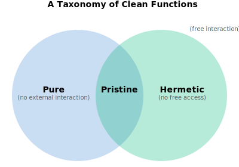

<style>
    .image-with-caption {
        display: block; margin-left: auto; margin-right: auto; max-width: 650px

    }
</style>


## Introduction

In most programming languages, any function can reach out and touch the world: read the clock, write a file, open a socket. But this interaction with **ambient state**--through imports, singletons, globals, built-in functions--can make testing brittle and reasoning murky. You run a test once and it passes; run it again and it fails because the clock advanced or a temporary file wasn't deleted.

The practice of **dependency injection** can help tame access to state: don't let code "reach out" for resources; pass them as parameters instead.

**Hermetic programming** is dependency injection taken to the extreme: **parameterization of all access to state**.

<!--
What happens if we take DI to the extreme, and **parameterize all access to state**—whether that "state" is an system resource (filesystem, network, clock) **or in-memory state**? If a function accesses it, it gets passed as a parameter.

This is **hermetic programming**.
-->

Hermetic programming forces complete inversion of control: **all references to system resources must be injected** by the runtime -- for example by passing them as parameters to main.

**Example (Typescript)**

```typescript
import type { Console } from "io";

// Runtime injects the concrete Console implementation.
export function main(console: Console): number {
  console.println("Hello, World!");
  return 0;
}
```

But hermetic programming doesn't stop at eliminating ambient access to system resources. In a **hermetic programming language every function is hermetic**.

> A function is hermetic if it **only accesses existing state through its parameters.** 

Hermetic programming gives the caller complete control over all state interaction, whether sorting an in-memory array or writing to a file. Deterministic time? Pass a fake clock. Sandboxed output? Pass a mock filesystem. Every potential access to state is visible at the call boundary. All interaction happens through hermetically sealed channels.

There are some surprising implications and benefits to this approach. Perhaps the most surprising is that **hermeticity is orthogonal to purity**, and therefore hermetic programming is applicable even in a pure functional language.

<!--

Hermetic programming is not just functional programming-lite. Rather, hermeticity is a new axis of "clean", independent and complementary to functional purity, with some surprising implications and benefits.
-->

<!--Effects, without ambient "side-effects".-->


<!-- A **hermetic function** is one that **only accesses existing state through its parameters.** -->


<!--
Hermetic functions can allocate fresh state during the call, such as mocks or mutable data structures. And they can of course pass references to this state to other hermetic functions. 
-->


<!--

### Hermeticity is Orthogonal to Purity

That's because functional programs still do I/O -- pure FP just requires modeling effects as values using things like IO monads. But this doesn't prevent people from creating purely functional programs that can't be tested with mocks because dependencies are not injected; or creating build systems that are not reproducible because they aren't isolated from their host environment. 


This essay splits "clean" state into two independent constraints: (a) purity = no interaction with external state; (b) hermeticity = no access to non-parameterized existing state. Later we’ll connect this to a value-level distinction (live vs inert), and show how a hermetic programming language requires an inert ambient scope. Finally we’ll cover benefits/costs, connect to capability discipline, and show how to practice hermetic programming in pure functional languages.”
-->


## The Purity Loophole

Suppose I have a function `getClock(): Clock` that, instead of returning the system clock time, **returns a handle to the system clock** (a value that implements a `Clock` interface). `getClock` is pure: it has no effect on the clock, and since it always returns the same handle, it is referentially transparent.

Suppose I also have a function `getTime(clock: Clock): Time`, which takes a `Clock` (either the real clock or a mock) and returns that clock's time. I can now get the current time from the system clock by calling `getTime(getClock())`. 

`getTime` is hermetic because it doesn't read or write any state other than the clock passed as a parameter. `getClock` is pure. But the resulting composed function `now = getTime ∘ getClock` is *neither hermetic nor pure*. 

How can this be? A hermetic function by definition can't "reach out" and access the clock. And a *pure* function is even...purer...then a hermetic function, isn't it?

The problem is that `getClock`, while being technically pure, is tainted by **access** to existing state. By returning a reference to the real clock, it **exposes** the clock.

<!--

So one function provides the ability to interact with state, the other provides the access, and the combination, `now`, is what we'll call a **dirty** function that can directly interact with un-parameterized state. 
-->

## Interaction vs Access


`now` and `getClock` can be thought of as being **hard-wired** to state. They both access the system clock and you can't pass a parameter that redirects that access to some other clock. `getTime` on the other hand parameterizes its access to state and is not hard-wired to any clock.


<!--
On the other hand, `getTime` is not hard-wired by anything. It's access to state is parameterized. So it is hermetic.-->


<div class="image-with-caption">


<div>
    <strong>Figure 1</strong>. Illustration of hermetic vs non-hermetic functions. Non-hermetic functions are hard-wired to state.
</div>

</div>

Although `getClock` and `now` are both hardwired to the clock, `getClock` is pure because it does not actually interact with the clock like `now` does.

<!--
Hermeticity is defined in terms of access, not interaction. As a result hermeticity is both more and less strict than purity. While hermetic functions *can* interact with state, they cannot *access* non-parameterized state like pure functions can.
-->

The most widely accepted definition of purity is **referential transparency**: an expression can be replaced by its value in any program context without changing observable behavior. A function can only fail referential transparency by interacting with state: either it *affects* state, or it returns different outputs for the same inputs because it is *being affected by state*.

To **access** state is to **interact with it or expose it**. Hermetic functions are restricted in terms of access to state, not interaction. So hermeticity is actually *more strict* then purity in some ways (it forbids exposing existing state), and less strict than others (it permits interaction with parameterized state).

We can now summarize the definitions of *pure* and *hermetic* functions as:

- **pure**: no **interaction** with **external state**
- **hermetic**: no **access** to **free state**

Where:

- **free state** is non-parameterized, existing state
- **external state** is state observable outside the call (including pre-existing state and freshly allocated state that escapes).

<!-- A function that is both pure and hermetic is **pristine**.--> 

**Interaction vs Access Grid: Examples**

<!--

|           |hermetic        | non-hermetic    
|-          |-               |-
|**pure**   | `sqrt(n)` ⬅ pristine        | `getClock()`
|**impure** | `getTime(clock)` | `now()`


-->

<div class="image-with-caption">


<div>
    <strong>Figure 2</strong>. Example functions arranged along the axes of interaction (pure/impure) and access (hermetic/non-hermetic).
</div>

</div>


<!--
## What's Next

Next I'll introduce the related concept of **live** values that provides access existing state, and **inert** values that do not, and show what it would mean for a whole language to be hermetic (inert ambient scope + inert packages). Then I'll talk about why you’d want this—testability, local reasoning, and capability security—and what it costs. Finally, I'll discuss hermetic programming in purely functional languages.
-->

## Live and Inert Values


When we say `getClock` exposes state, we mean it exposes a value that **provides access to state**.

> A value that provides access to state, directly or indirectly, is **live**. 

Live values can include object references, handles, impure functions, primitives, closures, etc.; as well as anything that embeds any of these and thereby provides a path to state.

Live values are like live wires. A value becomes live once it is connected to another live value. And if you plug a live value into a hermetic function, you can cause an interaction.

Values that don’t provide access to state are **inert**: isolated from state.


### The Mockability Test

Providing access to state is different from merely **designating** state. A file name for example does not by itself provide the ability to interact with the file system. 

<!--If the language provides a global `open` function that can open arbitrary files, then *`open` is what provides access to state*, while the file name merely designates *which* file is accessed.-->

Our test for whether a value provides access to state is the **Mockability Test**: can you swap it for a mock that redirects effects into in-memory state controlled by the caller, without otherwise changing program behavior? We define the Mockability Test more formally in the appendix. (TOOO: link)

### Hermetic Functions are Inert

We can talk about functions in two roles: as code (a callable) and as values (passable/storable). 

> A function is hermetic as code exactly when it is inert as a value.

Hermetic functions can only access state through live values passed as parameters. No live value is hard-coded in their definition, so they are not hard-wired to state. Passing one hermetic function to another cannot give the latter access to state.

A function can only stop being hermetic if it embeds a live value in its definition.

## Hermetic Programming Languages

### Live Free Identifiers

A **free identifier** is any name appearing in a function that is not a parameter or a local variable. A function embeds a live value in its definition when it refers to a free identifier that resolves to a live value. So:

> A function is hermetic if its definition has no live free identifiers.

Consider the Python example below:

<div class="image-with-caption">


<div>
    <strong>Figure 4</strong>. Example of hermetic vs a live function definition. 
</div>

</div>

In this example, `main` is live because it captures the live identifier `stdout`. But `hello` is inert because it only interacts with `out`, which is a bound variable (parameter).

### Live Functions

So functions are values like any other, and they become live when they embed other live values in a way that providing a path to state. Although `main` is a function and `stdout` is a handle, they are both live values, hard-wired to state.


<div class="image-with-caption">


<div>
    <strong>Figure 3</strong>. Illustration of access graph for Hello, World! program. main and stdout are both hardwired to state.
</div>

</div>


<!--

-->

<!--
-->


<!--

Any primitive, sysstem call

For primitives, system calls, etc. where we can't examine the function definition to see what it references, we'll say it embeds a reference to state if its implementation specifically identifies state. For example if a language has a `now` primitive that returns the system time, then however it is implemented, its implementation specifically identifies the system clock and therefore embeds a reference to state.-->


### Inert Ambient Scope

In a language where functions cannot capture live free identifiers in their definitions, all functions will be hermetic. This can be accomplished with an **inert ambient scope**.

**Ambient identifiers** are names that are available to all functions and modules by default. These are the identifiers that are *just there*: default imports, preludes, built-in functions, system calls, global constants, primitives, etc.

Collectively, these form the **ambient scope**. If this scope is inert, then all functions will be hermetic.

> **A hermetic programming language requires an **inert** ambient scope.**

 If the ambient scope contains even one live identifier (like a global `console` object), it allows any function to "reach out" and access ambient state.

### Inert Packages

An inert ambient scope implies **inert packages**. An import statement must not be able to introduce live values into the ambient scope. And imports themselves must not execute effects.

This means every identifier exported by a package or module must be inert. Consequently, package-scoped functions must not capture live values.

It follows that package-level globals must be immutable, inert constants! Otherwise, they would pollute every function that captured them, making those functions live and un-exportable.

For example, the following package for a singleton counter is live, because the exported `Inc` function is live, because it captures a live free variable `count`.

**Example (go): live package with package-global state**

```go
package counter

var count int = 0

func Inc() int {
    count++
    return count
}
```

On the other hand, constructors that allocate and return **fresh** state are hermetic! TODO: link to definitions

**Example (go): inert package with exported hermetic constructor**

```go
package counter

func NewCounter() func() int {
    var count int = 0
    return func() int {
        count++
        return count
    }
}
```

Inert packages can export types, interfaces, constants, methods, constructors, wrappers, and other hermetic functions. They can provide complex imperative algorithms that *interact* with external resources (e.g., a database client), as long as those resources are passed as parameters.

In a hermetic programming language, the standard library defines *interfaces* to system resources (filesystem, network, clock, etc.), but the actual access happens through parameters injected into main.


<!--A case study showing how a hermetic HTTP library can be implemented can be found in the [Appendix](#TODO-link)
-->

<!--
### Substitutability

An inert ambient scope means the only way to touch system resources is through live parameters. And to be live a value must pass the **mockability test**: it must be possible to **substitute** it for another value that redirects any interaction it enables with pre-existing state to the caller's **internal state**.

It follows that a hermetic programming language constrains the *types* of live parameters to **substitutable** types—interfaces/traits, function values, records of functions, or any other mechanism that lets callers swap implementations.


todo: BUT THIS WILL BE A CONSEQUENCE OF AN INERT AMBIENT SCOPE
todo: all hermetic functions can have a pure test.
-->


<!--
Values of hermetic types are live: they technically always pass the mockability test because they can be "mocked"/substituted with another value of the same type.
-->


### Example: Hermetic HTTP

It may seem like forcing packages and libraries to be inert would severely limit then. For example, how could an HTTP library be inert? HTTP is all about IO and state.

But hermetic HTTP just requires parameterizing access to the network. For example, go's `net/http` exports an `http.Serve` function that accesses the network exclusiely through it's `net.Listener` parameter. This parameter can be substituted for in-memory `net.Listener` implementation (notably gRPC’s `bufconn`) that don't interact with the actual network at all.


<!--
A `net.Listener` passes our mockability test: There are real, in-memory `net.Listener` implementations (notably gRPC’s `bufconn`) that don't interact with the actual network.-->


<!--
`net.Listener` is an interface with an `Accept` method that returns a `net.Conn`. And `net.Conn` is likewise an interface with `Read/Write` methods. `http.Serve` blocks on `Accept`, then reads/writes via the resulting `Conn`s. 
-->

<!--

```go

func runServer(ln net.Listener, lg *log.Logger) error {
    h := http.HandlerFunc(func(w http.ResponseWriter, r *http.Request) {
        w.Write([]byte("hello\n"))
    })

    srv := &http.Server{
        Handler:  h,
        ErrorLog: lg, // avoids default logging behavior
        // ReadHeaderTimeout: ...,
    }

    // Hermetic relative to ln: all network I/O flows through ln and accepted conns.
    return srv.Serve(ln)
}
```

The above `runServer` is hermetic. Although the `Serve` method itself....

TODO: problem. http.Server is live, but this is still hermetic! Our definition is not right. Embedding a live value is not enough to make something non-hermetic. It has to be non-trivial.
-->

Although go's `net/http` package also exports functions that are hard-wired to the network, and so it is a live package, an alternative, fully-functional HTTP package that eliminated these live functions *could* be made inert.

<!--TODO: Of course, where does the actual `net.Listener` come from? -->

In the Python world, Cory Benfield popularized the “sans-I/O” idea: protocol libraries should be **pure state machines over bytes**, like the [hyper-h2](https://github.com/python-hyper/h2) HTTP/2 library.


<!--IO and concurrency is managed by a lightweight wrapper (e.g. something like Go's `http.Serve`) -- which could itself be hermetic.-->


### Memory Safety and Unforgeable References

TODO: think through this
A hermetic language must make live values unforgeable. In C-like languages, raw pointers undermine this, since the program can fabricate addresses.

## Benefits

Hermetic programming supports several well-established software architecture practices: separation of concerns (functionality vs state), modularity, reusability, etc. But it offers some other surprising benefits.

### Behavioral Referential Transparency 

For pure functions, Referential Transparency ensures that `f(x)` depends only on the **value** of `x` (and the definition of `f`). **Behavioral Referential Transparency** generalizes this to stateful inputs: `f(x)` depends only on the **behavior** of `x` (as observable by `f`). There are no "hidden inputs".

The Behavioral Referential Transparency property facilitates **local reasoning**: minimizing the number of things a programmer needs to keep in mind to understand a fragment of code.

Pure functional programming achieves a strong form of local reasoning by eliminating interaction with state completely. But hermeticity also aids local reasoning by reducing the "splash radius" of possible interaction with state to the **explicit parameters** of a function.

For example, suppose I pass a mutable list to a hermetic function:

```typescript
// x is a mutable list
let x = [1, 2, 3]
f(x)
```

If `f` is indeed hermetic, the only state it can access is the list referenced by `x`: it cannot consult a global, log to a singleton, or touch the clock. To understand `f(x)` I only need to think about the functionality of `f` and the state of `x`. I can forget about any other possible side-effects.


### Composability

Hermeticity scales. Hermetic functions cannot give each other access to state. Composition can’t introduce new free live identifiers, so hermetic functions are **closed under composition** as well as **closed under higher-order application**, 

This means you can assemble large programs out of small pieces while preserving the **no hidden inputs / no ambient access** guarantees. You can read dependencies off the **signature**, instead of re-auditing the whole program.

### Isolation

Because hermetic functions are isolated from ambient state, all hermetic functions can be **tested with mocks** with no additional refactoring. They can be run **deterministically**: all sources of non-determinism (clock, RNG, network) must be explicitly passed as parameters, and can be replaced with deterministic alternatives. Hermetic functions can be run in different execution contexts -- as a stored procedure, plugin, browser, or sandbox -- without creating separate hermetic runtimes (todo: ref).

### Security

One of the tenets of secure code is the **principle of least authority** (POLA): each function should have only the minimum authority it needs to do its job. If you assume the functions you call may be malicious, a random math library should not be able to write to your filesystem.

Capability-based security discipline promotes POLA by eliminating **ambient authority**. Code can’t *reach out* for resources; it can only act through explicitly provided **capabilities** that designate a resource and authorize specific operations on it (read-only vs read/write, specific methods, etc.).

A hermetic programming language enforces exactly this. If we define “resources” and "dependencies" to include *any* state (filesystem, network, clock, randomness), then “inject all dependencies” is literally equivalent to “no ambient authority”. All authority must be delegated explicitly through live values passed as parameters, which means **live values are capabilities**.

Further, hermetic programming enforces key second-order capability-based security practices such as confinement and revocation. Authority can only flow through channels or surviving state that are themselves explicitly authorized. Confinement becomes a graph property: if untrusted code never receives a capability *nor any capability-bearing sink*, there is no path for that authority to spread. Revocation fits the same model: delegate via a proxy capability controlled by a revoker you keep.

Hermeticity isn’t a complete security story: you still need POLA discipline (avoid “god objects”). But **by definition**—via an inert ambient scope—a hermetic language gives you the core single-process capability baseline: **no ambient authority**, **explicit authority flow**, and therefore **confinement-by-construction** (relative to what you pass), with **revocation** as an ordinary library pattern (proxies).

## The Cost: Managing the Wires

Hermetic Programming requires more "wires". Parameters must be threaded through the call stack to reach all functions that need them ("prop-drilling", "parameter pollution"). This can make code noisy and refactoring complicated, especially for cross-cutting aspects of a program such as logging.

But trying to reduce the number of wires can tempt programmers into practices that undercut many of the advantages of hermetic programming.

### The God Object (Not Recommended!)

If `main(world)` is injected with a "world" object with sub-fields for all external resources (`world.clock`, `world.fs`, `world.net`...), it can just pass this down through the call stack. So every function always takes `world` as the first parameter and has access to everything.

This is still hermetic: callers still have complete control. But it it is not clear what part of the world it is interacting with. It violates the **interface segregation principle**. Testing a simple function requires mocking the entire world. And it violates the principle of least authority.

### Contexts

A better way of reducing the number of explicitly-passed parameters is to support **contexts** (also known as implicits).

In this pattern, the "wires" are hidden from the function *body*, but they usually remain visible in the function *signature*. Here's an example in Scala:

```scala
// 1. The Middleman (main): Carrier of the context
// main does not use Logger, but must declare 'using Logger'
// to allow it to pass implicitly to Bar.
def main()(using Logger): Unit = {
    foo()
}

// 2. The Leaf (foo): Consumer of the context
// foo explicitly states: "I can only run if a Logger is in context."
def foo()(using logger: Logger): Unit = {
    logger.info("Called foo")
}
```
 
This keeps the call sites clean while ensuring that dependencies are clearly documented in the types, satisfying the hermeticity while mitigating the verbosity and facilitating refactoring.


### Capability Discipline

If `main` receives the whole world, POLA says it should pass on just the parts it needs (e.g. a console).

```haskell
-- Main receives the whole world...
main :: World -> IO ()
main world = do
    -- But only passes the console to helloWorld
    helloWorld (console world)
````

Further, the caller should **restrict the operations** available to the callee as much as possible. Pass a single file handle instead of the entire filesystem. Make the handle read-only if the sub-function doesn't need write access. This sort of proactive restriction helps prevent **confused deputies**, where a function uses the capabilities it was given—accidentally or maliciously—to do something it wasn't meant to do.

<!--
Also be careful about **delegating authority** by **grafting** live values into surviving state (TODO link). Grafting is writing a capability into existing state—a data structure, channel, registry, callback slot—making it available to whatever code can later reach that state. In a hermetic system this is always explicit, and therefore always a choice: if you pass a database handle to a helper, don't also pass it a place to stash database handles unless you have a specific reason.
-->

## Hermetic Programming in Functional Languages

Even in pure FP, effect values can still be live capabilities. *Pure* does not imply *inert*. 

Much confusion around functional purity comes from an implicit assumption that pure code is not **operational**—that it directly defines program output without describing a sequence of steps. But modern pure languages routinely allow operational code -- step-by-step descriptions of effectful computations -- represented as "pure" values (e.g. an `IO ()`).

But modeling programs as values doesn't prevent people from creating programs that can't be tested with mocks because dependencies are not injected. So hermetic programming techniques are beneficial even in pure functional languages. Tagless final, capability-style mtl, and ReaderT are hermetic techniques in pure FP: they route authority through declared capabilities, not ambient names—cutting wiring noise while keeping authority narrow.


<!--

### Pure Code can be Operational

Much confusion around functional purity comes from an implicit assumption that pure code is not **operational**—that it directly defines program output without describing a sequence of steps. But modern pure languages routinely allow operational code -- step-by-step descriptions of effectful computations -- represented as "pure" values (e.g. an `IO ()`). This operational structure is often mistaken for impurity, when in fact it is orthogonal both to purity and hermeticity!

Operational but pure code is susceptible to all the hazards of imperative code; because it is capable of modeling the full semantics of an ordinary imperative language, including hidden state. So operational semantics should be limited to where they are necessary -- mostly doing IO ("IO at the edges", "imperative shell"). But when doing IO in functional languages, many of the same design principles of working with state still apply -- including dependency injection. 

Operational code can be pure. But pure operational code is not hermetic unless dependencies are injected.
-->

### FP Effect Values Are Live

In Haskell, in `IO ()` is like a compiled program: it is a value that can be executed. And when it is executed it accesses some **specific state**, such as the system console. The value itself carries the authority to access that state.

To illustrate, consider this "Hello, World!" program in Haskell

```haskell
module Main where

import System.IO (putStrLn)

-- main is a value of type IO ()
-- It describes the action, but doesn't execute it yet.
main :: IO ()
main = putStrLn "Hello, World!"
```
Now here's the exact same shape in Typescript.

```typescript
// Let's define IO simply as a function waiting to be run
type IO<T> = () => T;

// putStrLn returns an IO action (a thunk)
const putStrLn = (msg: string): IO<void> => 
    () => console.log(msg);

// main is a value of type IO<void>. 
// It describes the action, but doesn't execute it yet.
export const main = putStrLn("Hello, World!");
```

In both programs, `putStrLn` is pure. Calling it didn't do anything: it just returned a value that can be executed.

But crucially, in both cases `main` directly accesses system resources via **ambient authority** instead of parameters. It is hardwired to the system console. 

So `main` is **live** in our sense in both Haskell and Typescript. The liveness isn’t a matter of representation; it’s semantic. Executing the value can interact with state.


<div class="image-with-caption">


<div>
    <strong>Figure 5</strong>. Dependency graph for Hello World! program where main is live because it is
    ultimately hard-wired to the system console.
</div>

</div>


<!--

```typescript

// putStrLn and consolePutStrLn return IO actions thunks
const putStrLn: (string) => IO<void>
const consolePutStrLn: (Console, string) => IO<void>

const hello: () => ()
const consoleHello: (Console) => ()

```
-->


<!--
Our ultimate test for liveness is the mockability test. `putStrLn` can be substituted for a mock that redirects routes to an IO buffer without otherwise changing program behavior. So it is live, as any `IO ()` that uses `putStrLn` to write to the console.
-->

### Hermetic Programming in Haskell

A hermetic version of the Hello, World! program might require the console to be injected:

```haskell
-- A tiny console interface 
data Console = Console
  { consolePutStrLn :: String -> IO ()
  }

main :: Console -> IO ()
main console = consolePutStrLn console "Hello, World!"
```

In practice, Haskell code usually avoids manually passing capabilities down every call. A more canonical approach is to thread them implicitly using a `ReaderT` environment (the “mtl / ReaderT pattern”). The program’s *logic* runs in an `App` monad that has access to a `Console` capability, and `main` supplies the concrete implementation at the boundary.


```haskell
newtype App a = App { unApp :: ReaderT Console IO a }

hello :: App ()
-- ... uses `ask` to obtain the injected Console ...

main :: IO ()
main = runReaderT (unApp hello) (Console putStrLn)
```


<!--
In "Hermetic Haskell" all live values would have to be moved out of the standard libraries, making imports inert, and consequently making all functions both pure and hermetic. 
-->

## Conclusion

When we think of “pure” data, we may imagine something cleanly serializable—no pointers, closures, handles. But the quality we are really reaching for is not purity but **inertness**.

Values are values: it’s all just 0s and 1s in the end. But put on your hermeticity glasses and the fundamental differences pop out. References, mutexes, handles, channels—these are the living machinery of computation, rooted to their execution environment. Integers, strings, lists—inert matter being computed.

**Hermeticity is inertness applied to functions.** An inert function cannot access state directly; to become operational—to do anything in the world—it must be plugged into live parameters that the caller provides.

Pure code can also be operational in a language with an effect system. And pure code can be live. Pure/impure, operational/non-operational, and inert/live are three independent axes of "clean".

<!--
It’s not hard to make a (new) programming language a hermetic one. Keep live identifiers out of the ambient scope and standard libraries—export interfaces instead, and inject concrete resources into `main`. Optionally treat closures as objects rather than functions, and use contexts/implicits to manage the wires.
todo: swappability
-->
TODO: more about security?

Hermetic programming carves programs at the joints. A hermetic function’s behavior is exclusively a function of the behavior of its inputs. It may not be pure, but it is pure functionality: decoupled from IO, testable against mocks, reusable, and composable.

Hermetic programming unites several software design principles with a single semantic rule: **a function may only access existing state through its parameters**. No hard-coded dependencies. No ambient authority. No hidden inputs. No leaks. 


## Appendices


### Appendix A: Hermeticity as Isolation

> **Hermeticity is a software engineering concept that refers to the ability of a software unit to be isolated from its environment.**
>
> -- [Scott Herbert (slaptijack)](https://slaptijack.com/programming/benefits-of-hermeticity.html)

The term **hermetic** has been used to describe a number of systems that isolate imperative code from its environment: most notably Google's [**hermetic testing**](https://carloarg02.medium.com/how-we-use-hermetic-ephemeral-test-environments-at-google-to-reduce-test-flakiness-a87be42b37aa), [**hermetic servers**](https://testing.googleblog.com/2012/10/hermetic-servers.html),
hermetic builds ([**bazel**](https://bazel.build/basics/hermeticity)), and hermetic languages ([**wuffs**](https://github.com/google/wuffs#readme) and [**starlark**](https://github.com/bazelbuild/starlark)). These all **isolate** effects to specifically authorized state: a test mock, a build artifact, the function's arguments.

But a hermetic function is not isolated from its environment in every sense:

- A hermetic function might still spawn a goroutine or task that keeps interacting with state after the function has completed.

- In multi-thread environment with shared state, hermeticity doesn't guarantee **isolation in the ACID sense**: preventing concurrent processes from interleaving reads and writes.

- Hermeticity doesn't guarantee that a function will **complete successfully**: it may loop infinitely, run out of memory, panic, etc.

Google's Wuffs uses the term *hermeticity* to mean isolation in all of these senses (with the exception of the unsolvable halting problem). However, I've appropriated the term *hermetic* here to mean isolation only with respect to *access* to state. 

TODO: atomicity and infallibility are a function of *how function is executed*.


### Appendix B: Restrictions on Access to State

Our definitions of pure, hermetic, and pristine functions lead to some somewhat surprising conclusions. For example, a constructor can be hermetic, and a function that returns live values can still be pristine. 

In this section, we'll summarize our definitions of pure, hermetic, and pristine functions in terms of restrictions on access to state, and explore the implications for what these kinds of functions can and cannot do.


#### Types of State

State can exist before a function call (**existing state**), or be allocated during the function call (**fresh state**).

Fresh state that is destroyed during the function call (e.g. is de-allocated or becomes immutable when the function returns) is **internal state**. 

Existing state, or fresh state that escapes (is not deallocated) and is therefore observable after the function call, is **external state**.

**Free state** is existing state that is accessed through live free identifiers -- not the function's parameters.

**Ambient state** is state accessed through live ambient identifiers.


#### Purity as Non-Interaction

Purity is often described as “no side-effects”: evaluation can’t **affect** state. But purity also rules out the converse: evaluation can’t be **affected by** state.

`now()` is impure even though it has no effects. Its result varies across calls, so something other than its explicit inputs is determining its output: `now()` is affected by the state of the clock.

The most widely accepted definition of purity is **referential transparency**: an expression can be replaced by its value in any program context without changing observable behavior. `now()` fails this test, as does any function whose evaluation has an observable effect.

Affecting state and being affected by state are both ways of **interacting** with state. So it seems that **observable interaction with external state is what breaks referential transparency.**

A pure function can use state internally during its computation (e.g. freshly allocated memory that doesn't escape) and still be pure. It just can't interact with **external state**: state that is externally observable by normal operations (excluding memory usage and timing). 

<!--
So if we define purity as referential transparency, then:

> **A function is pure iff it does not interact with external state.**
-->


#### Types of Clean Function

So if we define purity as referential transparency, we arrive at the following definitions:

- **pure**: no **interaction with external state**
- **hermetic**: no **access to free state**
- **pristine**: both hermetic and pure

<!--

-->

#### Leaking State

When a function such as `getClock(): Clock` exposes ambient state, it **leaks** state.

#### Grafting State

A function can expose state by writing a live value into existing state (thus making the state available to the caller, or any concurrent thread sharing the state, without directly returning it). We call this **grafting** state.
 
For example, when a hermetic function appends a node to a linked list or inserts one into a binary tree, it stores a reference to the new node in the `left` or `right` or `next` field of an existing node: it has grafted fresh state (a new node) into the existing data structure.

#### Relaying State

A hermetic function cannot leak state because it cannot access free state. But a hermetic function can still expose state accessed through its parameters. A function such as `identity` which returns a live value passed to it exposes state but does not leak state. 

The identify function in fact is pristine, since it doesn't interact with state either.

When a function exposes parameterized state without interacting with state, we say it **relays** state.

A function relays state if it "unwraps" a live value (takes a tuple containing a reference and returns the reference), or otherwise accesses a live value through one of its parameters. 


But **it must do so without observably interacting with state**. So if a function takes a reference to *mutable* state that embeds another reference, and returns the embedded reference, it is **not** merely Relaying state, because it had to actually read the state to expose it.

#### Minting State

Also, a hermetic function can expose **new** state. So hermetic functions can be constructors.

Any fresh state that is exposed must survive the function call, and vice versa. When fresh state survives the function call it is said to "escape".

Exposing fresh state (causing it to escape) is called **minting** state.

Now, if a constructor function can mint state, isn't it live? This is a subtle point, but no, a live value is one that references **existing state**. A hermetic function, considered as a **value**, does not reference any existing state, even if it can mint state. So it is inert.

Now we might argue that the heap itself is state and so minting state is interacting with existing state. But access to the heap does not imply access to all objects on the heap. Heap interaction is **isolated** from all other heap-allocated state in a way that prevents non-parameterized state access. 

#### Summary of Restrictions

The restrictions on state access for pure, hermetic, and pristine functions are summarized in the table below.

Capability | Pure | Hermetic | Pristine
-|-|-|-
Access Free State                 | Yes | No  | No  
Interact with External State      | No  | Yes | No  
Interact with Internal State      | Yes | Yes | Yes 
Leak State                        | Yes | No  | No  
Mint State                        | No  | Yes | No  
Graft State                       | No  | Yes | No  
Relay State                       | Yes | Yes | Yes 


### Appendix C: Glossary of Terms

- **state**: anything that can affect or be affected by a computation that can be observed by normal program operations (ignoring timing, memory and CPU usage). This can be external resources (filesystem, network, clock) or internal memory.
- To **allocate** state: to allocate memory that can be read and written
- **existing state**: state that existed before the function call
- **fresh state**: state that is allocated during the function call
- **internal state**: fresh state that does not survive the function call
- **external state**: (fresh or existing) state that survives the function call
- **parameterized state**: state that is accessed through a function's parameters
- **free state**: existing state that is not parameterized
- **ambient state**: existing state accessible to all functions
- A **live value** provides access to state (per the mockability test)
- An **inert value**: not live
- To **interact** with state: to **affect or be affected by** it
- To **access** state: to **interact with or expose** it
- To **expose** state: to make a live value available to the caller (by returning or grafting)
- To **graft** state: to write a live value into external state
- To **mint** state: to expose fresh state, causing it to escape
- To **leak** state: to expose ambient state
- To **relay** state: to expose parameterized state without interacting with it
- A **pure** function: doesn't interact with external state 
- A **hermetic** function: doesn't access free state
- A **pristine** function: is both pure and hermetic
- An **identifier**: any binding or name-to-value association that can be referred to in a function definition
- A **live identifier**: any identifier whose value is live.
- A **free identifier** (relative to a function definition): any identifier that is not a parameter or local variable
- An **ambient identifier**: a free identifier available to all functions
- The **ambient scope**: all ambient identifiers


### Appendix D: The Mockability Test

We want a definition of **live value** that works in *any* language, without assuming object-capability discipline or appealing to informal explanations about where authority comes from. The only thing we assume is an operational view of evaluation: running code can produce an **interaction trace**—a log of observable interactions with **pre-existing state** (filesystem, network, clock, etc.), ignoring timing and resource usage.

#### The Trace-Projection Idea

A program’s interaction trace can be partitioned by *which state it touches*. If `S` is a particular pre-existing state resource (or set of resources)—a specific file, socket, clock, region of memory, etc.—we write:

* `π_S(trace)` for the **projection** (restriction) of a trace onto only the events that interact with `S`.

Now we can express “this program interacts with `S`” without talking about reference graphs or authority: it simply means `π_S(trace)` is non-empty.

#### Definition of Liveness

We will allow program contexts `C[–]` to range over **expression contexts**: the hole may appear wherever an expression may appear—including in “operator position” (e.g. `C[–] = (–)(x)`), which covers both `read(x)` and method-style calls once desugared (e.g. `x.read()` selects some callable expression and then applies it).

A value `v` provides access to some pre-existing state `S` iff:

> There exists a substitute value `v′` (admissible in place of `v`) such that, for every program context `C[–]` whose behavior does not depend on the representation identity (e.g. pointer address) of the value plugged into the hole, the projected traces  
>
> `π_S(trace(C[v]))` and `π_{S′}(trace(C[v′]))`  
>
> are the same **up to renaming of state identities**, where `S′` ranges over **fresh caller-allocated internal state** (disjoint from `S`).

And:

> `v` is live iff it provides access to some pre-existing state `S`.

Intuitively: `v` provides access to `S` if whatever interactions a program can have with `S` can always be retargeted by swapping `v` for `v′`, to an isomorphic interaction with state that the caller allocates and controls. 

#### Why “Internal State” Matters

The requirement that `S′` must range over the caller's **internal state** is the true test of whether a value really provides access to state, and doesn't just designate it. For example, if the caller of `read(filehandle)` can redirect reads to a different file, but cannot redirect them to an in-memory mock, then the *filehandle token* is just a **designator**. The live part is whatever operation interprets that token (e.g. `read` or `filehandle.read`), because *that* is what must be substituted to retarget the interaction to caller-controlled internal state.

If, on the other hand, `read` accepts an interface/trait/function that the caller can implement, then the caller can substitute a behavioral equivalent that routes reads not just to a different file, but to any internal state the caller controls. In that case, the file handle value itself is live.

TODO: Pointers to structs....

#### Pointers Are Live Even If They’re Forgeable

A pointer to mutable state is live under this test because it is retargetable: in any context that treats pointers extensionally (not inspecting their numeric address), you can substitute a pointer to one region with a pointer to a fresh region and obtain an isomorphic interaction trace over that region. This remains true even in a memory-unsafe language where pointers are **forgeable** from integers.

That is not a contradiction: **liveness** is about whether a value can serve as a retargetable conduit to state. **Hermeticity** is a stronger language property: it requires eliminating *ambient* ways to obtain conduits. In a language like C, the dereference operator (`*`) and integer-to-pointer casts act as ambient authority over memory. A hermetic programming language must therefore make references **unforgeable**—some form of memory safety / capability safety—so that a program cannot conjure access to arbitrary memory out of thin air.

So pointers can be live even in unsafe languages; but **a hermetic language cannot remain unsafe**.

#### References

A live value is not necessarily a "reference". It's not clear how to define exactly what constitutes a reference in some languages. But practically, a live value must be connected to state through some sort of **reference graph**: values (nodes) that **embed** references (edges) to other values. Even a built-in function such as `now` that access the system clock directly via CPU instructions can be thought of as embedding a reference to the clock. And a function that calls `now` can be thought of as embedding a reference to `now`, and so on.

### Appendix E: Closures and Methods

#### Closures

A closure that captures a live value is not hermetic.

However, a function that receives and executes a live closure can still be hermetic: the state access is parameterized by the closure value itself. A hermetic function can also create a new closure and call it or return it, as long as that closure does not capture any live free identifiers (free wrt the enclosing hermetic function's body).

Since all package-scoped functions are inert in a hermetic programming language, the only way a non-hermetic function can enter the language is as a locally-scoped closure or nested function.

So does hermetic programming forbid (live) closures? Not necessarily: the main benefit of hermetic programming comes from eliminating access to ambient state. But a **strictly hermetic** language would eliminate all non-hermetic functions. This means either live closures -- or stop treating them as functions. For example a language can **treat closures as objects** that are executed using methods (e.g. `closure.apply()`) rather than called like functions (`closure()`).


#### Methods

Methods can be thought of as functions parameterized by their receivers. Methods that only interact with their receivers are hermetic.

Consider an object that embeds a reference to a logger. If one of the object's methods writes to that logger (and only that logger), the method is hermetic -- it's the object that's live. On the other hand, if the method hard-coded access to a global logger, instead of the logger embedded in the object, then the method itself would be live.

In a hermetic programming languages, exported types cannot have any live methods can smuggle ambient access to state.


### Appendix F: Case Studies


#### Hermetic HTTP in Python

Go’s `http.Serve` is hermetic by **parameterizing I/O**. There’s another way to get the same effect: make the HTTP library *not do I/O at all*.

In the Python world, Cory Benfield popularized the “sans-I/O” idea: protocol libraries should be **pure state machines over bytes**. They parse input bytes, update protocol state, and emit “things to do next” (send these bytes, deliver this request, etc.)—but they never open sockets, read files, or call the OS. That makes the core HTTP implementation inert.

A sans-IO HTTP library needs a *wrapper* that hooks it up to IO. This wrapper itself can be hermetic. For example, a hermetic `http.Serve` method in Go could be implemented as a wrapper around a *sans-io*-style HTTP state machine.


<!--

### Appendix D: Strict Hermeticity

#### Are Closures Functions?

Strict hermeticity requires eliminating all non-hermetic functions from a language. On the other hand, closures that capture free state have an important place in imperative programming languages. 

So are closures functions? There are different opinions on this. But if we want to have our cake and eat it too, our only choice is to decide that closures are not functions: they must be objects, executed using methods instead of being called like functions.

Converting closures into objects is easy. For example, in Go, instead of defining closures as a functions that capture free variables:

```golang

count := 0
// Not allowed! count is a live free variable
func inc() {
    count++
}
````

They could be defined as objects with methods that capture free variables:

```typescript

count := 0
// Define an closure as an object with an Inc method
counter := closure {
    func Inc() {
        count++
    }
}

// Increment the counter
counter.Inc()

console.log(count) // output: 1

```

This can actually work quite well in Go because functions can already implement interfaces. For example closures in Go are commonly used to implement HTTP middleware: closures are made to implement the `http.Handler` interface by wrapping them with `http.HandlerFunc`. 

**Example: Typical HTTP middleware as closure in Go**

```go
func withLog(log Logger, h http.Handler) http.Handler {
  return http.HandlerFunc(func(w http.ResponseWriter, r *http.Request) {
    log.Println("Logging HTTP request")
    h.ServeHTTP(w, r)
  })
}
```

But what if Go just treated closures as "typeless" objects, instead of anonymous functions. A closure could implement the `http.Handler` interface directly:

**Example: Proposed HTTP middleware as as closure object in Go**

```go
func withLog(log Logger, h http.Handler) http.Handler {
  return closure {
    func ServeHTTP(w http.ResponseWriter, r *http.Request) {
        log.Println("Logging HTTP request")
        h.ServeHTTP(w, r) 
    }
  }
}
```

-->


<!--
For primitives, system calls, etc. where we can't examine the function definition to see what it references, we'll say it embeds a reference to state if its implementation specifically identifies state. For example if a language has a `now` primitive that returns the system time, then however it is implemented, its implementation specifically identifies the system clock and therefore embeds a reference to state.
-->

---


<!--
### Appendix D: Beyond Hermetic

There are levels of isolation beyond hermeticity -- just as there in the physical world (heat, sound, etc). 

If a function that uses [**structured concurrency**](https://en.wikipedia.org/wiki/Structured_concurrency), all spawned threads are completed before the function completes. For lack of an existing term, we'll call a function that strictly manages its threads this way **call-bound**. Just as a pure function can use **internal state** (allocating memory) that doesn't survive the call, call-bound functions may use **internal concurrency** (spawning threads) as long as it doesn't survive the call. 

A function call may also be **atomic** if, from the point of view of the caller, any state changes happen in a single instant (or not at all). Atomicity implies call-boundedness.

Finally, a function is **contained** if it is guaranteed to return control to the caller without crashing the host process, regardless of input. This can be achieved by a language that prevents runtime panics (like Wuffs) or a runtime that **sandboxes** execution to catch and contain failures (like Erlang supervisors).

Call-boundedness and hermeticity depend on the function definition itself, while containment and atomicity depend on the way a function is run. A function that is hermetic and call-bound, run in a context that guarantees atomicity and containment of failures could be considered to be **fully isolated**.
-->
