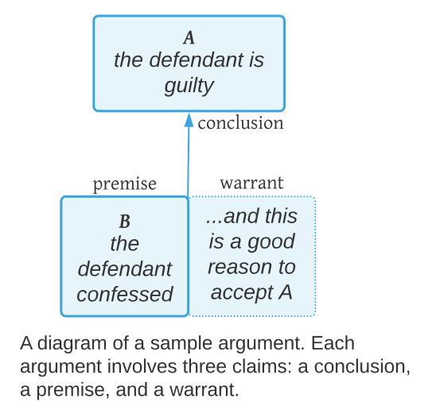
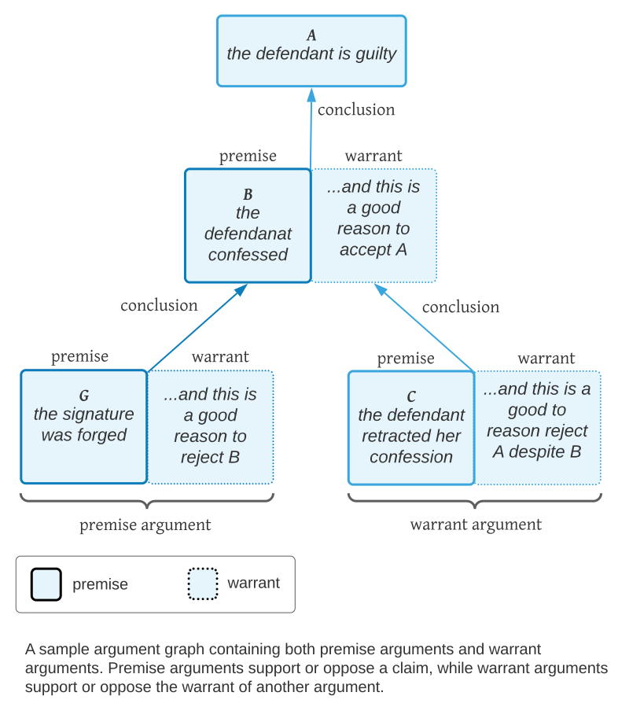
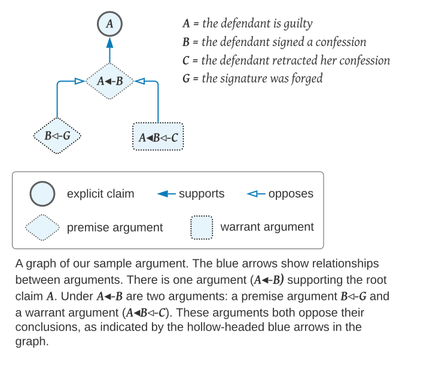

In this article we introduce an *argument model*: a set of terms for analyzing *arguments* by naming their parts. There are various argument models in the academic literature on [argumentation theory](https://en.wikipedia.org/wiki/Argumentation_theory) and related fields but none provide us with precise definitions for all the concepts behind our algorithms for improving for online conversations. So we will define those concepts here. Our model incorporates the basic ideas from the influential [Toulmin model](https://link.springer.com/content/pdf/10.1007%2F978-90-481-9473-5_4.pdf) of argumentation first [introduced in 1948](https://www.goodreads.com/book/show/859298.The_Uses_of_Argument).

## Anatomy of an Argument

### Claims

A **claim** is a declarative sentence that people can accept or reject (agree with or disagree with). This definition is broad enough to include not only **descriptive** claims about reality, such as *the universe is expanding*  (what *is*), but also **normative** claims about goals, such as *we should go to the beach* (what *should be*).

An argument involves at least three claims:

- A **conclusion**: the claim in dispute.
- A **premise**: the reason given to accept or reject the conclusion.
- A **warrant**: an unstated claim that the premise, if accepted, is a good reason to accept or reject the conclusion. 

### Premise and Conclusion

For example, during a jury trial, the prosecutor might claim that (𝐵) *the defendant signed a confession* to support the claim that  (𝐴) *the defendant is guilty*. In this case (𝐵) *the defendant signed a confession* is the premise, and (𝐴) *the defendant is guilty* is the conclusion

An argument may be worded in such a way that the premise is unclear (sarcasm, etc.), but there is general agreement among argumentation theorists that there is always a premise hiding in an argument. Some authors use the "grounds", "evidence", or "data" instead of premise.

Since any logical combination of premises can be treated as a single premise, we will speak of an argument as always having one premise. 

It is easy to confuse the term *claim* with *premise* or *conclusion*. A claim is any declarative statement that can be agreed with or disagreed with. A claim can also take the **role** of premise or conclusion in some argument. In the example above, 𝐴 and 𝐵 are both claims, where 𝐵 takes on the role of premise, and 𝐴 takes on the role of conclusion. If the defense contested the premise 𝐵 with some new argument (e.g. *the signature was forged*), 𝐵 would take on the role of **conclusion** in the new argument.

### The Warrant

The warrant can be thought of as a second *unexpressed premise* that links the expressed premise to the conclusion. For example, the warrant of argument (𝐵) *the defendant signed a confession* might be (𝐶) *if she confessed, she must be guilty!*.

People generally don't find it necessary to explicitly state the warrant. It it's a good argument, the link from the premise to the conclusion will be obvious. The arguer assumes that their audience shares the belief.

The warrant can be thought of as belief that "justifies the inferential leap from premise to conclusion". It related to the Aristotles concept of [**enthymeme**](https://en.wikipedia.org/wiki/Enthymeme). 

Even if the arguer does (pedantically) explicitly explicitly express the warrant, there still is 

In our model, for simplicity sake, we assume **every argument has an implicit warrant**.  

### Summary of Model

The diagram below shows a sample argument with labels for the three parts of the argument.

So in the diagram above, the argument in support of conclusion (𝐴) *the defendant is guilty*, has two halves. On the left is the premise (𝐵) *the defendant signed a confession*. This is the actual claim that has been made. On the right is the *warrant*: the claim that *𝐵 is a good reason to accept 𝐴*.

This is a very simplified model. There are many concepts from the field of argumentation theory literature that we don't need to address here (rebuttals, backing, etc.), and our definitions may lack nuance. But these definitions are meant to provide not as a comprehensive theory of argumentation, but a vocabulary that helps us develop the [math](/distributed-bayesian-reasoning-math).

## Types of Arguments

### Opposing and Supporting Arguments

The warrant of a **supporting argument** is the claim that the premise is a good reason to accept the conclusion, and the warrant of an **opposing argument** is the claim that the premise is a good reason to reject the conclusion. 

Note that an opposing argument is just a supporting argument for the negation of the conclusion. (𝐵) *the defendant signed a confession* supports conclusion 𝐴, but opposes conclusion (not 𝐴) *the defendant is innocent*.

### Premise Arguments and Warrant Arguments

Making the distinction between premise and warrant allows us to cleanly distinguish between **premise arguments** and **warrant arguments**.

In the chart below, we have added two arguments that oppose 𝐵. The argument with premise (𝐺) *the signature was forged*, opposes the premise (𝐵) *the defendant signed a confession*. It is a reason asserted for believing that 𝐵 is not true. We call this a **premise argument**. The argument with premise (𝐶) *the defendant retracted her confession*, opposes the *warrant* of the argument with premise 𝐵 -- the claim that 𝐵 is a good reason to accept 𝐴. We call this a **warrant argument**.

## Argument Notation

The same claim can be used as the premise of many different arguments. To identify arguments unambiguously, we will need a notation that represent the argument itself, and not just the premise.

### Identifiers for Premise Arguments

We represent an argument that supports conclusion 𝑋 with premise 𝑌 using the notation:

$$
    \text{𝑋◂-𝑌}
$$

Note we place the premise after the conclusion. 

For example, referring to our jury trial argument graph, the argument $\text{𝐴◂-𝐵}$ could be expressed in plain English as *the fact that the defendant signed a confession is a good reason to believe that she is guilty.*

We represent an argument that opposes conclusion 𝑋 with some premise 𝑌 using the notation:

$$
    \text{𝑋◃-𝑌}
$$

For example, the argument $\text{𝐵◃-𝐺}$ might be expressed in plain English as *the fact that the signature was forged is a good reason NOT to believe that the defendant signed a confession*.

If the claim 𝐵 is also used as the premise of some other argument, that would be a separate argument. For example, an argument that opposes conclusion 𝐻 with premise 𝐵 would be $\text{𝐻◃-𝐵}$, which is not the same argument as $\text{𝐴◂-𝐵}$, even though it uses the same premise

### Identifiers for Warrants

We represent the warrant of the argument $\text{𝐴◂-𝐵}$ using the notation

$$
    \text{𝐴◂𝐵}
$$

It's easy to confuse the warrant with $\text{𝐴◂𝐵}$ with the argument $\text{𝐴◂-𝐵}$. The **warrant** $\text{𝐴◂𝐵}$ is a claim that 𝐵, *given it is accepted*, supports 𝐴, whereas the **argument** $\text{𝐴◂-𝐵}$ is the claim that 𝐵 *should be accepted*, and that it supports 𝐴. The former says "**if** the defendant signed a confession, that would be a good reason to believe she is guilty," whereas the latter says “**the fact that** the defendant signed a confession is a good reason to believe she is guilty.”

### Identifiers for Warrant Arguments

Premises such as (𝐶) *the defendant retracted her confession* oppose the **warrant** of the argument $\text{𝐴◂-𝐵}$. We notate warrant arguments like this:

$$
    \text{𝐴◂𝐵◃-𝐶}
$$

This identifier has the same form as the identifier for a premise argument, except that the conclusion (the part on the left of the $\text{◃-}$ or $\text{◂-}$) is a warrant.

In plain English, this argument might be read as *the fact that the defendant retracted her confession is a good reason to believe that she is not guilty even if she confessed.*

## Argument Graphs

Given a set of arguments that have been made in some situation, we can create a graph that shows relationships between the arguments. The graph below represents our sample argument, now using our new argument notation.

Each argument in this graph has one outgoing blue arrow, pointing to the argument or claim it supports or opposes. Using the same convention we adopted for argument identifiers, solid arrow heads represent supporting arguments, and hollow arrows heads indicate opposing arguments.

Note that the blue arrows in this graph are redundant, because the relationships between arguments are revealed in the identifiers themselves. But note also that the two arguments that oppose $\text{𝐴◂-𝐵}$ oppose it in different ways: $\text{𝐵◃-𝐺}$ opposes the premise ($𝐵$), and $\text{𝐴◂𝐵◃-𝐶}$ opposes the warrant ($\text{𝐴◂𝐵}$), but they both oppose the argument overall.

Because cycles are hard to deal with, we will assume all argument graphs are acyclic, thus our argument graphs will always be DAGs.

## Review of Sample Argument

Here is a brief review of the sample argument shown in the argument graph above using the terminology and notation we have introduced so far:

- The claim (𝐺) *the signature was forged* opposes the conclusion (𝐵) *the defendant signed a confession*. Since 𝐵 is the premise of the argument $\text{𝐴◂-𝐵}$, $𝐺$ **opposes the premise** of $\text{𝐴◂-𝐵}$. So $\text{𝐵◃-𝐺}$ is a **premise argument**.

- The claim (𝐶) *the defendant retracted her confession*, **opposes the warrant** of $\text{𝐴◂-𝐵}$. It says that even if the premise 𝐵 were true, it is not a good or sufficient reason to support $𝐴$. So $\text{𝐴◂𝐵◃-𝐶}$ is a **warrant argument**.

- Both $\text{𝐵◃-𝐺}$ and $\text{𝐴◂𝐵◃-𝐶}$ oppose their conclusions: the premise and the warrant of $\text{𝐴◂-𝐵}$, respectively. Thus they both oppose the argument $\text{𝐴◂-𝐵}$.

- In the example above, we consider $\text{𝐴◂-𝐵}$ itself to be a premise argument, because it is supporting the claim $𝐴$. While claim $𝐴$ does not play the role of premise in any argument in this graph, it is pragmatic to call $\text{𝐴◂-𝐵}$ a premise argument because we always assume that $𝐴$ could be playing the role of premise in some larger argument graph.

## Argument Threads

### Definition of an Argument Thread

An argument can support or oppose **the warrant of another warrant argument**.

In response to $\text{𝐴◂𝐵◃-𝐶}$, someone might argue (𝐷) *guilty people always say they are innocent*. This argument would be written as $\text{𝐴◂𝐵◃𝐶◃-𝐷}$.

And of course there could be a response to **this** argument, and response to the response. The result could be a long **argument thread**.

We define an **argument thread** is a premise argument followed by a chain of **zero or more** warrant arguments. The chart below illustrates an single argument thread.

### Argument Threads are Dialogs

Argument threads proceed along the lines of "𝐴 because 𝐵, yes but not 𝐶, okay but 𝐷," and so on. Each argument in the thread is made in the context of all the previous arguments in the thread. The thread may be long, but arguers that are adding to the thread can be assumed to have have followed the whole thread of the argument -- even if they have not participated in the sub-jury about each premise. 

The claims in the thread thus represents a **shared context**. Each argument in the thread is made in the context of all the previous claims in the thread, and **presumes acceptance of all claims but the root claim**. For example, when someone argues that ($\text{𝐴◂𝐵◃-𝐶}$) *the defendant retracted her confession* it is clear from context that they accept (concede) that (𝐵) *the defendant signed a confession* but still don't accept that (𝐴) *the defendant is guilty*. 

Now, the arguer may not actually accept 𝐵 to be true, but by responding with a warrant argument instead of a premise argument (e.g. (𝐵◃-𝐺) *the signature was forged*), they are *conceding* 𝐵 for the sake of argument, providing a reason to reject 𝐴 even if 𝐵 is accepted.

Considering a longer argument thread, the argument $\text{𝐴◂𝐵◃𝐶◃-𝐷}$ presumes acceptance of 𝐵 and 𝐶: a person who makes this argument is giving 𝐷 as a reason to reject 𝐴 given (even if) 𝐵 and 𝐶 are accepted. 

So the warrant of the last argument in the thread can be interpreted as the claim that the premise, **given acceptance of all preceding premises in the thread**, is a good reason to accept or reject the root conclusion. 

## Next

Understanding the concepts in this argument model, in particular the difference between premise and warrant arguments, and the idea of argument threads as dialogs with shared context, is critical to understanding the [Causal Assumptions](/distributed-bayesian-reasoning-math/#causal-assumptions) in the [Distributed Bayesian Reasoning Math](/distributed-bayesian-reasoning-math/).

