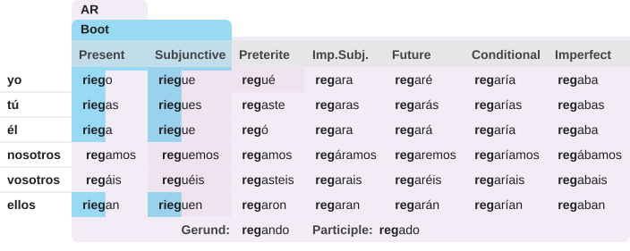
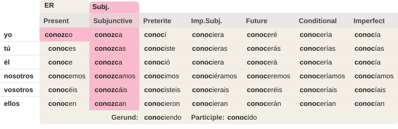
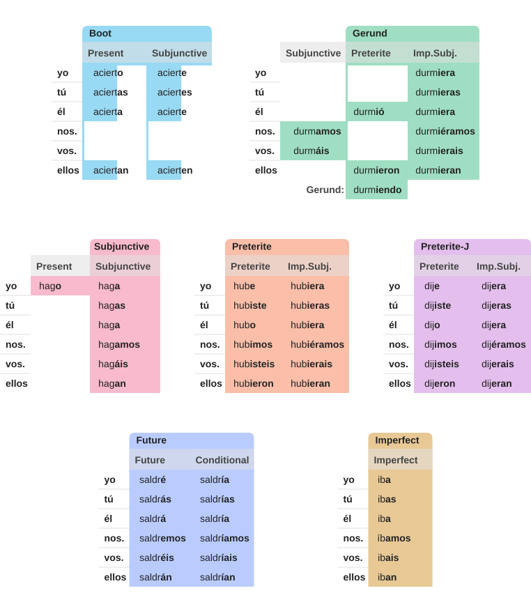
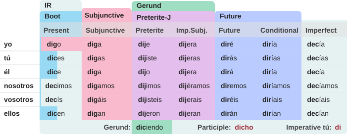
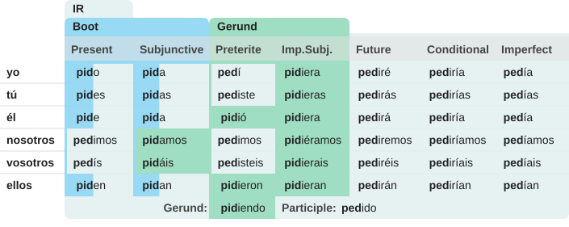
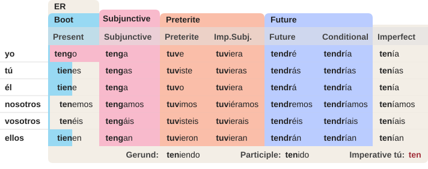

<style>
.seven-stems-formula {
  display: flex;
  flex-wrap: wrap;
  align-items: baseline;
  gap: 0.42em;
  margin: 1.25em 0;
  line-height: 1.4;
}

.seven-stems-formula--lead {
  justify-content: center;
  padding: 0.8em 0.7em;
  font-size: 1.1em;
}

.seven-stems-formula-term {
  display: inline-flex;
  align-items: baseline;
  gap: 0.42em;
  white-space: nowrap;
}

.seven-stems-spill {
  display: inline-flex;
  align-items: baseline;
  overflow: hidden;
  white-space: nowrap;
}

.seven-stems-formula-stem {
  font-family: Arial, Helvetica, sans-serif;
  font-style: normal;
  font-weight: 700;
}

.seven-stems-formula-ending {
  display: inline-block;
  padding: 0.01em 0.18em 0.05em;
  border-radius: 0.18em;
  color: #222;
  font-family: ui-monospace, "SFMono-Regular", Menlo, monospace;
  font-size: 1em;
  font-weight: 400;
  line-height: 1.18;
}

.seven-stems-formula-plus {
  color: var(--card-text-color-secondary);
  font-weight: 700;
}

.seven-stems-ending-ar { background: #f1ecf5; }
.seven-stems-ending-er { background: #f3eee6; }
.seven-stems-ending-ir { background: #e6f1f2; }
.seven-stems-ending-boot { background: #98d9f3; }
.seven-stems-ending-l { background: #f8bacc; }
.seven-stems-ending-gerund { background: #9fdec2; }
.seven-stems-ending-preterite-i { background: #fabea9; }
.seven-stems-ending-preterite-j { background: #e4beed; }
.seven-stems-ending-future { background: #baccff; }
.seven-stems-ending-imperfect { background: #eec698; }
</style>

<div class="seven-stems-formula seven-stems-formula--lead" role="img" aria-label="Stem formula for caber: cab-er, quep-a, cup-iera, cabr-ía">
  <span class="seven-stems-formula-term"><span class="seven-stems-spill"><span class="seven-stems-formula-stem">cab·</span><span class="seven-stems-formula-ending seven-stems-ending-er">er</span></span></span>
  <span class="seven-stems-formula-term"><span class="seven-stems-formula-plus" aria-hidden="true">+</span><span class="seven-stems-spill"><span class="seven-stems-formula-stem">quep·</span><span class="seven-stems-formula-ending seven-stems-ending-l">a</span></span></span>
  <span class="seven-stems-formula-term"><span class="seven-stems-formula-plus" aria-hidden="true">+</span><span class="seven-stems-spill"><span class="seven-stems-formula-stem">cup·</span><span class="seven-stems-formula-ending seven-stems-ending-preterite-i">iera</span></span></span>
  <span class="seven-stems-formula-term"><span class="seven-stems-formula-plus" aria-hidden="true">+</span><span class="seven-stems-spill"><span class="seven-stems-formula-stem">cabr·</span><span class="seven-stems-formula-ending seven-stems-ending-future">ía</span></span></span>
</div>

I have been living part-time in Madrid for the past three years, and my Spanish is still not as fluent as I want it to be. The thing that trips me up most is irregular verb conjugation.

So I decided to start studying deliberately. My goal was to be able to confidently conjugate every irregular verb in every tense I was likely to use.

At first, this felt pretty daunting. A Spanish verb table has six pronouns across seven simple-tense columns, which gives you 42 verb forms before you get to imperatives, compound tenses, and less common forms I sometimes hear older people use, like *hubiese*. Most of those forms are regular. Some are irregular but follow common patterns. Some follow rarer patterns. A few seem like true one-off exceptions.

What I wanted was to really understand these patterns and see if I could find "patterns to the patterns" that would minimize the number of things I actually had to memorize. Put another way, I was looking for a way to *compress* irregular verb conjugation tables into the most compact representation possible.

This is an appealing problem for a software engineer. A lot of software design is compression: finding a smaller, cleaner representation of something apparently complicated. When it works, you not only save space; you understand the problem better.

So I sat down with a notebook, a pencil, and the conjugation tables for a few common verbs I kept stumbling over. I started marking the irregular stems and spelling changes and categorizing the patterns.

One of the verbs I started with was *regar*, because I recalled my stepmother saying “riego las plantas” (“I’m watering the plants”), and I was vaguely confused about why she said *r**ie**go* and not “*r**e**go*.” Revisiting *regar*’s conjugation table reminded me that it is really quite simple: the stem ***reg-*** changes to ***rieg-*** in present and present-subjunctive forms except *nosotros* and *vosotros*:




This is an extremely common pattern in Spanish verbs. These positions are called the “boot” positions because, if you mark them on a classroom conjugation table, they form a kind of boot shape:


Many other verbs change *e* to *ie* in the boot positions: p**e**nsar → p**ie**nsa, ent**e**nder → ent**ie**nde, and so on. This an a handful of other [**Boot** stem vowel change patterns](https://7stems.net/learn/model-verbs/#boot-stem-vowel-change-models) account for a large portion of the irregularity in Spanish verbs.

## Patterns to the Patterns

I noticed a number of other irregular-verb patterns that also involved stem changes in specific tenses. For example, *conocer* uses the stem ***conozc-*** for present indicative *yo* and throughout the present subjunctive:



This **Subjunctive stem** pattern is extremely common. You see it, for example, in *venga*, *tenga*, *quepa*, and *construya*.

## Key Insight: The Stem Type Determines the Ending

Another thing I noticed, which turns out to be significant, is that **Subjunctive stems** always take the same endings: *-o* for present *yo* and endings beginning with *-a-* in the present subjunctive. It does not matter what the verb’s regular type is.

This means that when using a subjunctive stem, you don't need to conjugate the verb as regular and then swap in the subjunctive stem. Rather, you can **conjugate the stem**: start with the stem (*veng-*, *dig-*, etc.) and add the appropriate ending for the tense you want to use. There is some research that indicates that this is exactly what fluent speakers do.

It turns out that this is true for all the irregular stem patterns I found: the irregular stem’s conjugation is independent of the regular stem type. It is as if these stems are completely different verbs with a different type: but only used for certain tenses. And these verbs are conjugated just like regular verbs: **by adding an ending to the stem**. 

So what makes a verb irregular in Spanish is that **it has more than one stem**. To conjugate a verb in Spanish, you just need to know:

1. which stem goes with the tense you want to use
2. the stem's type
3. the right ending to use in that tense with stems of that type

With relatively few exceptions, almost all irregularity in Spanish verb conjugation can be explained by **seven irregular stem types**. Each stem type has a conjugation table that gives the tenses where that stem is used and the endings to use with each tense. Because these tables apply to only a subset of forms, I call them **conjugation cards**. Here they are.




<!-- 
## Stem Formulas

To remember a verb’s irregular stems, **you just need to remember one conjugated form for each stem type**. If you remember *venga* for the present subjunctive of *venir*, then it is easy to remember *vengo* in the present indicative, *tú vengas* in the present subjunctive, and so on.

This means we can break down an irregular verb’s conjugation table into a **stem formula** with one form for each stem type, including the regular stem. For example, *valer* has three stems. Its stem formula is:

<div class="seven-stems-formula" role="img" aria-label="Stem formula for valer: val-er, valg-a, valdr-ía">
  <span class="seven-stems-formula-term"><span class="seven-stems-spill"><span class="seven-stems-formula-stem">val·</span><span class="seven-stems-formula-ending seven-stems-ending-er">er</span></span></span>
  <span class="seven-stems-formula-term"><span class="seven-stems-formula-plus" aria-hidden="true">+</span><span class="seven-stems-spill"><span class="seven-stems-formula-stem">valg·</span><span class="seven-stems-formula-ending seven-stems-ending-l">a</span></span></span>
  <span class="seven-stems-formula-term"><span class="seven-stems-formula-plus" aria-hidden="true">+</span><span class="seven-stems-spill"><span class="seven-stems-formula-stem">valdr·</span><span class="seven-stems-formula-ending seven-stems-ending-future">ía</span></span></span>
</div>
 -->
<!-- 
## Spelling Rules Are Regular


Some apparent irregularities are really regular **spelling changes** that apply consistently in certain situations. For example, a silent *u* is added after the *g* in *llegar* whenever the ending begins with *e*. Otherwise, the *g* would be pronounced with a different sound.

But this does not make *llegar* irregular. If the added *u* were an irregularity, you would need to remember which verbs it applied to. Instead, you just need to remember the situation in which the spelling rule applies.

This spelling rule does not change the pronunciation. It prevents the pronunciation from changing, ensuring that the *g* in the stem sounds the same with every ending.

There are also spelling rules that create small pronunciation changes. For example, *leer* has forms such as *leyó*. Spanish spelling does not allow an unstressed *i* to sit between two vowels in that position, so the vowel *i* becomes the consonant *y*: *le**i**ó* becomes *le**y**ó*. The result has a slightly different pronunciation, especially in regions where consonant *y* has a strongly fricated sound. Because of this, the Real Academia Española considers *leer* irregular—but in my opinion, it is a rather regular kind of irregular.
 -->


## Visualizing the Conjugation Tables

After understanding these patterns, I was lying in bed one day—really—and started thinking about how I could visualize conjugation tables as overlapping cards. In my mind, each card was a physical piece of laminated card stock with its own color and a partial conjugation table for one of the verb’s irregular stem types. Beneath them was the full conjugation table for the regular stem type.

So I fired up my favorite AI coding agent and built some tables. And they looked great! Here are some examples:

**decir**



**pedir**



**tener**



The table for virtually any verb in Spanish can be found at [7stems.net](https://7stems.net/).

## The Algorithm

With these seven irregular stem types and a handful of spelling rules, I had an elegant way of modeling most Spanish verb irregularities. In software terms, the conjugation table is a set of layered matrices. Start with the regular stem card. Lay the irregular stem cards on top in precedence order. Apply spelling rules. Then apply any true exceptions.

I implemented this in [seven-stems-conjugator](https://github.com/johnwarden/seven-stems-conjugator), a Python verb-conjugation library that builds a complete conjugation table for any verb. 

Consistent with my goal of **compressing** what I needed to learn, the information necessary to construct a verb's conjugation table is encoded in a small data structure containing its irregular stems and exceptions. Here are examples for a few verbs:

***Sample Verb Conjugation Data***

```python
'caber': {
    'stems': {
        'Subjunctive': 'quep',
        'PreteriteI': 'cup',
        'Future': 'cabr',
    },
},
'saber': {
    'stems': {
        'Subjunctive': 'sep',
        'PreteriteI': 'sup',
        'Future': 'sabr',
    },
    'exceptions': {(0, PRESENT): 'sé'},
},
'tener': {
    'stems': {
        'BootE': 'tien',
        'Subjunctive': 'teng',
        'PreteriteI': 'tuv',
        'Future': 'tendr',
    },
    'exceptions': {(1, IMPERATIVE): 'ten'},
},
```

## Validating the System

I figured that if I was going to publish this system, I had better be sure it was correct. So I created an  automated test that compares the output of my library against 462,348 known correct conjugated forms using an independent conjugation library. It turns out, there were many errors in that other library, so in the end I used the Real Academia Española as my source of truth.

## The Book and Website

Eventually, I decided to self-publish the method and the conjugation tables for all the model verbs as a book. That became more work than I expected, but a couple of months ago I finally published [*Seven Stems Spanish Verb Conjugation*](https://7stems.net/book/).

I never expected to sell a huge number of copies, but it would be gratifying to get the method into the hands of people who would use it. Distribution for a language-learning book is difficult, so I built the [Seven Stems website](https://7stems.net/) with the book’s core content, searchable conjugations, and a prominent “Buy the Book” link.

Then I wondered how anybody would find the website, and figured I had better write a blog post about the whole thing. And so here we are. If you are trying to improve your Spanish then please explore the website, consider buying the book if you like what you see, and leave me a good review. If you do not like it, skip the review and send me feedback instead. 🙂
