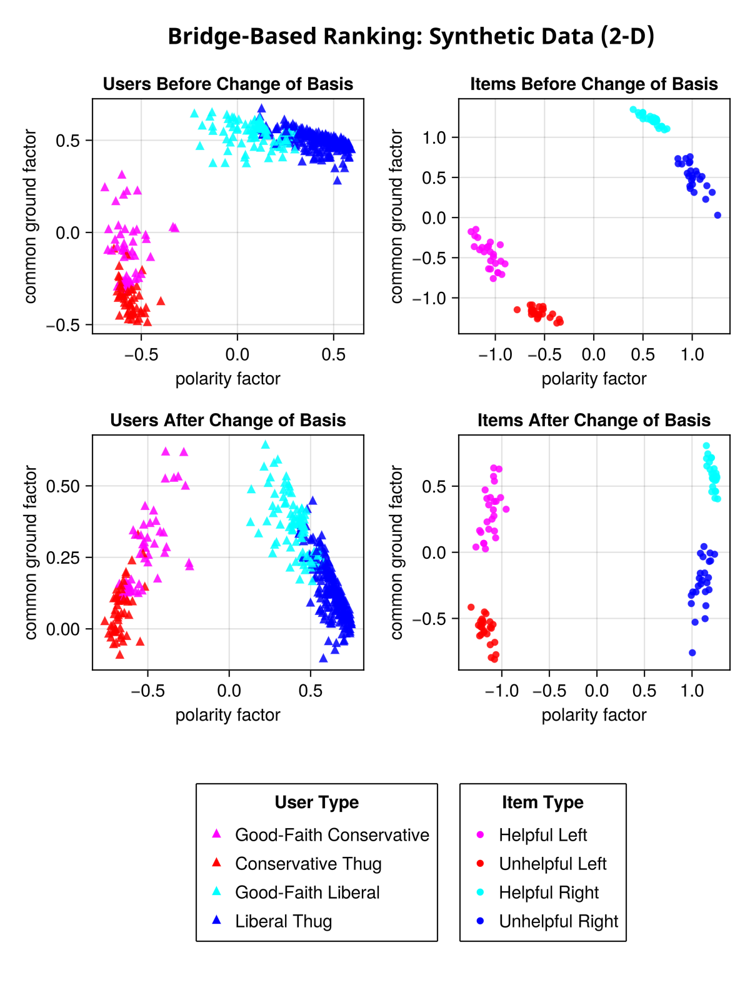

## Introduction

In my article on [Understanding Bridge-Based Ranking](/understanding-bridge-based-ranking), I describe the basic Matrix Factorization algorithm used in the bridge-based ranking algorithm used by Community Notes. In this article, I introduce a way to break this algorithm and describe an variation of the algorithm that uses 2-dimensional Matrix factorization.

## Breaking the Algorithm

The algorithm uses Matrix Factorization to find a latent factor that best explains the variation among users votes. It assumes that this latent factor corresponds to some sort of polarization within the community. But what if this is not the case? What if the factor that best explains variation in users' votes corresponds to, for example, how informed or educated that user is? For example, suppose in some expert advice forum the regression for a post looks like this.

           
           Vote 
            +1   ✕ ✕ ✕ ✕ 
             |    ↗
             |  ↗ 
    -1 ______|↗______ +1  User Expertise
            ↗|
          ↗  |
        ↗    |
      ✕ ✕   -1

Now bridge-based ranking will do the opposite of what we probably want: it will favor posts that get upvoted regardless of user expertise. If the forum was already populated by a majority of experts, and a minority of uninformed quacks promoting baseless claims, then informed posts would have had the advantage. Bridge-based ranking would just take this advantage away.

In fact, this points to a strategy for attacking a bridge-based ranking algorithm. An attacker trying to break Community Notes using a lot of sockpuppet accounts won't succeed just by upvoting notes that support some political agenda. As discussed in the last post, [the intercept is not the average](/understanding-bridge-based-ranking/#the-intercept-is-not-the-average). Downvotes will not shift the intercept for a post if those downvotes can be explained by the polarity factor of the user.

Instead, they should *downvote helpful posts and upvote unelpful posts, regardless of politics*.

With enough sockpuppet accounts contributing, the result will be that the primary factor that explains variation in users voting behavior will not be politics, but helpfulness. The matrix factorization algorithm will thus discover this factor, and a regression for a helpful post will now look something like this:

           Vote 
            +1   ✕ ✕ ✕ ✕ 
             |    ↗
             |  ↗ 
    -1 ______|↗______ +1  User Helpfulness
            ↗|
          ↗  |
        ↗    |
      ✕ ✕   -1

However, the algorithm doesn't know that the latent factor it has discovered corresponds to user helpfulness. It assumes that it corresponds to polarity. The result would be disastrous, because the algorithm will nullify the effect of Helpfulness and favor posts would be most upvoted if helpfulness were not a factor. And which posts might these be? Well in Community Notes, the factor that most predicts how users vote, after helpfulness, is...politics! 

What would the intercept be? A positive intercept means a post gets a lot of upvotes after adjusting for helpfulness. Community notes users seem to lean heavily to the right, right-wing posts will have a positive intercept and left-wing posts will have a negative intercept. This is definitely not the desired result.

## Two-Dimension Matrix Factorization

To address this problem, I have developed a variation of the algorithm that uses a two dimensional Matrix factorization, and then users a process similar to principal component analysis to find the high-entropy dimension and the low-entropy dimension.

Every user and post is characterized by a two-dimensional vector, instead of a single factor plus an intercept. So the probability of a user upvoting a post is just the dot-product of this vector. That is, the model simplifies to:

$$
    ŷ_{ij} = \vec{w_i} \cdot \vec{x_j}
$$

Where $w⃗_i$ and $x⃗_j$ are now vectors.

The problem is, the two factors of this two-dimensional vector do not necessarily align with the polarity-factor and the common-ground factor: instead they may be any arbitrarily linear combination of these factors. So the results of the matrix factorization algorithm, when plotted in two dimensions, will appear to be rotated arbitrarily.

However, we can use a technique similar to principle component analysis to find a change of basis so that our axis align with the polarity and common-ground factor. 

The chart below shows the results of this algorithm using a synthetic dataset. The dataset simulates four user profiles: each profile is either left- or right-wing biased, but some users are less biased -- they make a good-faith effort to rate posts based on helpfulness.

I then created upvote/downvote Matrix with votes drawn randomly with probabilities defined by these profiles. I then factorized the resulting matrix using two latent factors. The results of the initial Matrix factorization are shown in the first row of charts below.

As you can see, the matrix factorization clearly has discovered the two dimensions that best explain the variation in users' votes: left-right polarity and helpfulness. But it chose, in a sense, an arbitrary set of axes.

The bottom row of charts shows the same data after a change of basis that makes "polarity" the vertical axis and "common ground" the horizontal axis.

The key to discovering the polarity axis and the common-ground axis is to notice that there is less "disagreement" along the common-ground axis. As you can see in the bottom-left chart, almost all users have a positive value for the common-ground factor. If users were to vote entirely based on this factor, there would be little disagreement: they would mostly upvote helpful items and download unhelpful items.

So finding the common-ground axis is as simple as finding a vector which, when users are projected onto this vector, results in most users having a positive (or negative value). The specific measure I use is actually a measure of entropy, which is the log of the probability that a user upvotes a post after users are projected into a vector. The exact code is [here](https://github.com/social-protocols/bridge-based-ranking/blob/main/change-basis.jl#L132).

Likewise, the polarity axis can be discovered by finding the vector with maximum entropy.

The algorithm is almost identical to principal component analysis, except instead of maximizing variance (which is how PCA works), we maximize/minimize entropy.

Here is a subset of the Community Notes data run through the same algorithm. As you can see, after initially running matrix factorization we don't know which way is "up". But after discovering the high-entropy and low-entropy vectors and doing a change of basis, the vertical does indeed correspond to "common ground", as you see from the fact that the posts that Community Notes has rated as helpful (the green dots) mostly have a positive value for the common ground factor, and the red dots mostly have a negative value.

### Quantifying User Helpfulness

Another advantage to using two-dimension Matrix factorization is that it actually gives us a helpfulness factor for each user. The 1D Matrix factorization algorithm used by community notes assigns an intercept to each user. This intercept can be thought of as the user's "friendliness" -- how likely they are to upvote a post ignoring that post's polarity. But this intercept does not correspond to a user's helpfulness. 

With two-dimensional matrix factorization, we get both a polarity factor and a helpfulness factor for each user. This is what has allowed us to produce the polarity plot for users shown earlier in this essay, which I repeat here.

One of the advantages of characterizing users by helpfulness, and not just polarity, is that it can help with the cold-start problem. If a new post has only received a few votes, then we can estimate what it's helpfulness factor by taking an average of the user's votes weighted by their helpfulness factor. 

