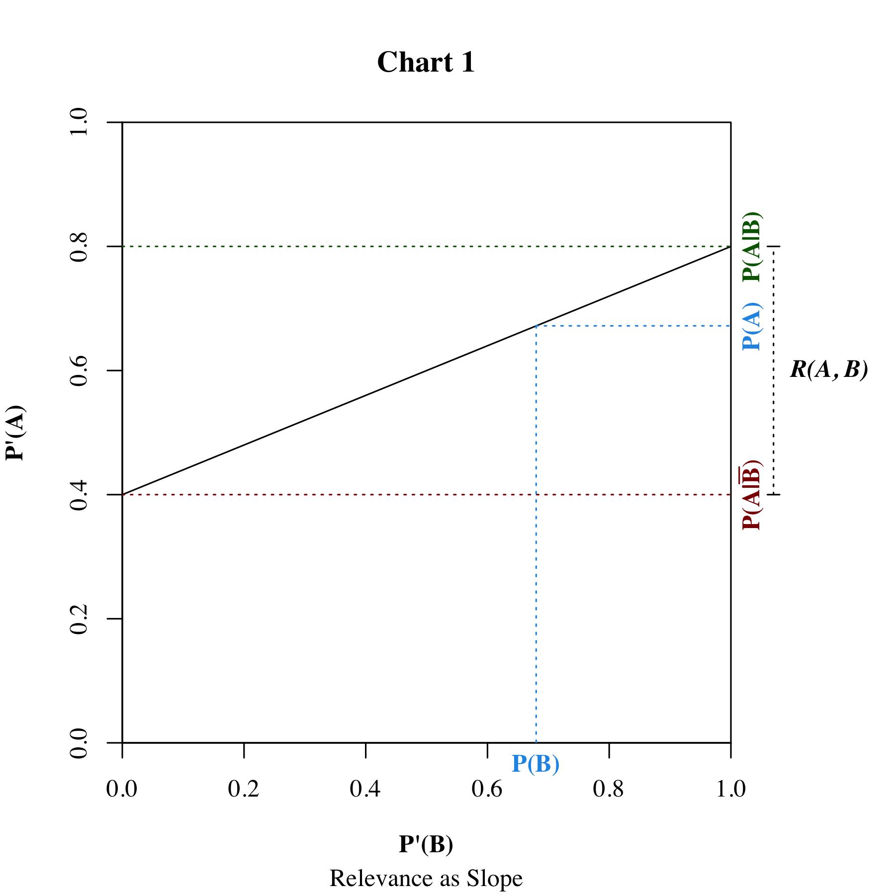

---

layout: single
title:  "Relevance and Corelevance"
toc: true
toc_sticky: true
tags: ['Argumentation Theory']
weight: 71
sidebar:
  - title: "In This Series"
    nav: "bayesian-argumentation"
  - nav: "bayesian-argumentation-related"
    title: "Related Articles"
series: ['Bayesian Argumentation']
canonical_url: https://jonathanwarden.com/relevance-and-corelevance/

---

## Definition of Relevance

In the [previous essay](/bayesian-argumentation) in this series, we introduced the basic ideas and terminology of Bayesian argumentation, including the concept of **relevance**.

<!--more-->

To review, **a premise $B$ is relevant to conclusion $A$** (in the mind of the subject) **iff**:

$$
    P(A|B) ≠ P(A|\bar{B})
$$

If the above condition does not hold, then **𝐵 is irrelevant to 𝐴**. It's easy to show that this is the case if and only if 𝐴 and 𝐵 are statistically independent ([proof](#proof-2)).

## Definition of Support and Oppose

We say that premise **supports** the conclusion (in the mind of the subject) iff the subject is **more** likely to accept the premise if they accept the conclusion. That is, **𝐵 supports 𝐴 iff**:

$$
    P(A \vert B) > P(A \vert \bar{B})
$$

If the subject is **less** likely to accept 𝐴 if they accept 𝐵 ($P(A \vert B) < P(A \vert \bar{B})$), it follows that they are **more likely to accept not 𝐴**, in which case we say that the premise **opposes** the conclusion. That is, **𝐵 opposes 𝐴 iff:**

$$
    P(A|B) < P(A|\bar{B}) ⟺ P(\bar{A}|B) > P(\bar{A}|\bar{B})
$$

## Quantifying Relevance

We have defined the term **relevant** as a binary attribute. But we often talk about degrees or relevance. This can be measured as the difference between $P(A \vert B)$ and $P(A \vert \bar{B})$.

### Definition of Relevance

**The relevance of 𝐵 to 𝐴 is**:

$$
\label{1}
    R(A,B) = P(A|B) - P(A|\bar{B}) 
\tag{1}
$$

The relevance will be negative if 𝐵 opposes 𝐴. Now recall that if 𝐵 opposes 𝐴 it supports $\bar{A}$. And it's also the case that if 𝐵 opposes 𝐴, $\bar{B}$ supports 𝐴! In fact, the following are all equal:

$$
    R(A,B) = -R(\bar{A},B) = -R(A,\bar{B}) = R(\bar{A},\bar{B})
$$

<!--
proof

    R(A,B) = P(A|B) - P(A|\bar{B})
            = - ( P(A|\bar{B}) - P(A|B) )
            = - R(A,\bar{B})

    R(A,B) = P(A|B) - P(A|\bar{B})
            = (1 - P(negA|B)) - (1 - P(negA|\bar{B}))
            = P(negA|\bar{B}) - P(negA|B)
            = R(negA,\bar{B})

-->

### Relevance as Slope

The relevance can be understood as the **slope of the line relating belief in the premise with belief in the conclusion**.

$$
\label{2}
P(A) = P(A|\bar{B}) + P(B)R(A,B) 
\tag{2}
$$

This follows from rewriting $P(A)$ using the law of total probability:

$$
\begin{aligned}
    P(A) &= P(A|\bar{B})P(\bar{B}) + P(A|B)P(B) ~ \text{(Law of total prob.)}\cr
         &= P(A|\bar{B})(1 - P(B)) + P(A|B)P(B) \cr
         &= P(A|\bar{B}) - P(A|\bar{B})P(B) + P(A|B)P(B) \cr
         &= P(A|\bar{B}) + P(B)(P(A|B) - P(A|\bar{B})) \cr
         &= P(A|\bar{B}) + P(B)R(A,B) 
\end{aligned}
$$

If we assume that the conditional probabilities $P(A \vert B)$ and $P(A \vert \bar{B})$ don't change when $P(B)$ changes, then if the subject acquires information that causes them to increase their belief in $B$ from prior $P(B)$ to posterior $P'(B)$, then their posterior belief $P'(A)$ changes according to the following formula ([proof](#proof-1)).

$$
\label{3}
    P'(A) = P(A|\bar{B}) + P'(B)R(A,B) 
\tag{3}$$

Formula $\eqref{3}$ is known as [Jeffrey's Rule of Conditioning](https://www.sciencedirect.com/science/article/pii/0888613X89900030#:~:text=Abstract,of%20the%20normative%20Bayesian%20inference.). 

<!-- This image is generated using R. Source: relevance-delta-chart.R -->

<!--

            
          |               |
          |               ∙  - <- P(A|B)
          |           ∙   |  |
     P(A) |       ∙       |  | <- R(A,B) = P(A|B)-P(A|B̄)
          |   ∙           |  |
          ∙               |  - <- P(A|B̄)
          |_______________| 
                 P(B)   

    CHART 1

-->

The horizontal axis is the **posterior** belief $P'(B)$, and the vertical axis is the **posterior** belief $P'(A)$. The line intersects the vertical at $P(A \vert \bar{B})$ -- the subject's belief were they to completely reject 𝐵. The posterior belief in 𝐴 increases linearly as the posterior belief in 𝐵 increases, to the point that the subject completely accepts 𝐵, and the belief in $P'(A)$ has the maximum possible value $P(A \vert B)$. The prior beliefs, $P(A)$ and $P(B)$, are a point on this line. 

## Conditional Relevance and Corelevance

Relevance exists in the context of the subject's other prior beliefs.  For example, if (𝐶̅) *the car is out of gas*, and also ($\bar{B}$) *the battery is dead*, then both of these are good reasons to believe (𝐴̅) *the car won't start*. Yet neither is relevant on its own by the definition of relevance given above. Given that the car is out of gas, it makes no difference whether the battery is dead or not: the car won't start anyway. In other words, ($\bar{B}$) *the battery is dead* is irrelevant to (𝐴̅) *the car won't start* given (𝐶̅) *the car is out of gas*.

But if the subject believes (𝐶) *the car has gas*, then ($\bar{B}$) the battery is dead will probably be relevant. When accepting one premise causes another premise to become relevant, we say that the premises are **corelevant**. If a premise is corelevant with some unexpressed premise, we can say that the premise is **conditionally relevant**.

### Definition of Conditional Relevance

To define corelevance mathematically, we need to first define the **conditional relevance** of 𝐵 to 𝐴 given 𝐶, $R(A,B \vert C)$:

$$
    R(A,B|C) = P(A|B,C) - P(A|\bar{B},C)
$$

### Definition of Corelevant

Then 𝐵 and 𝐶 are corelevant to 𝐴 if:

$$
    R(A,B|C) ≠ R(A,B|\bar{C})
$$

### Quantifying Corelevance 

We can measure the magnitude of the correlevance as the difference:

$$
    CR(A;B,C) = R(A,B|C) - R(A,B|\bar{C})
$$

It's easy show that co-relevance is symmetrical ([proof](#proof3)).

$$
    CR(A;B,C) = CR(A;C,B)
$$

### Counterfactual Relevance

Unfortunately, this definition of conditional relevance still doesn't capture the the common notion of "relevance" very well, because we can almost always find some second premise that makes the premise conditionally relevant. For example, the premise (𝐻) *The car has a hood ornament* may not seem relevant to (𝐴) *the car will start*, but it is conditionally relevant given the premise (𝑀) *The car is powered by a magical hood ornament*.

Of course, 𝑀 is pretty implausible -- $P(M)$ may be infinitesimally small. But other more plausible corelevant premises may have small probabilities. For example, if the subject just filled the car with gas, they will be quite certain that (𝐺) *the car has gas* and thus $P(\bar{G})$ might be infinitesimally small. So in both cases we have corelevant premises with small prior probabilities, but a car running out of gas is something that is likely to actually happen in many similar scenarios, even if not this particular one. 

Accounting for the difference in relevance in these two cases takes us into the metaphysical realm of modal logic, possible worlds, counterfactuals, and other difficult epistemological questions, that we won't try to answer here.

## Next in this Series

In our introductory example, we claimed that *he has a pulse* is relevant to the conclusion *this is a good candidate for the job*. But it is obviously not a very good argument.  Why not?

Obviously, because the subject probably already assumed that the candidate had a pulse. Relevance doesn't say anything about the subject's **actual** prior degree of belief in the premise or conclusion. In the [next essay in this series](/necessity-and-sufficiency), we will show that, because the subject already believes that *he has a pulse* is true, it is a **necessary but not sufficient** premise for the conclusion *this is a good candidate for the job*.

## Proofs

### Proof 1

**Jeffrey's Rule of Conditioning**

If a Bayesian agent acquires information that has no direct effect other than to increase their belief in $B$ from prior $P(B)$ to posterior $P'(B)$, then their posterior belief $P'(A)$ changes according to 

$$
    P'(A) = P(A|\bar{B}) + P'(B)R(A,B)
$$

**Proof:**

First, the above assumptions mean that a change in $P(B)$ does not change the **conditional** probabilities $P(A \vert B)$ and $P(A \vert \bar{B})$. So:

$$
\begin{aligned}
         P'(A|B)        &= P(A|B)\cr
         P'(A|\bar{B})  &= P(A|\bar{B}) 
\end{aligned}
$$

This means that the relevance doesn't change either:

$$
    R'(A,B) = P'(A|B) - P'(A|\bar{B}) = P(A|B) - P(A|\bar{B}) = R(A,B)
$$

Now, the equality $\eqref{2}$ holds for any probability distribution, including the posterior probability distribution $P'$. So:

$$
    P'(A) = P'(A|\bar{B}) + P'(B)R'(A,B) ~~~~~ \text{Formula }\eqref{2}
$$

And since the posteriors $P'(A|\bar{B})$ and $R'(A,B)$ are the same as the priors:

$$
\begin{aligned}
    P'(A) &= P'(A|\bar{B}) + P'(B)R'(A,B) \cr
          &=  P(A|\bar{B}) + P'(B)R(A,B) 
\end{aligned}
$$

This formula can be rearranged to express Jeffrey's rule in the more typical form:

$$
\begin{aligned}
    P'(A)   &=  P(A|\bar{B}) + P'(B)R(A,B) \cr
            &=  P(A|\bar{B}) + P'(B)( P(A|B) - P(A|\bar{B}) )  \cr
            &=  P(A|\bar{B}) + P'(B)P(A|B) - P'(B)P(A|\bar{B}) )  \cr
            &=  P(A|\bar{B}) + P'(B)P(A|B) - (1 - P'(\bar{B}))P(A|\bar{B}) ) \cr
            &=  P'(B)P(A|B) + P'(\bar{B})P(A|\bar{B})
\end{aligned}
$$

### Proof 2

**(Ir)Relevance Implies (In)Dependence**

$$
    R(A,B) = 0 ⟺ P(A) = P(A|B) = P(A|\bar{B})
$$

**Proof:**

If $R(A,B) = 0$, then $P(A \vert B) = P(A \vert \bar{B})$, because:

$$
    0 = R(A,B) = P(A|B) - P(A|\bar{B}) \iff P(A \vert B) = P(A \vert \bar{B}) 
$$

And it also follows that $P(A) = P(A \vert \bar{B})$, because:

$$
\begin{aligned}
    P(A) &= P(A|\bar{B}) + P(B)R(A,B) ~~~~~ \text{Formula } \eqref{2} \cr
         &= P(A|\bar{B})
\end{aligned}
$$

### Proof 3

**Symmetry of Corelevance**

$$
    CR(A;B,C) = CR(A;C,B)
$$

**Proof:**

$$
\begin{aligned}
    CR(A;B,C)   &= R(A,B \vert C) - R(A,B \vert \bar{C}) \cr
                &= ( P(A \vert B,C) - P(A \vert \bar{B},C) )  \cr
                &\space\space\space\space- ( P(A \vert B,\bar{C}) - P(A \vert \bar{B},\bar{C}) )  \cr
                &= ( P(A \vert B,C) - P(A \vert B,\bar{C}) )  \cr
                &\space\space\space\space- ( P(A \vert \bar{B},C) - P(A \vert \bar{B},\bar{C}) )  \cr
                &= ( P(A \vert C,B) - P(A \vert \bar{C},B) \cr
                &\space\space\space\space- ( P(A \vert C,\bar{B}) - P(A \vert \bar{C},\bar{B}) )  \cr
                &= R(A,C \vert B) - R(A,C \vert \bar{B}) \cr
                &= CR(A;C,B) \cr
\end{aligned}
$$

<!--

Now we have said that a warrant **exists** in the mind of the subject if the premise is relevant. So if there is some unexpressed premise that causes the premise to be relevant to the conclusion, then this  justifies the inferential leap from premise to conclusion. In the above example, the premise that the car is **not** out of gas makes D relevant to C, and thus is a candidate for the warrant.

But clearly this is not a complete explanation. Many other beliefs contribute to the warrant: the belief that the car has a working engine, etc. The complete warrant would be something along the lines of **the car is in perfect mechanical working order**. But even this is not sufficient: the subject must also believe that a car in perfect mechanical working order will start if it has gas. So the warrant really boils down to **if the car is not out of gas it will start**.

Will a Bayesian subject really have such a belief? Perhaps not, but we'll show that, if have a model of the subject's belief, we can identify the full subset of beliefs that must be *a priori* accepted in order for the premise to be relevant to the conclusion.
-->

<!--

## Definition of Corelevant

A premise $C$ is **corelevant** with the premise if the conditional relevance of the premise to the conclusion given $C$  is higher than it is given $\bar{C}$.

Mathematically:

$$
    R(A,B|C) > R(A,B|\bar{C})
$$

-->

