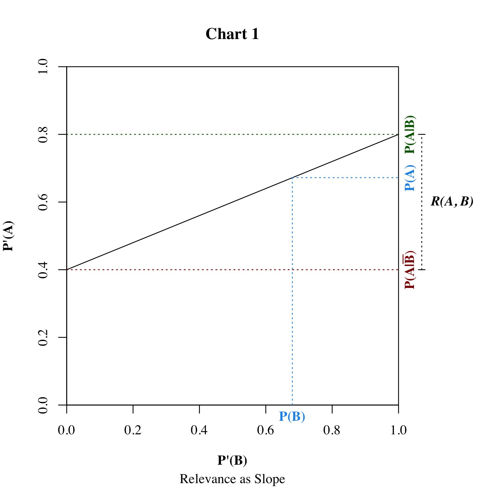

---

layout: single
title:  "Relevance"
toc: true
toc_sticky: true
tags: ['Argumentation Theory']
weight: 71
series: ['Bayesian Argumentation']
canonical_url: https://jonathanwarden.com/relevance/
aliases:
- /relevance-and-corelevance/

---

## Definition of Relevance

In the [previous essay](/bayesian-argumentation) in this series, we introduced the basic ideas and terminology of Bayesian argumentation, including the concept of **relevance**.

<!--more-->

To review, **a premise $B$ is relevant to conclusion $A$** (in the mind of the subject) **iff**:

$$
    P(A|B) ≠ P(A|\bar{B})
$$

If the above condition does not hold, then **𝐵 is irrelevant to 𝐴**. It's easy to show that this is the case if and only if 𝐴 and 𝐵 are statistically independent ([proof](#proof-2)).

## Definition of Support and Oppose

We say that premise **supports** the conclusion (in the mind of the subject) iff the subject is **more** likely to accept the premise if they accept the conclusion. That is, **𝐵 supports 𝐴 iff**:

$$
    P(A \vert B) > P(A \vert \bar{B})
$$

If the subject is **less** likely to accept 𝐴 if they accept 𝐵 ($P(A \vert B) < P(A \vert \bar{B})$), it follows that they are **more likely to accept not 𝐴**, in which case we say that the premise **opposes** the conclusion. That is, **𝐵 opposes 𝐴 iff:**

$$
    P(A|B) < P(A|\bar{B}) ⟺ P(\bar{A}|B) > P(\bar{A}|\bar{B})
$$

## Quantifying Relevance

We have defined the term **relevant** as a binary attribute. But we often talk about degrees or relevance. This can be measured as the difference between $P(A \vert B)$ and $P(A \vert \bar{B})$.

### Definition of Relevance

**The relevance of 𝐵 to 𝐴 is**:

$$
\label{1}
    R(A,B) = P(A|B) - P(A|\bar{B}) 
\tag{1}
$$

The relevance will be negative if 𝐵 opposes 𝐴. Now recall that if 𝐵 opposes 𝐴 it supports $\bar{A}$. And it's also the case that if 𝐵 opposes 𝐴, $\bar{B}$ supports 𝐴! In fact, the following are all equal:

$$
    R(A,B) = -R(\bar{A},B) = -R(A,\bar{B}) = R(\bar{A},\bar{B})
$$

<!--
proof

    R(A,B) = P(A|B) - P(A|\bar{B})
            = - ( P(A|\bar{B}) - P(A|B) )
            = - R(A,\bar{B})

    R(A,B) = P(A|B) - P(A|\bar{B})
            = (1 - P(negA|B)) - (1 - P(negA|\bar{B}))
            = P(negA|\bar{B}) - P(negA|B)
            = R(negA,\bar{B})

-->

### Acceptance of the Premise

Now a Bayesian agent doesn't just accept or reject premises. In a Bayesian model all beliefs are probabilities. 

I'll use the terms **acceptance** to mean simply the subject's degree of belief in the claim (the probability that the claim is true. $ P(A \vert B) $ is the subject's degree of belief in, or acceptance of, the conclusion given they **completely accept the premise** -- that is, if they think there is a 100% probability that the premise is true. And $P(A \vert \bar{B})$ is the acceptance of the conclusion given they completely reject of the premise. But what will acceptance of the conclusion be if they thought the premise might be true -- suppose the acceptance of the premise was, say, 50%?

### Relevance as Slope

It turns out that the relationship between acceptance of the premise and conclusion is linear, and **relevance is the slope of the line relating acceptance of the premise with acceptance the conclusion**.

$$
\label{2}
P(A) = P(A|\bar{B}) + P(B)R(A,B) 
\tag{2}
$$

This relationship is illustrated in the chart below:

<!-- This image is generated using R. Source: relevance-delta-chart.R -->

<!--

            
          |               |
          |               ∙  - <- P(A|B)
          |           ∙   |  |
     P(A) |       ∙       |  | <- R(A,B) = P(A|B)-P(A|B̄)
          |   ∙           |  |
          ∙               |  - <- P(A|B̄)
          |_______________| 
                 P(B)   

    CHART 1

-->

The horizontal axis is the **posterior** belief $P'(B)$, and the vertical axis is the **posterior** belief $P'(A)$. The line intersects the vertical at $P(A \vert \bar{B})$ -- the subject's belief were they to completely reject 𝐵. The posterior belief in 𝐴 increases linearly as the posterior belief in 𝐵 increases, to the point that the subject completely accepts 𝐵, and the belief in $P'(A)$ has the maximum possible value $P(A \vert B)$. The prior beliefs, $P(A)$ and $P(B)$, are a point on this line. 

<aside class="custom-aside" markdown="1">

### Derivation of Formula

The above formula follows from rewriting $P(A)$ using the law of total probability:

$$
\begin{aligned}
    P(A) &= P(A|\bar{B})P(\bar{B}) + P(A|B)P(B) ~ \text{(Law of total prob.)}\cr
         &= P(A|\bar{B})(1 - P(B)) + P(A|B)P(B) \cr
         &= P(A|\bar{B}) - P(A|\bar{B})P(B) + P(A|B)P(B) \cr
         &= P(A|\bar{B}) + P(B)(P(A|B) - P(A|\bar{B})) \cr
         &= P(A|\bar{B}) + P(B)R(A,B) 
\end{aligned}
$$

</aside>

<aside class="custom-aside" markdown="1">

### Jeffrey's Rule

If the subject acquires information that causes an agent to increase their belief in $B$ from prior $P(B)$ to posterior $P'(B)$, but does not have any other effects on the agent's beliefs, then their posterior belief $P'(A)$ changes according to the following formula ([proof](#proof-1)).

$$
\label{3}
    P'(A) = P(A|\bar{B}) + P'(B)R(A,B) 
\tag{3}$$

Formula $\eqref{3}$ is known as [Jeffrey's Rule of Conditioning](https://www.sciencedirect.com/science/article/pii/0888613X89900030#:~:text=Abstract,of%20the%20normative%20Bayesian%20inference.). 

</aside>

## Next in this Series

In our introductory example, we claimed that *he has a pulse* is relevant to the conclusion *this is a good candidate for the job*. But it is obviously not a very good argument. Why not?

Obviously, because the subject probably already assumed that the candidate had a pulse. Relevance doesn't say anything about the subject's **actual** prior degree of belief in the premise or conclusion. In the [next essay in this series](/necessity-and-sufficiency), we will show that, because the subject already believes that *he has a pulse* is true, it is a **necessary but not sufficient** premise for the conclusion *this is a good candidate for the job*.

## Proofs

### Proof 1

**Jeffrey's Rule of Conditioning**

If a Bayesian agent acquires information that has no direct effect other than to increase their belief in $B$ from prior $P(B)$ to posterior $P'(B)$, then their posterior belief $P'(A)$ changes according to 

$$
    P'(A) = P(A|\bar{B}) + P'(B)R(A,B)
$$

**Proof:**

First, the above assumptions mean that a change in $P(B)$ does not change the **conditional** probabilities $P(A \vert B)$ and $P(A \vert \bar{B})$. So:

$$
\begin{aligned}
         P'(A|B)        &= P(A|B)\cr
         P'(A|\bar{B})  &= P(A|\bar{B}) 
\end{aligned}
$$

This means that the relevance doesn't change either:

$$
    R'(A,B) = P'(A|B) - P'(A|\bar{B}) = P(A|B) - P(A|\bar{B}) = R(A,B)
$$

Now, the equality $\eqref{2}$ holds for any probability distribution, including the posterior probability distribution $P'$. So:

$$
    P'(A) = P'(A|\bar{B}) + P'(B)R'(A,B) ~~~~~ \text{Formula }\eqref{2}
$$

And since the posteriors $P'(A|\bar{B})$ and $R'(A,B)$ are the same as the priors:

$$
\begin{aligned}
    P'(A) &= P'(A|\bar{B}) + P'(B)R'(A,B) \cr
          &=  P(A|\bar{B}) + P'(B)R(A,B) 
\end{aligned}
$$

This formula can be rearranged to express Jeffrey's rule in the more typical form:

$$
\begin{aligned}
    P'(A)   &=  P(A|\bar{B}) + P'(B)R(A,B) \cr
            &=  P(A|\bar{B}) + P'(B)( P(A|B) - P(A|\bar{B}) )  \cr
            &=  P(A|\bar{B}) + P'(B)P(A|B) - P'(B)P(A|\bar{B}) )  \cr
            &=  P(A|\bar{B}) + P'(B)P(A|B) - (1 - P'(\bar{B}))P(A|\bar{B}) ) \cr
            &=  P'(B)P(A|B) + P'(\bar{B})P(A|\bar{B})
\end{aligned}
$$

### Proof 2

**(Ir)Relevance Implies (In)Dependence**

$$
    R(A,B) = 0 ⟺ P(A) = P(A|B) = P(A|\bar{B})
$$

**Proof:**

If $R(A,B) = 0$, then $P(A \vert B) = P(A \vert \bar{B})$, because:

$$
    0 = R(A,B) = P(A|B) - P(A|\bar{B}) \iff P(A \vert B) = P(A \vert \bar{B}) 
$$

And it also follows that $P(A) = P(A \vert \bar{B})$, because:

$$
\begin{aligned}
    P(A) &= P(A|\bar{B}) + P(B)R(A,B) ~~~~~ \text{Formula } \eqref{2} \cr
         &= P(A|\bar{B})
\end{aligned}
$$

<!--

Now we have said that a warrant **exists** in the mind of the subject if the premise is relevant. So if there is some unexpressed premise that causes the premise to be relevant to the conclusion, then this  justifies the inferential leap from premise to conclusion. In the above example, the premise that the car is **not** out of gas makes D relevant to C, and thus is a candidate for the warrant.

But clearly this is not a complete explanation. Many other beliefs contribute to the warrant: the belief that the car has a working engine, etc. The complete warrant would be something along the lines of **the car is in perfect mechanical working order**. But even this is not sufficient: the subject must also believe that a car in perfect mechanical working order will start if it has gas. So the warrant really boils down to **if the car is not out of gas it will start**.

Will a Bayesian subject really have such a belief? Perhaps not, but we'll show that, if have a model of the subject's belief, we can identify the full subset of beliefs that must be *a priori* accepted in order for the premise to be relevant to the conclusion.
-->

<!--

## Definition of Corelevant

A premise $C$ is **corelevant** with the premise if the conditional relevance of the premise to the conclusion given $C$  is higher than it is given $\bar{C}$.

Mathematically:

$$
    R(A,B|C) > R(A,B|\bar{C})
$$

-->

