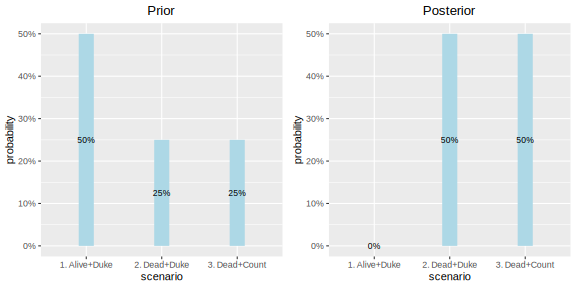
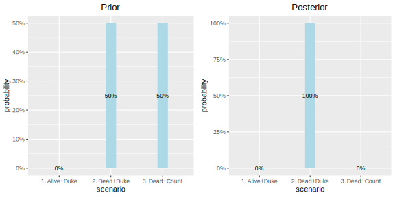
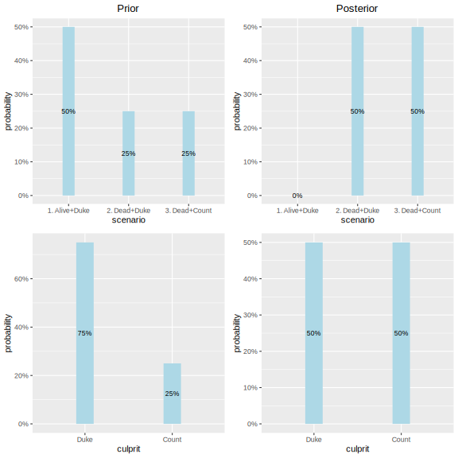
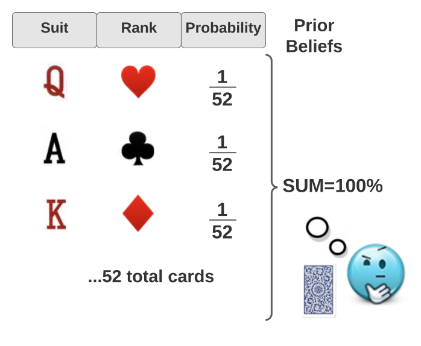
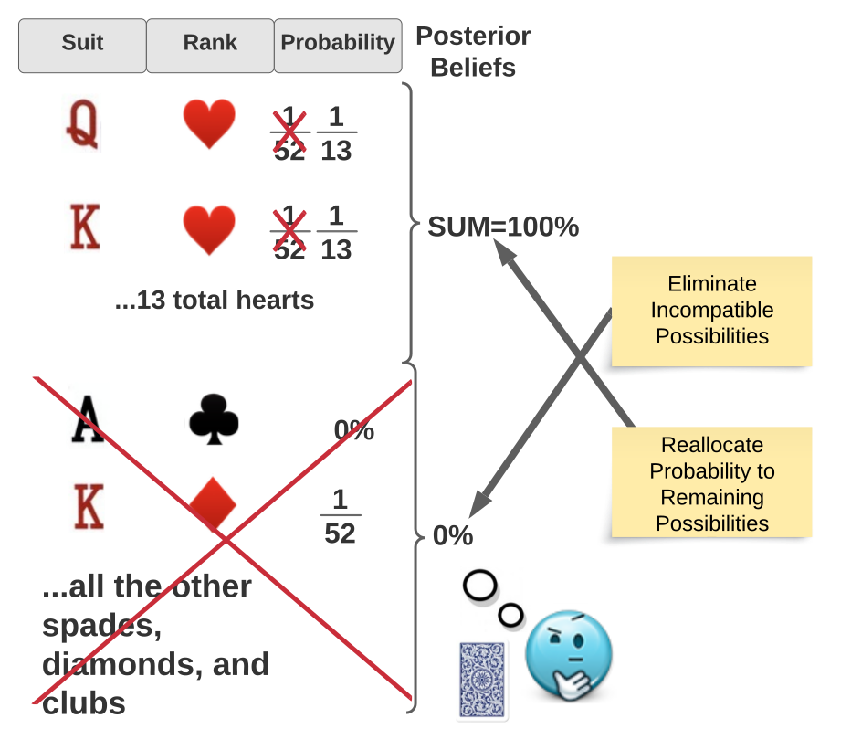

> “When you have eliminated the impossible, all that remains, no matter how improbable, must be the truth.”
> 
> -- Sherlock Holmes (Arthur Conan Doyle)

For a long time Bayesian inference was something I understood without really understanding it. I only really *got it* it after reading Chapter 2 of John K. Kruschke's textbook [*Doing Bayesian Data Analysis*](https://nyu-cdsc.github.io/learningr/assets/kruschke_bayesian_in_R.pdf), where he describes Bayesian Inference as *Reallocation of Credibility Across Possibilities*

I now understand Bayesian Inference to be essentially Sherlock Holmes' pithy statement about eliminating the impossible quoted above, taken to its mathematical conclusion. This article is my own attempt to elucidate this idea. If this essay doesn't do the trick, you might try [Bayesian Reasoning for Intelligent People](https://www.google.com/search?q=bayesian+for+smart+people&oq=bayesian+for+smart+people&aqs=chrome..69i57.3581j0j9&sourceid=chrome&ie=UTF-8) by Simon DeDeo or Kruschke's [Bayesian data analysis for newcomers](https://link.springer.com/article/10.3758/s13423-017-1272-1).

## Prior Beliefs

A Bayesian reasoner starts out with **prior** beliefs, which are a set of mutually exclusive and exhaustive possibilities for the situation at hand.

For example, suppose that Sherlock Holmes is investigating the Case of the Disappearing Duchess, and believes that there is:
- a 50% chance that the Duke has kidnapped the Duchess and is holding her alive in captivity
- a 25% that chance that the Duke has murdered her
- and a 25% chance that she has been murdered by the Count

The total of the probabilities is 100%. Holmes' prior beliefs can be summarized in the table below.

**Prior Beliefs**

| Culprit   | Status    | Probability 
| --------- | --------- | -------------
| Duke      | Alive     | 50%          
| Duke      | Dead      | 25%         
| Count     | Dead      | 25%         
|           | TOTAL     | 100%

## Revising Beliefs

Bayesian reasoners then revise their beliefs when they acquire new information/evidence according to very simple rules:

- reject any possibilities that are incompatible with the evidence
- reallocate probability to the remaining possibilities so that they sum to 100%

For example, if the Duchess's body is found buried under the Atrium, Holmes must eliminate the possibility that she is being held captive and alive by her jealous husband, the Duke. He must then reallocate probability among the remaining possibilities.

So all the remaining probability is allocated to the remaining two scenarios in which the Duchess is dead.

These new beliefs are Holmes **posterior** beliefs, as summarized in the table below.

**Posterior Beliefs**

| Culprit   | Status    | Probability 
| --------- | --------- | -------------
| Duke      | Alive     | **0% (eliminated)**         
| Duke      | Dead      | 50%         
| Count     | Dead      | 50%         
|           | TOTAL     | 100%

## Reallocation of Probability Mass

Another way of looking at this is that the 50% "probability mass" previously allocated to the first possibility is reallocated to the remaining possibilities. You can visualize this if we plot the prior and posterior probabilities as bar charts. The total volume of the bars in each of the two charts below is the same: 100%. The 50% probability mass that was previously allocated to the first possibility in the prior is reallocated to the remaining two possibilities in the posterior.

<!--
     Prior Probabilities                        Posterior Probabilities (After body found)                
     -------------------------------            -------------------------------    
       50%                                                   50%        50%       
        #                                                     #          #         
        #         25%        25%                              #          #         
        #          #          #                               #          #          
        #          #          #                    0%         #          #          
     -------------------------------            -------------------------------    
      Alive/    Dead/      Dead                  Alive       Dead/     Dead/     
      Duke      Duke       Count                 Duke        Duke      Count  
-->

<!-- This image is generated using R. Source: relevance-delta-chart.R -->

Illustration of the concept of "Reallocation" or Probability Mass. After the "Alive+Duke" scenario is eliminated, probability mass is reallocated to the remaining 2 scenarios.

## Sequential Updating

Suppose Holmes subsequently finds evidence that exonerates the Count. To update Holmes' beliefs again, we repeat the process. The posterior after the last piece of evidence becomes the new prior. We then eliminate possibility #3 (she was murdered by the Count). This time, since only one possibility remains, all probability mass is reallocated to this possibility.

<!--
    
    
    Prior Beliefs                              Posterior Beliefs (Count Exonerated)                 
    -------------------------------            -------------------------------    
                                                            100%
                                                             #
                                                             #
                                                             #
                 50%        50%                              #               
                  #          #                               #                 
                  #          #                               #                 
                  #          #                               #                  
       0%         #          #                    0%         #                  
    -------------------------------            -------------------------------    
      Alive/    Dead/      Dead                  Alive       Dead/     Dead/     
      Duke      Duke       Count                 Duke        Duke      Count  
    
    Reallocation or Probability Mass after "Murdered by Count" is eliminated
-->

Illustration of sequential updating. The posterior after the first piece of evidence becomes the prior for the next piece of evidence. After the "Dead+Count" possibility is eliminated, probability mass is reallocated to the remaining possibility.

## All That Remains

So what happens now that we've reached a point where there are no more possibilities to eliminate? At this point, no more inferences can be made. There is nothing more to learn -- at least with respect to the Case of the Disappearing Duchess. Holmes' has eliminated the impossible and the remaining possibility *must* be the truth.

It's not always possible to eliminate all uncertainty such that only one possibility remains. But Bayesian inference can be thought of as the process of reducing uncertainty: eliminating the impossible, and increasing the probability of "all that remains" so that it sums to 100%.

> When you have eliminated the impossible, the probability of all that remains, no matter how improbable, must sum to 100%
> 
> -- Sherlock Thomas Bayes Holmes (Jonathan Warden)

## Updating Beliefs based on Evidence

What makes Bayesian inference so powerful is that learning about one thing can shift beliefs in other things, sometimes in non-intuitive ways.

For example, learning that the Duchess is dead **decreased** the probability that the Duke did it (from 75% to 50%), and **increased** the probability that the Count did it (from 25% to 50%).

How can this be? This is demonstrated visually in the four charts below. The first row of charts we have already seen: they show Holmes' priors on the left, and his posteriors after learning that the Duchess is dead on the right.

The second row of charts show the same probabilities, but this time the charts show the *total* for each possible *culprit*. The Duke is the culprit in two different scenarios in the priors, so the total prior probability for the Duke is 50% + 25% = 75%. The total prior probability for the Count is 25%.

After eliminating the Alive+Dike scenario, the remaining probability mass for the Duke and the Count are both 25% -- but these are then scaled up so to 50% each so their total sums to 100%, as shown in the bottom-right chart. The net result is a decreased total probability for the Duke and increased total probability for the Count.

Illustration of how Holmes belief in the probability of guilt of the two suspects changes after learning that the Duchess is dead. Probability mass is reallocated proportionally to the remaining two possibilities, as illustrated in the top two charts. But although this results in an increase in the total probability that the Count did it, it results in an decrease in the total probability that the Duke did it, as illustrated in the bottom two charts.

## Beliefs as Joint Probability Distributions 

The key to the power of Bayesian inference is that it tells us exactly how a rational being should update their belief in one thing (the Duke or Count did it), after learning another thing (the Countess is dead), given their prior beliefs.

Inferring one thing from another thing is only possible here because Holmes' prior beliefs are beliefs in **combinations** of propositions, not just individual propositions. Holmes' prior beliefs are not simply that *there is a 75% chance that the Duke did it* or *there is a 50% chance that the Duchess is dead*. If his beliefs were so simple, learning that the Duchess was murdered would not tell Holmes anything about whether it was the Duke or the Count that did it.

Rather his beliefs are about **combinations** of propositions (e.g. *the Countess is Dead and the Duke did*). His beliefs form a [**joint probability distribution**](https://en.wikipedia.org/wiki/Joint_probability_distribution) that encodes the knowledge that enables Holmes to make inferences about the culprit upon learning of the Duchess's death.

I think that understanding prior beliefs a joint probability distribution is key to understanding Bayesian Inference.

<!--
## Proportional Reallocation

An important detail we previously glossed over as that reallocation of probability must be proportional. In the example above, the prior probabilities of last two possibilities were equal, so the posteriors must also be equal -- anything else would be arbitrary and illogical. On the other hand, if one possibility were twice as likely as the next in the priors, it would remain twice as likely in the posteriors. 
-->

## Conditional Probability

Before discovering the Duchess's body, we can calculate what Holmes' beliefs **would** be if he learned that the Duchess was definitely alive or dead. The probability that the Duke/Count is the culprit **given** the countess is Alive/Dead is called a **conditional** probability.

Conditional probabilities are written in the form $P(Hypothesis \vert Evidence)$. $Evidence$ is whatever new information has been learned (e.g. the *Duchess is Dead*), and $Hypothesis$ is any other proposition of interest (e.g. the *Duke Count did it*).

The conditional probability of some Hypothesis given some piece of Evidence can be calculated using the following formula:

$$
\begin{aligned}
    P(Hypothesis \vert Evidence) &= \frac{P(Hypothesis, Evidence)}{P(Evidence)}
\end{aligned}
$$

Where $P(Hypothesis, Evidence)$ is the **total prior probability** of all possibilities where both the evidence and hypothesis is true, and $P(Evidence)$ is the total probability of all possibilities where the evidence is true.

For example, referring back to Holmes' prior probability table, you can see that $P(Duke, Dead) = 25\\%$, and $P(Dead) = 25\\% + 25\\% = 50\\%$. So:

$$
\begin{aligned}
    P(Duke|Dead) &= \frac{P(Duke, Dead)}{P(Dead)}\cr
                 &= \frac{25\\%}{50\\%} = 50\\%
\end{aligned}
$$

## Posterior Belief Formula

It is a common convention to represent **prior** beliefs (before learning some piece of new information) as $P$, and **posterior** beliefs (after learning new information) as $P'$. $P'$ represents a whole new probability distribution, generated from $P$ by eliminating all possibilities incompatible with the evidence and scaling the remaining probabilities so they sum to 1.

For example, let's say Holmes' beliefs after finding the Duchess's body is $P'$.

Now we don't actually have to calculate all of $P'$ if all we want to know is $P'(Duke)$. Instead, we can use the conditional probability formula above to calculate $P(Duke|Dead)$. That is, the posterior belief, $P'(Duke)$, is equal to the prior *conditional* belief *given* the Duchess is dead, $P(Duke|Dead)*.

$$
    P'(Duke) = P(Duke|Dead)
$$

Or more generally

$$
\begin{aligned}
    P'(Hypothesis)\cr
        &= P(Hypothesis|Evidence)\cr\cr
        &= \frac{P(Hypothesis, Evidence)}{P(Evidence)}\cr
\end{aligned}
$$

This three-part formula is useful one to memorize. Note that the left-hand side is a *posterior* probability. The middle formula is the notation for the *conditional* probability of the hypothesis given the evidence. And the right-hand side lets us calculate the posterior probability of any hypothesis given any piece of evidence in terms of the prior probability distribution.

## Summary

So far, we have engaged in Bayesian inference without using the famous Bayes' Theorem. Bayes rule is not actually necessary for Bayesian inference, and conflating the use of Bayes' rule with Bayesian inference can interfere with an understanding of the more fundamental principle of Bayesian inference as reallocation of probabilities.

So here's a summary of the principle of Bayesian inference:

- Start with prior beliefs as a joint probability distribution 
- Eliminate possibilities inconsistent with new evidence
- Reallocate probability to remaining possibilities such that they sum to 100%
- Update beliefs sequentially by eliminating possibilities as new evidence is learned
- Make inferences by simply calculating the total posterior probability of the hypothesis given the evidence using the conditional probability formula

<!--

## Summary

Which brings us back to Sherlock Holmes: *When you have eliminated the impossible, all that remains, no matter how improbable, must be the truth.* Paraphrasing this gives us a good summary of the idea of Bayesian inference as reallocation of credibility across possibilities:

> When you have eliminated the impossible, the probability of all that remains, no matter how improbable, must be scaled to sum to 1.
> 
> -- Sherlock Thomas Bayes Holmes (Jonathan Warden)

For example, if a Bayesian reasoner draws a random card from a standard 52-card deck without looking at it, her prior beliefs are that the probability of each card is exactly $\frac{1}{52}$. The total of the probabilities is $\frac{1}{52}\times52=1$.

## Revising Beliefs

Bayesian reasoners then revise their beliefs when they acquire evidence according to very simple rules:

- reject any possibilities that are incompatible with the evidence
- reallocate probability to the remaining possibilities so that they sum to 1 

For example, if the Bayesian card player peeks under one corner and learns that the card is a heart, she must update her beliefs as follows:

- eliminate the 13×3=39 possible cards that are not hearts
- reallocate probability to the remaining 13 cards so that they sum to 1

The result is that the 13 remaining hearts now each have a 1/13 probability, and the total probability still adds up to 1.

These new beliefs are the Bayesian reasoners **posterior** beliefs.

This might seem too simple to warrant all the ado about Bayesian inference. But in fact this is all that Bayesian inference is, whether it is used for winning at cards or cracking the Enigma code. 

Unfortunately real-world application of Bayesian inference can be difficult because priors are often complex, hard to describe, or not fully known. 

For example, suppose the Bayesian card player peaks under one corner of the card but doesn't see it clearly, and concludes there is a 75% chance that it is a heart, but 25% chance that it is a diamond? Or what if the prior beliefs are described by a continuous probability distribution?

TDOO: not hard

## Reallocating Probabilities

Reallocating probability among the remaining 13 cards in this example was trivial because we know each card has equal probability. Other scenarios may be more complex. The general rule for reallocating probability is to scale up the probabilities of each remaining possibility such that they sum 1.

To scale a set of numbers such that they sum to 1, just divide each by the total. In this case, the total probability of a heart was $\frac{1}{4}$. So the posterior probability of each remaining heart is its prior probability divided by $\frac{1}{4}$: $\frac{1/52}{1/4} = \frac{1}{13}$$

## Repeating Inferences

Suppose Sherlock Holmes has three suspects in the case of the Disappearing Duchess. His prior beliefs in the probability of guilt of each of the 3 suspects is shown in the chart below.

          Prior Beliefs 
     -------------------------
      50%                     
       #     37.5%            
       #       #              
       #       #     12.5%    
       #       #       #      
     --------------------------
      The     The     The      
      Duke    Count   Gardener 

Now suppose Holmes finds evidence that rules out the Duke. The total probability of the possibilities that are compatible with the evidence (the remaining two suspects) is 37.5% + 12.5% = 50%. So the probability of the each of the remaining two possibilities is divided by 50%.

But another way of looking at this is that the 50% "probability mass" previously allocated to The Duke is reallocated to the other two possibilities. This is illustrated in the chart below:

          Prior Beliefs                  Posteriors Beliefs
     -------------------------        ---------------------------
                                                75%               
                                                 #                
      50%                                        #                
       #     37.5%                               #                
       #       #                                 #      25%       
       #       #     12.5%                       #       #        
       #       #       #                 0%      #       #        
     --------------------------        --------------------------
      The     The     The               The     The     The      
      Duke    Count   Gardener          Duke    Count  Gardener  

Suppose Holmes subsequently finds evidence that rules out the Count. We now simply repeat the process. The posterior after the last piece of evidence become the prior for the next. So The probability of the remaining possibility, the Gardener, is now 20%/20% = 100%. All probability mass is reallocated from The Count to The Gardener, as illustrated below.

          Prior Beliefs                   Posteriors Beliefs
     --------------------------        -------------------------
                                                        100%    
              75%                                        #      
               #                                         #      
               #                                         #      
               #                                         #      
               #                                         #      
               #      25%                                #      
               #       #                                 #      
       0%      #       #                 0%     0%       #      
     --------------------------        -------------------------
      The     The     The               The     The     The      
      Duke    Count   Gardener          Duke    Count  Gardener  

## Joint Probabilities

In the real world, the set of possibilities are more complex. They usually involve a **combination** of propositions such as *The Count Did It*, and their **joint probabilities**.

For example, suppose that after exonerating the Duke, Holmes thinks there is a 50% probability that the Count kidnapped the Duchess, a 25% that probability that the Count murdered the Duchess, and a 25% chance that the Gardener murdered the Duchess.

| Prior Beliefs
| How       | Who      | Probability 
| --------- | ---------|--------------
| Kidnapped | Count    | 50%          
| Murdered  | Count    | 25%         
| Murdered  | Gardener | 25%         

Note the total probability that the Count did it is 75%, and the total probability that the Gardener did it is 25%.

Suppose that the Duchess's body is found buried under the Atrium. We now must eliminate the first possibility, and scale up the other two possibilities.

| Posterior Beliefs
| How       | Who      | Probability 
| --------- | ---------|--------------
| Kidnapped | Count    | 0%          
| Murdered  | Count    | 50%         
| Murdered  | Gardener | 50%         

Notice that the probability that the Gardener did it increased, but the probability that the Count did it decreased! 

This is because when probabilities are reallocated in Bayesian inference, they are reallocated among **possibilities**, not **propositions**. Each of the possibilities is scaled up in equal proportion. But the probability of an individual proposition may increase, decrease, or stay the same.

## The Math

In general, the total probability of the possibilities compatible with the evidence is just the total probability of the evidence. If we say that $P(E)$ is the probability of the evidence, then Bayesian inference basically comes down to dividing by $P(E)$.

TODO: don't use H. The possibilities are the combined possibilities. States of the world?

$$
\begin{aligned}
    P'(H) &= 0  &&~~~\text{if H is not compatible with E}\\
    P'(H) &= \frac{P(H)}{P(E)} &&~~~\text{if H is compatible with E}
\end{aligned}
$$

Where $P'$ is the posterior probability, $P$ is the prior probability, $H$ is any possibility (often called a *hypothesis*), and $E$ is the evidence.

## Another Example

Suppose Sherlock Holmes has three suspects in the case of the Disappearing Duchess. His beliefs in the probability of guilt of each of the 3 suspects is:

1. The Duke: 70%
1. The Caretaker: 20%
1. The Mail Carrier: 10%

Suppose evidence is found exonerating the Duke completely. What are Holmes new beliefs?

The total probability of the possibilities that are compatible with the evidence is 20% + 10% = 30%. So Holmes' posterior beliefs are:

1. The Duke: 0%
1. The Caretaker: 20%/30% = 67% 
1. The Mail Carrier: 10%  = 33%

Perhaps counter-intuitively, this is also the probability of the evidence. To understand this, consider that Sherlock believed there was only a 30% chance that the Duke was not guilty. 

<aside class="custom-aside" markdown="1">

### We Don't Need No Conditional Probabilities

You may be familiar with the more common form of the formula for Bayesian inference written in terms of **conditional probabilities**.

$$
    P'(H) = P(H \vert E)
$$

And of course the conditional probability is often calculated using Bayes rule.

But Bayesian inference does not actually require using conditional probabilities or Bayes rule. Here's why:

The conditional probability is defined as:

$$
     P(H|E) = \frac{P(H,E)}{P(E)} 
$$

Where $P(H,E)$ is the probability that both $H$ and $E$ are true. 

But for possibilities that are incompatible with the evidence, $P(H,E)=0$. For example the ace of spades can't be a heart, so: 

$$
    P(\text{Ace of Spades}, \text{Heart})=0
$$

Thus:

$$
    P(\text{Ace of Spades} \vert \text{Heart})=0
$$

For the possibilities that *are* compatible with the evidence, $P(H,E)$ is just $P(H)$. For example:

$$
    P(\text{Ace of Hearts}, \text{Heart})=P(\text{Ace of Hearts})
$$

Thus

$$
\begin{aligned}
    P(H|E) = \frac{P(H,E)}{P(E)} &= 0  &&\text{if H is not compatible with E}\\
    P(H|E) = \frac{P(H,E)}{P(E)} &= \frac{P(H)}{P(E)} &&\text{if H is compatible with E}
\end{aligned}
$$

So the rule $P'(E) = P(H \vert E)$ can be formulated as:

$$
\begin{aligned}
    P'(H) &= 0  &&~~~\text{if H is not compatible with E}\\
    P'(H) &= \frac{P(H)}{P(E)} &&~~~\text{if H is  compatible with E}
\end{aligned}
$$

</aside>

## Summary

Which brings us back to Sherlock Holmes: *When you have eliminated the impossible, all that remains, no matter how improbable, must be the truth.* Paraphrasing this gives us a good summary of the idea of Bayesian inference as reallocation of credibility across possibilities:

> When you have eliminated the impossible, the probability of all that remains, no matter how improbable, must be scaled to sum to 1.
> 
> -- Sherlock Thomas Bayes Holmes (Jonathan Warden)

-->

