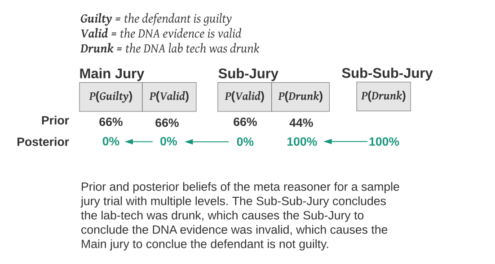

In the [Introduction to Distributed Bayesian Reasoning](/distributed-bayesian-reasoning-introduction), we argue that the rules of Bayesian inference can enable a form of distributed reasoning.

In this article we introduce the idea of **meta-reasoner**, which is the **hypothetical fully-informed average juror**.

The meta-reasoner resembles the average juror in that it holds **prior** beliefs equal to the average beliefs of the participants, but it is fully-informed because it holds beliefs for every relevant sub-jury. 

But **the beliefs of the sub-juries may be mutually inconsistent**. In the jury trail example from the introduction, the sub-jury unanimously believes the DNA evidence is not valid, but most members of the main jury believed it is valid. These beliefs are inconsistent, and the meta-reasoner cannot simultaneously believe that the DNA evidence is valid and that it is not.

So the meta-reasoner must update its beliefs to be consistent. To do this, it engages in a reasoning process, where it updates its beliefs based on other beliefs, resulting in consistent posteriors. Its belief in the evidence in the sub-jury causes it to update its belief about DNA evidence, and this new belief then causes it to update its belief about guilt.

Suppose during the subtrial, a witness claimed that the DNA lab technician was drunk, and all of the jurors believed this, and as a result conclude that the DNA evidence was not valid.

The meta-reasoner would then need to use the rules of Bayesian belief revision to update their posterior belief in the probability of guilt based on a new posterior belief in the probability that the DNA evidence was valid. We will develop the formula for doing this in [The Math](/distributed-bayesian-reasoning-math). The process is illustrated in the diagram below.

## The Causal Model and the Justified Opinion

So in a sense, information and belief propagates through the meta-reasoner's brain from the sub-juries towards the main jury. This means that the beliefs of the meta-reasoner depend on the **argument structure**. The DNA evidence was argued as a reason that the defendant is guilty, and not vice versa, so the meta-reasoner updates their belief in guilt on the strength of the DNA evidence argument, and not vice versa. Likewise any convincing arguments/reasons given for rejecting the DNA evidence would cause the meta-reasoner to reduce their belief in the DNA evidence, and thus indirectly reduce their belief in guilt.

The causal model we derive from the argument structure is important: it makes the beliefs of the meta-reasoner deterministic, and justifies the assumptions behind the mathematical formulas we use to calculate these beliefs.

However, these causal assumptions may not actually reflect the beliefs of the average juror. Even if the jurors' votes show that there is  a statistically significant correlation between belief in the DNA evidence and belief in guilt, we can't be sure that the DNA evidence is a reason and not a justification: the average may simply dislike the defendant, and be predisposed to believe in her guilt and any evidence that confirms that belief.

If we ask for jurors opinions before/after being presented with each piece of evidence, then sometimes we will be able to observe a causal relationship between evidence. But this is not actually necessary; we can **assume** a causal relationship. As discussed in the the introduction, in a fair trial each side should have a chance to submit reasons that might effect jurors beliefs. If reasons are omitted, we can't really model what a fully-informed juror **would** believe; but what we can do is determine which belief has been [justified](/distributed-bayesian-reasoning-introduction/#the-justified-verdict) by the reasons that were given. 

So the **posterior beliefs of the meta-reasoner** can be thought of as the **justified opinion of the group**.

## Summary of the Meta-Reasoner

- The priors of the meta-reasoner are a set of joint probability distributions $ P_1, P_2, ..., P_n $ over sets of claims (e.g. one set of possibilities for each "sub-jury")
- Different probability distributions may cover the same claim, and the marginal probability for the same claim in different distributions may be different (e.g. $ P_0(Valid) ≠ P_1(Valid) $ ). Thus the beliefs of the meta-reasoner may be inconsistent.
- The meta-reasoner updates their beliefs so that its posterior beliefs are consistent.
- It does this by using the posterior beliefs from one probability distribution as evidence for updating the beliefs of another. The mathematical formula for this update is developed in [The Math](/distributed-bayesian-reasoning-math).
- The argument structure determines the causal relationship between the meta-reasoner's beliefs (e.g. $ Drunk → Valid → Guilty $) and thus the ordering of updates.
- The **posterior beliefs of the meta-reasoner** can be thought of as the **justified opinion of the group**.

## Next in This Series

- In [Basic Math](/distributed-bayesian-reasoning-math) we derive a formula for estimating the beliefs of the meta-reasoner when there is a single argument thread.

