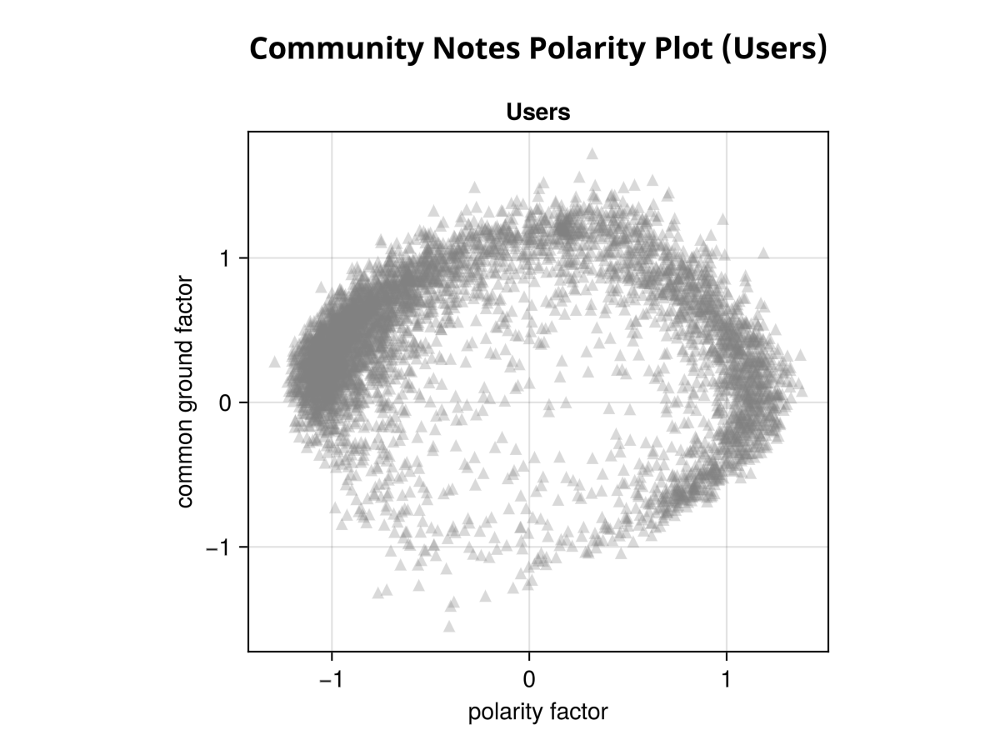
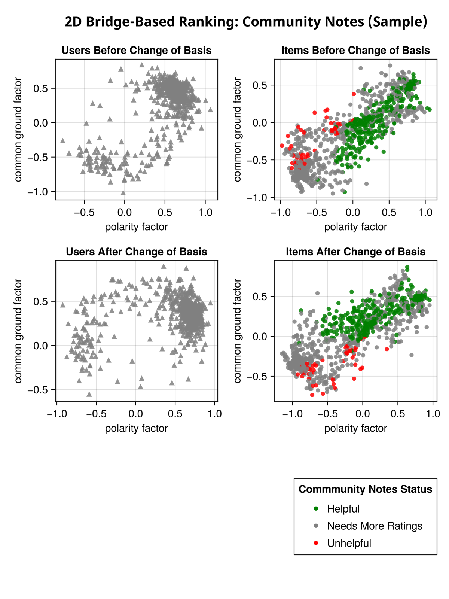

[Bridge-Based Ranking](https://www.belfercenter.org/sites/default/files/files/publication/TAPP-Aviv_BridgingBasedRanking_FINAL_220518_0.pdf) is an alternative way to score and rank content by **adjusting for user polarization**.

The most successful implementation of Bridge-Based Ranking, X's Community Notes, explains that the algorithm favors notes that are rated highly by users across a "[diversity of perspectives](https://communitynotes.twitter.com/guide/en/contributing/diversity-of-perspectives)". But as I show in this article, ratings from users with diverse perspectives are not necessary for a note to rank highly. It is somewhat more accurate to say that the note must rank highly **regardless of diversity of perspective**, or more specifically, regardless of **polarization**.

The algorithm works by attempting to model *why* a post receives the votes it does: how many votes are due to users left-wing or right-wing biases, and how many are due to other factors. If a post is only appealing to right-wing voters, and an online forum is dominated by right-wing voters, then that right-wing bias probably explains why it gets so many upvotes. So the algorithm tries to correct for this bias, and estimate how a post would rank if all users were perfect centrists. What remains is content that ranks highly **regardless** of users' political biases.

### Extracting Information

Now why would we want to do this? Why for example would a predominantly left-wing community want to artificially give right-wing opinions more weight?

For a fact-checking product like Community Notes, plausible political neutrality may be necessary for public acceptance. But bridge-based ranking has advantages beyond political neutrality: it actually allows us to extract more **information** from users. 

In Community Notes, users vote notes as "Helpful" and "not Helpful". If Community Notes was dominated by left-wingers, what would we learn by the fact that a note received a lot of "helpful" votes? That it is helpful? Or that it supports a left-wing worldview? Or both? It's hard to say: perhaps a marginally helpful note that supports a left-wing world view gets more votes than a truly helpful note that supports a right-wing world-view. We can't tell just from the raw vote counts how "helpful" the note is, and how left-wing it is. 

Bridge-based ranking on the other hands let's us break down the vote counts, attributing some to the post's "helpfulness" and others to its "polarity". So it is not about giving "both sides" equal weight; by "cancelling out" the effect of political bias, we can actually extract more interesting **information** from the users votes. 
 
### Projection in Opinion Space 
 
The chart below illustrates how this works. This charts shows a subset of  notes from the Community Notes public data set, run through my own implementation of the algorithm. The horizontal axis shows the note's "polarity" -- e.g. +1 for right-wing and  -1 for left wing -- and the vertical axis shows its "helpfulness". The note's final score is its vertical component, or its projection on the "helpfulness" axis. 
 

Notice how there is a large spread along not just the the vertical axis, but also the horizontal axix. If want we want to know how helpful a note is, the horizontal axis is just noise. Separating the polarity factor from the helpfulness factor by ignoring the horizontal component removes the noise.

### Why it Works

People are politically biased, but they are also in a sense biased towards helpfulness. That is, they will mostly upvote notes that support their perspective but they will **especially** upvote notes that support their perspective and are actually helpful. And they will tend to downvote notes that support opposing perspectives....but they will zealously downvote notes that support the opposing perspective using false or misleading information.

When bridge-based ranking algorithm dissects users voting behavior and factors out the left-right component, it finds that **almost everyone is slightly biased towards helpfulness!**. You can see this in the plot of Community Notes users below. 

The first thing you may notice is the clump of users in the upper-right quadrant. There are far right-leaning than left-leaning users. But notice also that the helpfulness factor for these users is above zero. They are also almost all biased towards helpfulness; their votes can't be entirely explained by their politics. 

### Common Ground

This vertical component in these plots represents **common ground**. It is something users tend to agree on independently of their politics.

What exactly the common ground is depends on the community. Suppose for example there is a forum for Harry Potter fan fiction. But unfortunately in recent years it has been overwhelmed by debates about whether J.K. Rowling is transphobic. There is still a lot of good fan-fiction being posted, but the home page is dominated by the political posts.

In this case, the vertical axis will represent the pro- and anti- J.K. Rowling factions, and the vertical axis will represent the common ground of the community: quality Harry Potter fan fiction. Using bridge-based ranking we can in a sense de-polarize the forum, factoring out the effect of polarization and getting back to community's original essence.

Politics is not the only factor that can divide a forum. Suppose there is a popular forum for posting ridiculously cute pet pics. Sadly, in recent years, two factions have formed: the cat faction and the dog faction. The more extreme cat people mercilessly downvote pictures of dogs (regardless of how cut they are), and the dog people vice versa. Recently, the dog faction has gained the upper hand, and a cat-picture has little chance of making the front page, no matter how frigging adorably it is.

Again, by separating the dog-cat factor from the common ground factor, we can re-focus the community on it's original purpose: raw frigging cuteness.

### Understanding the Algorithm

But how does the algorithm actually work? How does it determine the polarization factor and common ground factor for each user and post?

It actually works using a fairly simple algorithm called Matrix Factorization. A good way of understanding Matrix Factorization is that it is like running a bunch of regressions: one for each user and each item.

For example, suppose we have already discovered the polarity factor for each user, and we want to find the polarity factor for each post. We can use regression analysis to estimates the probability that a user upvotes a post as a function of the user's polarity factor.

For a highly polarizing right-wing post, the regression line might have a positive slope:

***Highly Polarizing, Right-Wing Post***

           Vote 
            +1   ✕ ✕ ✕ ✕ 
             |    ↗
             |  ↗ 
    -1 ______|↗______ +1  User's Polarity Factor
            ↗|
          ↗  |
        ↗    |
      ✕ ✕   -1

In this chart upvotes have a value of +1 and downvotes have a value of -1. All the right-wing users upvoted and all the left-wing users downvoted (as shown by the little ✕s). So the best fit is a line with a slope of +1: the more right-wing the user, the higher the probability of an upvote. The more left-wing, the higher the probability of a downvote. 

Note that there are more right-wing users than left wing users, but it doesn't make a difference. Even if there were 100 right-wing users and 2 left-wing users, the slope of the best fit would be approximately the same. This is why bridge-based ranking does not favor the majority.

A very polarizing lift-wing post might have a negative slope:

***A Highly Polarizing, Left-Wing Post***

           Vote    
      ✕ ✕   +1    
        ↘    |     
          ↘  |    
    -1 _____↘|________ +1  User's Polarity Factor
             |↘
             |  ↘
             |    ↘
                ✕ ✕ ✕ ✕

For a completely non-polarazing post, on the other hand, the slope would be zero:

***A Non Polarizing, "Good" Post***

           Vote    
    ✕ ✕     +1     ✕ ✕ ✕ 
      →  →  →|→  →  →  
             |  
    -1 ______|________ +1  User's Polarity Factor
             | 
             |   
           ✕ |       
       

This is a good post. Not just because the upvote probability is independent of the user's politics, but because the intercept is above the horizontal because this post receives mostly upvotes. This post has some quality that users of this forum are looking for.

<!-- And for completeness sake, a unequivocally bad post might look like this.

           Vote    
            +1      
             |
             |  
    -1 ______|________ +1  User's Polarity Factor
             | 
             |   
      →  →  →|→  →  →  
       

 -->

Now, suppose there is a post that looks like this:

***A "Good" but Polarizing Post***

           Vote
       ✕    +1   ✕ ✕ ✕ ✕
             |  ↗ 
             |↗
            ↗|
    -1 __ ↗__|________ +1  User's Polarity Factor
        ↗    |
      ↗      |
    ✕ ✕ 
 

This post has a positive slope, so it is clearly very polarizing. But the positive intercept means that voting behavior for this post cannot be explained entirely by politics. There is also a component that is independent of politics.

### The Intercept is Common Ground

So the intercept represent "common ground". It represents something about a post that causes users to upvote independently of politics -- a component that cannot be explained entirely by users' polarity factors.

### The Intercept is not the Average

We might suppose that the last post above will receive more upvotes than downvotes because it has a positive intercept. But this is not necessarily the case. It depends on how many left-wing and right-wing users there are. The intercept is not the average: a post can have a positive intercept even though it receives more downvotes than upvotes, or it can have a negative intercept even though it receives more upvotes than downvotes. 

What a positive intercept does tell us is that this post **would** receive more upvotes than downvotes if there **was** an equal balance of left and right-wing users. 

It also tells us how users would hypothetically vote if they were all totally a-political. In such a hypothetical world, the only thing influencing users votes is some common-ground factor that aligns with the intent of this particular community, attracting upvotes independently of politics.

### Matrix Factorization

Okay, so we have used regression analysis to find the polarity factor for each post (the slope) of the regression line. But in order to do these regressions, we first need to know the polarity factors for the users.

But how do we find these?

Well, if we knew all the **posts'** polarity factors, we could use regression analysis to estimate the probability that a user upvotes a post as a function of the polarity factor of the posts. The slope of the regression line would then be the user's polarity factor. The regression line for a very right-wing user, for example, might look just like that for a very right-wing post. (but in this case, the horizontal axis represents the polarity factor of the post).

    A Right-Wing User

           Vote 
            +1   ✕ ✕ ✕ ✕ 
             |    ↗
             |  ↗ 
    -1 ______|↗______ +1  User's Polarity Factor
            ↗|
          ↗  |
        ↗    |
      ✕ ✕   -1

But we seem to have a chicken-and-egg problem, where we can't find the polarity factors of users unless we know the polarity factors for posts, and vice versa.

However, the Matrix Factorization algorithm solves this by discovering the polarity factors (and intercepts) for every user and every post all in one go. 

It does this by using a single equation to estimate the probability that user $i$ upvotes post $j$:

$$
    ŷ_{ij} = w_i×x_j + b_i + c_j
$$

Here $w_i$ is the user's polarity factor, $x_i$ is the post's polarity factor, $b_i$ is the user's intercept, and $c_j$ is the post's intercept.

It then simply finds a value for every $w_i$, $x_j$, $b_i$, and $c_j$ that best *fit* the data -- that produce values for $ŷ_{ij}$ that are closet to the actual values of $y_{ij}$. This is usually done using a standard [gradient descent](https://en.wikipedia.org/wiki/Gradient_descent) algorithm.

The polarity factor the algorithm discovers doesn't necessarily correspond exactly to politics, or cat-dog preferences, or any measurable quantity. It may be a linear combination of factors. But whatever it is, it represents **some** latent factor of users and posts that does a good job predicting their votes.

### Breaking the Algorithm

The algorithm we've described so far works on the assumption that this latent factor corresponds to some sort of polarization within the community. But what if this is not the case? What if the factor that best explains variation in users' votes corresponds to, for example, how informed or educated that user is? For example, suppose in some expert advice forum the regression for a post looks like this.

           
           Vote 
            +1   ✕ ✕ ✕ ✕ 
             |    ↗
             |  ↗ 
    -1 ______|↗______ +1  User Expertise
            ↗|
          ↗  |
        ↗    |
      ✕ ✕   -1

Now bridge-based ranking will do the opposite of what we probably want: it will favor posts that get upvoted regardless of user expertise. If the forum was already populated by a majority of experts, and a minority of uninformed quacks promoting baseless claims, then informed posts would have had the advantage. Bridge-based ranking would just take this advantage away.

In fact, this points to a strategy for attacking a bridge-based ranking algorithm. An attacker trying to break Community Notes using a lot of sockpuppet accounts won't succeed just by upvoting notes that support some political agenda. Instead, they should *downvote helpful posts and upvote unelpful posts, regardless of politics*.

With enough sockpuppet accounts contributing, the result will be that the primary factor that explains variation in users voting behavior will not be politics, but helpfulness. The matrix factorization algorithm will thus discover this factor, and a regression for a helpful post will now look something like this:

           Vote 
            +1   ✕ ✕ ✕ ✕ 
             |    ↗
             |  ↗ 
    -1 ______|↗______ +1  User Helpfulness
            ↗|
          ↗  |
        ↗    |
      ✕ ✕   -1

This would be a disaster, because bridge-based ranking will nullify the effect of Helpfulness and favor posts would be most upvoted if helpfulness were not a factor. And which posts might these be? Well in the community notes, the factor that most predicts how users vote, after Helpfulness, is ...politics! 

What would the intercept be? A positive intercept means a post gets a lot of upvotes after adjusting for helpfulness. So if the forum is dominated by right-wingers for instance, right-wing posts will have a positive intercept and left-wing posts will have a negative intercept. This is definitely not the desired result.

### Two-Dimension Matrix Factorization

To address this problem, I have developed a variation of the algorithm that uses a two dimensional Matrix factorization, and then users a process similar to principal component analysis to find the high-entropy dimension and the low-entropy dimension.

Every user and post is characterized by a two-dimensional vector, instead of a single factor plus an intercept. So the probability of a user upvoting a post is just the dot-product of this vector. That is, the model simplifies to:

$$
    ŷ_{ij} = \vec{w_i} \cdot \vec{x_j}
$$

Where $w⃗_i$ and $x⃗_j$ are now vectors.

The problem is, the two factors of this two-dimensional vector do not necessarily align with the polarity-factor and the common-ground factor: instead they may be any arbitrarily linear combination of these factors. So the results of the matrix factorization algorithm, when plotted in two dimensions, will appear to be rotated arbitrarily.

However, we can use a technique similar to principle component analysis to find a change of basis so that our axis align with the polarity and common-ground factor. 

The chart below shows the results of this algorithm using a synthetic dataset. The dataset simulates four user profiles: each profile is either left- or right-wing biased, but some users are less biased -- they make a good-faith effort to rate posts based on helpfulness.

I then created upvote/downvote Matrix with votes drawn randomly with probabilities defined by these profiles. I then factorized the resulting matrix using two latent factors. The results of the initial Matrix factorization are shown in the first row of charts below.

As you can see, the matrix factorization clearly has discovered the two dimensions that best explain the variation in users' votes: left-right polarity and helpfulness. But it chose, in a sense, an arbitrary set of axes.

The bottom row of charts shows the same data after a change of basis that makes "polarity" the vertical axis and "common ground" the horizontal axis.

The key to discovering the polarity axis and the common-ground axis is to notice that there is less "disagreement" along the common-ground axis. As you can see in the bottom-left chart, almost all users have a positive value for the common-ground factor. If users were to vote entirely based on this factor, there would be little disagreement: they would mostly upvote helpful items and download unhelpful items.

So finding the common-ground axis is as simple as finding a vector which, when users are projected onto this vector, results in most users having a positive (or negative value). The specific measure I use is actually a measure of entropy, which is the log of the probability that a user upvotes a post after users are projected into a vector. The exact code is [here](https://github.com/social-protocols/bridge-based-ranking).

Likewise, the polarity axis can be discovered by finding the vector with maximum entropy.

The algorithm is almost identical to principal component analysis, except instead of maximizing variance (which is how PCA works), we maximize/minimize entropy.

Here is a subset of the Community Notes data run through the same algorithm. As you can see, after initially running matrix factorization we don't know which way is "up". But after discovering the high-entropy and low-entropy vectors and doing a change of basis, the vertical does indeed correspond to "common ground", as you see from the fact that the posts that Community Notes has rated as helpful (the green dots) mostly have a positive value for the common ground factor, and the red dots mostly have a negative value.

## Conclusion

One of the reasons for my interest in bridge-based ranking is that I think it may be a critical part of a [social protocol](https://social-protocols.org) for a self-moderating community. Without it, user polarization will tend to lead to either suffocating uniformity or least-common-denominator mediocrity. Bridge-based ranking can help focus users attention on posts with high [Information Value](https://social-protocols.org/global-brain/information-value.html). 

<!--

-----

However, another thing we want from online communities is **information**. We want to find content that is useful, or funny, or accurate, or whatever, and sometimes looking at what **other** people find useful, or funny, or accurate is a good way to do that. But often when a community becomes polarized, upvotes no longer represent these aspects of the content. If people are upvoting something **because** it supports a left-wing or right-wing point of view, then they are not upvoting it **because** it is useful or funny or current.

So bridge-based ranking can be seen as a sort of Information-extraction algorithm, that separates the polarity component from some core component that represents whatever it is that people are looking for from this forum -- what we might call the "common ground" component.

So for example Community Notes attempts to identify notes that users find **helpful** -- which basically means accurate and relevant. Unfortunately, users are very biased, and tend to upvote notes not because they are helpful, but because they support their political perspective. 

But they, **also**, to a lesser degree, tend to upvote notes that are helpful. They will mostly upvote notes that support their perspective but they will **especially** upvote notes that support their perspective and are actually helpful. And they will tend to downvote notes that support opposing perspectives....but they will show extra enthusiasm in downvoting notes that support the opposing perspective using false or misleading information.

When bridge-based ranking algorithm dissects users voting behavior and factors out the left-right component, it finds that **almost everyone is slightly biased towards helpfulness!**. Consider the diagram below. It shows a subset of users from the Twitter Community Notes data after running my own modified version of the algorithm. The X axis is the user's polarity factor (roughly, left-wing to right-wing), and the Y axis is their "helpfulness" factor. 

You can see that far more users lean towards the (left/right). Without using bridge-based ranking, Community Note would just be a (left/right-wing) opinion meter... 

But more interestingly, you can see the vast majority of users on both side have a positive value for the "common ground" factor (the vertical axis). 

 inaccurate, unfair, or in any way unhelpful that 

, and downvote, or at best ignore, notes that don't. 

Whether it be technical knowledge or cute pet pics or funny jokes or accurate news. An online community uses the "wisdom of crowds", or at least the aggregate opinion of crowds, to help you discover content that you are also likely to find cute or funny or useful or accurate.

Discussion

In a forum 

...Crowdsourcing....extracting information

Unfortunately, in an online forum where participation is open to random people on the internet, the opinions of each side will not be very sophisticate

...but fact checking....

But ...beyond ostensibly politically neutral fact-checking...compromise...

For every online forum that becomes polarized. Yes, we want our side of the culture war to win, but we also don't want every corner of the internet to be dominated by expressions of the correct opinion about the Isreal-Palestine conflict. 

Unfortunately, whatever long-term foresight some people may exercise when pressing the vote button, it tends to be overwhelmed by short-term passions. They may faithfully downvote political content when they see but tend to let one or two items through on subjects they are particularly passionate about. Others are less disciplined. The aggregate result is a bias towards political content, skewed towards one side.

The trick of bridge-based ranking is to get people

It models **why** users 
    strays from that ... start to downvote

People with some common understanding to 

The resulting ranking of content represents the "common ground" of the community.

Now what polarizes a community may not always be politics. It could be a controversy about styles of art, an economic theory, or the meaning of a word. And it may be that a community is not polarized, or that differences of opinion are best explained by differences in, say, expertise. In these cases bridge-based ranking can do more harm than good (e.g. dumbing down a forum by removing "expertise bias"). In another essay I hope to explain an variation of the algorithm that addresses this problem.

TODO: show how Community Notes removes left-right bias.

------

new users votes do not count until the user has "earned in" by upvoting notes that were ultimately deemed as helpful

If I were an attacker trying to break this algorithm, I would of course create a lot of sockpuppet or meanpuppet accounts. But I wouldn't have them upvote notes that support a political agenda. As discussed in "Average vs Intercept" above, changing the average vote does not change the intercept for a post. I could create a billion sock-puppet accounts voting in support of left-wing notes, and the algorithm would simply classify all those accounts as far left-wing and all their votes would be "explained" by their politics.

No, to break the algorithm, I would have my sockpuppet accounts *downvote helpful posts and upvote unelpful posts, regardless of politics*.

With enough sockpuppet accounts contributing, the result will be that the primary factor that explains variation in users voting behavior will not be politics, but helpfulness. The matrix factorization will thus discover this factor. A linear regression for a helpful post will now look like this:

                  Upvote
                Probability    
                    ↑
                    |  ↗ 
                    |↗
                   ↗|
    Unhelpful __ ↗__|_______ Helpful
    Voter      ↗    |        Voter
             ↗      |

So what does a positive intercept represent now? Well, it means the post has attributes that cause many users to upvote it regardless of helpfulness. What attributes might these be? Politics! 

If I can trick the matrix factorization into flipping the Axis, the intercept will no longer represent the common ground of "Helpfulness", but instead will represent the dominant politics of the forum.

THe protection from such an attack is some sort of reputation system. In Community Notes, new users votes do not count until the user has "earned in" by upvoting notes that were ultimately deemed as helpful

----

They are latent factors that the algorithm infers exist, b

may be a linear combination of 

---
 Matrix factorization works exactly the same way, but it tries to find the best *combination* of all values (a Wi and Bi for every user, Xj and Cj for every post) all one go.

The result is 

----

This equation can be interpreted as the regression line for either the user or the post. If we say that Wi to a constant and plot Yij as a function of Xj (replacing Cj with its average), we get the regression line for the user. If we plot Yij as a function of Wj, we get the regression line for the post.

----

To see how this works, we start with the equation for regression for user i, which looks like this:

    Yij = Wi*Xj + Bi

Yij is the probability that user i upvotes post j. Wi is the slope for user i (their polarity factor), Xj is the polarity factor post j, and Bi is the intercept for user B.

Now, the equation for a post looks similar

    Yij = Wi*Xj + Bi

To do this, it first creates a single equation for estimating the probability that user i upvotes post j. 

    Yij = Wi*Xj + Bi
    
Where Wi is the user's polarity factor, and Xi is the post's polarity factor, and Bi is the intercept for the user. 

    r̂_un = μ + i_u + i_n + f_u ∙ f_n 

It does this first by randomly guessing 

TODO: subcommunities

seems to be a chicken and egg 

Now, to find the slope and intercept 

The goal of the algorithm is to assign an estimated slope and intercept to each post

Matrix Factorization works by 

Matrix factorization is an algorithm that simply discovers a set of 

    Y = f_u ∙ f_n + i_n

    Y = W * X + B + C + u

    r̂_un = μ + i_u + i_n + f_u ∙ f_n 

### Conclusion

- how exactly it work
- limitations
- attacks

What needs to be in the conclusion? An analysis of strengths and weaknesses. Or at least a summary.

- that the primary dimension that explains variation may not be controversial

Now, there is a lot more to be said

- Multipple dimensions

### Discussion

The first implementation of [Bridge-Based Ranking](https://www.belfercenter.org/sites/default/files/files/publication/TAPP-Aviv_BridgingBasedRanking_FINAL_220518_0.pdf) was probably [pol.is](https://pol.is/home), used successfully by vTaiwan to bring together Taiwan's citizens and government to deliberate on national issues. The concept and was refined at Twitter with their launch of Birdwatch, now Community Notes, which is used to rank the "helpfulness" of notes attached to posts that may be misinformed or misleading.

According to the [Community Notes Documentation](https://communitynotes.twitter.com/guide/en/contributing/diversity-of-perspectives),

    "Community Notes takes into account not only how many contributors rated a note as helpful or unhelpful, but also whether people who rated it seem to come from different perspectives."

I think this explanation is mostly correct. However, ratings across a diversity of perspectives is not necessary for a note to receive a high intercept. For example, if a note receives a lot of upvotes from users who are politically neutral, it could still have a high intercept.

Perhaps a better way of describing the algorithm is that it corrects for political bias. Or better yet, that it extracts information from noise -- the information being the common idea of "Helpfulness", and the noise being political bias.

### Breaking the Algorithm 

#### Flipping the Axis

If I were an attacker trying to break this algorithm, I would of course create a lot of sockpuppet or meanpuppet accounts. But I wouldn't have them upvote notes that support a political agenda. As discussed in "Average vs Intercept" above, changing the average vote does not change the intercept for a post. I could create a billion sock-puppet accounts voting in support of left-wing notes, and the algorithm would simply classify all those accounts as far left-wing and all their votes would be "explained" by their politics.

No, to break the algorithm, I would have my sockpuppet accounts *downvote helpful posts and upvote unelpful posts, regardless of politics*.

With enough sockpuppet accounts contributing, the result will be that the primary factor that explains variation in users voting behavior will not be politics, but helpfulness. The matrix factorization will thus discover this factor. A linear regression for a helpful post will now look like this:

                  Upvote
                Probability    
                    ↑
                    |  ↗ 
                    |↗
                   ↗|
    Unhelpful __ ↗__|_______ Helpful
    Voter      ↗    |        Voter
             ↗      |

So what does a positive intercept represent now? Well, it means the post has attributes that cause many users to upvote it regardless of helpfulness. What attributes might these be? Politics! 

If I can trick the matrix factorization into flipping the Axis, the intercept will no longer represent the common ground of "Helpfulness", but instead will represent the dominant politics of the forum.

Some sort of reputation system can help make these attacks more difficult. In Community Notes, new users votes do not count until the user has "earned in" by upvoting notes that were ultimately deemed as helpful. 

#### Brigading

Suppose you have an agenda that does not align with the left-right spectrum. Perhaps you represent a company and are trying to protect the reputation of your product. If you create a bunch of sockpuppet accounts that "earn in" by upvoting posts ultimately rated as helpful, then I can call on these accounts to downvote notes critical of my product and vice versa. Because 

Self-selection

What I am trying to do is make it so that the fa

### Diving Into the Algorithm

corrects for the influence of political

but also whether people who rated it seem to come from different perspectives.

### Subdividing Communites

Now, there could be some political posts with a high intercept, but these would be posts that this particular community finds interesting and relevant, for whatever reason, independently of their political leanings.

Common ground might also include relevant political posts that 

Because fan-fiction is essentially non-political, 

Notice that:

The intercept of a post tells us how many upvotes it would get if users weren't influenced by politics.

    or political posts that both sides agree upon, such as non-opinionated news

. The intercept tells us which 

TODO: what if average post has more upvotes than downvotes? Horizontal is not necessarily at 50%
... it is common ground.

## Adding Dimensions

 would be how well it aligns with the intent of the community

If we could somehow ask them to ignore their political leanings and tell us how much 

We can do a regression to 

- Regular ranking, one side "wins"

The idea is that 

intercepts for users

First, we all understand devisive conten
The idea that users votes can be *explained* by 

-->

